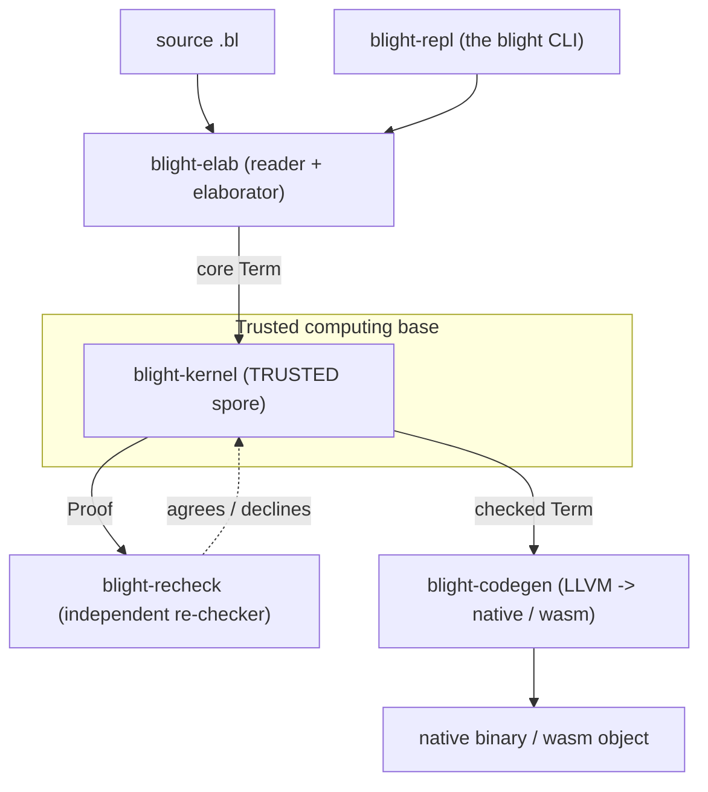

# Blight

> "Scheme's soul, a proof assistant's spine, grown from one spore."

**Blight is a dependently-typed programming language that is also a proof assistant**, written in
Scheme-style s-expression syntax. You can write ordinary programs in it (recursion, data types,
pattern matching, a standard library) *and* state and prove theorems about them — and the same
small, trusted core checks both. That core is the **spore**: a tiny kernel that is the only thing
allowed to certify that a term is well-typed. Everything else is built on top of it.

**The one big idea: trust is bounded, power is not.** The kernel is deliberately microscopic and is
the *only* code that can mint a `Proof`. Data types, pattern matching, traits, ML-style modules and
functors, effect handlers, tactics, the standard library, and the package manager are all
*untrusted "tower" code* written in the language itself — every one of them ultimately bottoms out
in the kernel. A second, independently-written **re-checker** can re-verify any kernel-accepted
proof, so the soundness argument is "two small checkers agree," not "trust one large compiler."

**How it compares.** If you know other languages: Blight takes its dependent, *cubical* type theory
from the Cubical Agda family, its quantitative `0/1/ω` grading from Idris 2's QTT, and adds
algebraic effects with handlers — all wearing Scheme syntax and organized, like Coq, around a tiny
kernel that re-checks every proof. The kernel itself is a cubical type theory with quantitative
grading and effects.

This repo is the bootstrap implementation: a Rust host that seeds the kernel, elaborates the surface
syntax, and compiles checked terms to native (or WebAssembly) code.

- Spec: [docs/blight-spec.md](docs/blight-spec.md) — the canonical language design.
- Tutorial: [docs/tutorial.md](docs/tutorial.md) — a hands-on walk from `Nat` to a tactic proof.
- Implementation notes: [docs/implementation.md](docs/implementation.md) — host architecture, the TCB boundary, the milestone map.
- Performance: [docs/performance.md](docs/performance.md) — cost model, benchmarks, advantages/disadvantages.
- Benchmarks game: [docs/benchmarks-game.md](docs/benchmarks-game.md) — scaling tables + one honest cross-language comparison.
- Roadmap: [docs/roadmap.md](docs/roadmap.md) — can we build games / be fast / do I/O, and what each costs the trusted kernel.
- Examples: [examples/](examples/) — small runnable programs and a sample package.

## Blight in 60 seconds

Blight is s-expression syntax over a dependently-typed core. Here are five complete, real snippets
(each is a checked-in example or stdlib module).

**Data + structural recursion.** `Nat` is the unary Peano encoding; `plus` recurses on its first
argument (from [std/nat.bl](crates/blight-prelude/std/nat.bl)):

```scheme
(defdata Nat () (Zero) (Succ (n Nat)))

(define-rec plus (Pi ((a Nat) (b Nat)) Nat)
  (lam (a b) (match a
    [(Zero) b]
    [(Succ n) (Succ (plus n b))])))
```

**A buildable program.** A `main` global is what `blight build` compiles and runs; here it is a
`Nat` ([examples/hello_nat.bl](examples/hello_nat.bl) — `(2 * 3) + 1`):

```scheme
(load "std/nat.bl")
(define two   Nat (Succ (Succ Zero)))
(define three Nat (Succ (Succ (Succ Zero))))
(define main  Nat (plus (mult two three) (Succ Zero)))
```

```bash
cargo run -p blight-repl --features llvm -- build examples/hello_nat.bl -o hello && ./hello
# 7
```

**A length-indexed type.** `Vec a n` tracks its length in the type; `vec-length` reads the index
back as a `Nat` ([examples/vec_head.bl](examples/vec_head.bl) builds a `Vec Nat 3` and prints `3`):

```scheme
(load "std/nat.bl")
(load "std/vec.bl")
(define sample (Vec Nat three)
  (vcons two one (vcons one two (vcons Zero three (vnil)))))
(define main Nat (vec-length Nat three sample))
```

**A guarantee the type enforces.** Because the length lives in the type, you can write a `safe-head`
whose argument type `Vec A (Succ n)` *demands* a non-empty vector. Calling it on an empty vector is
a compile-time type error — the index `Succ n` cannot match `Zero` — caught by the trusted kernel
and, independently, by the second re-checker ([examples/safe_head.bl](examples/safe_head.bl)):

```scheme
(define-rec safe-head (Pi ((A (Type 0)) (n Nat) (v (Vec A (Succ n)))) (Maybe A))
  (lam (A n v) (match v
    [(vnil) nothing]            ; unreachable: no caller can supply a Vec A Zero
    [(vcons m x xs) (just x)])))

(the (Maybe Nat) (safe-head Nat one sample))   ; ok
(the (Maybe Nat) (safe-head Nat Zero (vnil)))  ; rejected: expected index Succ Zero, found Zero
```

**A proof by tactics, re-checked by the kernel.** `plus n Zero = n` is not definitional, so it needs
induction; tactics only *propose* the term and the spore re-checks it
([plus_zero_tac.bl](crates/blight-prelude/plus_zero_tac.bl)):

```scheme
(define-by plus-zero
  (Pi ((n Nat)) (Path Nat (plus n Zero) n))
  (intro n
    (induction n
      [(Zero)   refl]
      [(Succ k) (cong Succ (exact k#ih))])))
```

**Text output.** A buildable `main` can be a `String`, which the runtime prints as text. A string
literal desugars into a cons-list of `Nat` codepoints — no primitive string type in the kernel
([examples/hello_string.bl](examples/hello_string.bl) prints `hello`):

```scheme
(load "std/string.bl")
(define main String "hello")
```

## Architecture and the trust boundary

Only `blight-kernel` is trusted (TCB); its Cargo manifest sets `[lints.rust] unsafe_code = "forbid"`,
so the trusted base contains no `unsafe`. Every other crate is untrusted and can only *propose*
terms that the kernel must independently accept.



| Crate | Trust | Purpose |
|---|---|---|
| [`blight-kernel`](crates/blight-kernel) | **Trusted** | The spore: terms, normalization-by-evaluation, the typing rules, and the cubical Kan table. The only `Proof` door; `unsafe` is lint-forbidden. |
| [`blight-recheck`](crates/blight-recheck) | Untrusted | An independent, minimal re-checker that re-verifies a `Proof`'s conclusion from scratch (spec §8.3). |
| [`blight-elab`](crates/blight-elab) | Untrusted | The s-expression reader, bidirectional elaborator, macros, tactics, and the `spores` package manager. |
| [`blight-codegen`](crates/blight-codegen) | Untrusted | The backend: erasure, closure conversion, monomorphization, ANF, and LLVM codegen to a native binary or a WebAssembly object. |
| [`blight-repl`](crates/blight-repl) | Untrusted | The `blight` CLI binary: read, elaborate, check, report, build. |

The standard library and the self-model live as `.bl` sources in
[`crates/blight-prelude`](crates/blight-prelude) (tower code, not a compiled crate).

## Build

The kernel, elaborator, re-checker, and REPL build with a stock Rust toolchain (edition 2021,
`rust-version = 1.96`):

```bash
cargo build
cargo test --workspace
```

The native/WASM backend (`blight build`) needs the `llvm` feature, which requires **LLVM 18** and
`clang`. On macOS via Homebrew:

```bash
brew install llvm@18
export LLVM_SYS_181_PREFIX="$(brew --prefix llvm@18)"
cargo build --features llvm
cargo test --workspace --features blight-codegen/llvm,blight-repl/llvm
```

## Quickstart

### REPL

```bash
cargo run -p blight-repl
```

Enter top-level forms — `(defdata …)`, `(define …)`, `(define-rec name T body)`,
`(deftotal name T body)`, `(load "path")`, or `(the T e)`; multi-line forms are read until the
parentheses balance, and `Ctrl-D` exits. Each form prints `ok` for a declaration or the checked
conclusion for a `(the …)`. `define-rec` allows general (possibly partial, `Later`-guarded)
recursion, while `deftotal` requires the definition to compile to a structural eliminator — a
non-structural recursive call is a hard error.

Lines starting with `:` are REPL commands rather than forms:

- `:help` (`:h`) — list the commands.
- `:type <expr>` (`:t`) — infer and pretty-print the type of an expression.
- `:load <file>` (`:l`) — load and check a file of forms.
- `:quit` (`:q`) — exit.

The package form `(import "pkg/mod")` is resolved against a `spore.toml` manifest (see the
[`spores` package manager](#feature-tour) below), so it runs inside a package build rather than the
bare REPL.

### Building a program

```
blight build <file.bl> [-o <bin>] [--recheck] [--target=wasm32] [--opt=<level>]
```

- `<file.bl>` is elaborated and every form is type-checked; its `main` global is compiled, run, and
  printed. `main` is usually a `Nat` (printed as a decimal numeral), but it may also be a `String`,
  in which case the runtime prints it as text. Strings are untrusted tower code — a `String`
  ([std/string.bl](crates/blight-prelude/std/string.bl)) is a cons-list of `Nat` codepoints and the
  reader desugars a quoted literal like `"hello"` into that chain, so the kernel gains no primitive
  string type.
- `-o <bin>` sets the output path (defaults to the input stem, or `<stem>.wasm` for wasm).
- `--recheck` re-verifies every kernel-accepted judgement with the independent re-checker before
  emitting code; a rejection aborts the build as a soundness alarm.
- `--target=wasm32` emits a WebAssembly module — a linked `.wasm` (exporting `bl_main`) when a
  wasm-capable `clang` + `wasm-ld` are found, else the object only (see caveats). Default is `native`.
- `--opt=<level>` selects the LLVM IR optimization pipeline: `0`/`none`, `2`/`default` (the default),
  or `3`/`aggressive`. The pipelines preserve `musttail` tail calls. Note: with no cross-object LTO
  against the C runtime, higher levels currently cost a little compile time without measurably moving
  runtime (see [docs/performance.md §2d](docs/performance.md)).

`blight build` requires a binary built `--features llvm`. For example, from a checkout:

```bash
cargo run -p blight-repl --features llvm -- build examples/hello_nat.bl -o hello
./hello
```

## Feature tour

- **Standard library** ([crates/blight-prelude/std](crates/blight-prelude/std)) —
  [`std/nat`](crates/blight-prelude/std/nat.bl) (`Nat`, `plus`, `mult`, `pred`, `sub`, `min`, `max`,
  `even`, `odd`),
  [`std/bool`](crates/blight-prelude/std/bool.bl) (`Bool`, `not`, `and`, `or`),
  [`std/order`](crates/blight-prelude/std/order.bl) (`nat-le`/`nat-eq`, the `Show`/`Ord` traits),
  [`std/ordering`](crates/blight-prelude/std/ordering.bl) (`Ordering`, `ordering-flip`, `nat-compare`),
  [`std/list`](crates/blight-prelude/std/list.bl)
  (`List`, `length`, `append`, `map`, `filter`, `reverse`, `foldr`, `concat`),
  [`std/maybe`](crates/blight-prelude/std/maybe.bl) (`Maybe`, `maybe-map`, `maybe-bind`, `maybe-or`),
  [`std/either`](crates/blight-prelude/std/either.bl)
  (`Either`, `either`, `either-map-left`, `either-bind`),
  [`std/pair`](crates/blight-prelude/std/pair.bl) (`Pair`, `pair-fst`, `pair-snd`, `pair-swap`),
  [`std/function`](crates/blight-prelude/std/function.bl) (`id`, `compose`, `const`, `flip`),
  [`std/vec`](crates/blight-prelude/std/vec.bl) (length-indexed `Vec`, `vec-length`),
  [`std/string`](crates/blight-prelude/std/string.bl),
  [`std/tree`](crates/blight-prelude/std/tree.bl) (`Tree`, `RedBlackTree`), and the
  [`std/prelude`](crates/blight-prelude/std/prelude.bl) aggregator.
- **Tactics + proofs** — `plus-zero : Π(n:Nat). Path Nat (plus n Zero) n` is proved entirely by
  tactics in [plus_zero_tac.bl](crates/blight-prelude/plus_zero_tac.bl); the tactic vocabulary
  (`refl`, `intro`, `induction`, `cong`, …) is documented in
  [tactics.bl](crates/blight-prelude/tactics.bl). Tactics only *propose* terms; the kernel re-checks.
- **Cubical paths** — equality is a `Path` type, and the kernel's Kan table implements `transp`,
  `hcomp`, and `comp` (`comp = hcomp + transp`, CCHM) plus `Glue`/`unglue`, conformance-tested
  against Cubical Agda ([crates/blight-kernel/src/kan.rs](crates/blight-kernel/src/kan.rs)).
  Function extensionality and univalence (`ua`) are both provable in the standard library
  ([std/path.bl](crates/blight-prelude/std/path.bl)): `funext` re-checks, and `ua` is built from a
  single-face `Glue` line whose `transp` reduces to the equivalence's forward map (the univalence
  *computation* rule, witnessed by a kernel white-box test and the closed
  [ua_compute.bl](examples/ua_compute.bl)). The independent re-checker `Declines` `ua`/`Glue`
  (TCB-disciplined — see caveats).
- **Traits and modules** — dictionary-passing `Show`/`Ord` and an ML-style `RedBlackTree` functor
  applied to a `Nat` module ([std/tree.bl](crates/blight-prelude/std/tree.bl)).
- **Effects and grades** — quantitative binders (`0`/`1`/`ω`) drive erasure and region elision;
  effects are tracked by a `! E` judgement (spec §3, §4).
- **`spores` package manager** — a `spore.toml` manifest plus an idempotent, cycle-checked
  `(import "pkg/mod")` form ([crates/blight-elab/src/spores.rs](crates/blight-elab/src/spores.rs));
  see [examples/package](examples/package).
- **Self-model** — [spore.bl](crates/blight-prelude/spore.bl) models the kernel's own core term
  language in Blight, and [spore_meta.bl](crates/blight-prelude/spore_meta.bl) proves small
  metatheorems about it (re-checked through the kernel door).
- **Independent re-checking** — `--recheck`, backed by [`blight-recheck`](crates/blight-recheck).

## Examples

The [examples/](examples/) directory has a mix of **buildable** programs (a `main` — a `Nat`, a
native `Int`, or a `String` printed as text — that `blight build` compiles, runs, and prints) and
**load-only** programs (typecheck through the REPL / test corpus, e.g. tactic proofs, functors, and
effects). See [examples/README.md](examples/README.md) for the full table with run
commands and expected outputs.

| Example | Kind | What it shows |
|---|---|---|
| [hello_nat.bl](examples/hello_nat.bl) | buildable → `7` | smallest program; `plus`/`mult` |
| [containers.bl](examples/containers.bl) | buildable → `2` | `Maybe`, two-parameter `Either`, length-indexed `Vec` |
| [vec_head.bl](examples/vec_head.bl) | buildable → `3` | recover a `Vec`'s index as a `Nat` |
| [safe_head.bl](examples/safe_head.bl) | buildable → `1` | length-indexed `safe-head`: the **type** makes calling it on an empty vector a compile-time error (caught by the kernel and the independent re-checker) |
| [list_sum.bl](examples/list_sum.bl) | buildable → `6` | `List` + `foldr` |
| [list_sort.bl](examples/list_sort.bl) | buildable → `1` | insertion sort over a `List Nat` |
| [minmax.bl](examples/minmax.bl) | buildable → `7` | `min`/`max` on `Nat` |
| [fib.bl](examples/fib.bl) | buildable → `13` | structural Fibonacci via a pair accumulator |
| [factorial.bl](examples/factorial.bl) | buildable → `24` | structural factorial (`fact 4`) |
| [gcd.bl](examples/gcd.bl) | buildable → `4` | fuel-bounded subtractive Euclidean GCD |
| [ackermann.bl](examples/ackermann.bl) | buildable → `9` | Ackermann via `deftotal` structural descent |
| [collatz_steps.bl](examples/collatz_steps.bl) | buildable → `8` | fuel-bounded Collatz step count |
| [tree_sum.bl](examples/tree_sum.bl) | buildable → `6` | fold a `Tree Nat` built with `tree-insert` |
| [either_compute.bl](examples/either_compute.bl) | buildable → `4` | `Either`/`Maybe` computation |
| [region_scratch.bl](examples/region_scratch.bl) | buildable → `2` | `(region …)` arena allocation |
| [hello_string.bl](examples/hello_string.bl) | buildable → `hello` | smallest text-printing program; `main : String` |
| [string_length.bl](examples/string_length.bl) | buildable → `5` | `string-length` over the codepoint spine |
| [string_reverse.bl](examples/string_reverse.bl) | buildable → `cba` | `string-reverse`, printed as text |
| [palindrome.bl](examples/palindrome.bl) | buildable → `1` | `string-eq word (reverse word)` |
| [caesar.bl](examples/caesar.bl) | buildable → `bcd` | per-codepoint Caesar shift, printed as text |
| [plus_zero_proof.bl](examples/plus_zero_proof.bl) | load-only | tactic proof `plus n Zero = n` |
| [mult_one_proof.bl](examples/mult_one_proof.bl) | load-only | tactic proof `mult n 1 = n` |
| [traits.bl](examples/traits.bl) / [show_dispatch.bl](examples/show_dispatch.bl) | load-only | `Show`/`Ord` dictionary dispatch |
| [functor.bl](examples/functor.bl) | load-only | an ML-style functor over an `ORD` module |
| [redblacktree.bl](examples/redblacktree.bl) | load-only | the `RedBlackTree` functor |
| [effects_demo.bl](examples/effects_demo.bl) | load-only | a `State` effect + handler |

## Performance

Blight's priorities are soundness (a tiny trusted kernel plus an independent re-checker) and
predictable, bounded-stack execution — not peak throughput. The headline trade-offs:

- **Advantages** — two small checkers agreeing is the soundness story; deep recursion runs in bounded
  stack via the `Later`/`Fix` trampoline; `(region …)` arenas reclaim in O(1) and bypass the GC; the
  GC is precise (no leaks mid-run) and `musttail` calls are guaranteed.
- **Disadvantages** — `Nat` is unary, so arithmetic is O(n) heap allocations (use the primitive
  machine `Int` for numeric scale); every value is boxed; LLVM optimization passes are available via
  `--opt` but buy no measurable runtime gain on the current C-runtime/GC-bound architecture (no
  cross-object LTO); the trampoline allocates
  a thunk per step; the wasm runtime is bump-only (no GC, no `Later`/effects/regions); the native
  heap is a fixed 64 MiB.

Full cost model, measured numbers, and reproduction instructions are in
[docs/performance.md](docs/performance.md). The in-tree harness is criterion benches
(`cargo bench -p blight-codegen --bench pipeline`, and `--features llvm --bench runtime` for runtime
+ GC/arena counters) plus `bench/run.sh` (hyperfine over `blight build` and the built binaries).

## Status

All milestones M0-M6 are implemented and green (`cargo test --workspace`, with and without the
`llvm` feature).

| Milestone | Deliverable |
|---|---|
| M0 | Stage-0 kernel (full cubical) + reader/elaborator/REPL |
| M1 | Quantitative grading exploited at the surface |
| M2 | Effects + handlers (`! E` judgement) |
| M3 | Tower rewritten in Blight + tactics |
| M4 | Native backend (LLVM) |
| M5 | Region elision from grades + GC maturation |
| M6 | Self-hosting model + ecosystem (std tree, spores, WASM, extended re-checker) |

See the [milestone map](docs/implementation.md#7-milestone-map-m0m6) and the
[M6 status](docs/implementation.md#9-m6-status-self-hosting--ecosystem) for detail.

### Honest caveats

- The *combination* of cubical + grading + effects in one kernel has no published end-to-end
  normalization proof; M0 soundness rests on the component results plus extensive testing (spec §10).
- The cubical layer ships `transp`/`hcomp`/`comp` and `Glue`/`unglue`. Both `funext` and `ua` are
  exported from [std/path.bl](crates/blight-prelude/std/path.bl): `funext` re-checks, and `ua` is
  built from a single-face `Glue` line. The univalence *computation* rule (`transp` over `ua e`
  reduces to `e`'s forward map) holds definitionally in the kernel and is witnessed by a white-box
  test plus the closed [ua_compute.bl](examples/ua_compute.bl). What is **deliberately deferred** is
  a *polymorphic* `ua-computes` lemma proved inside Blight: that would force threading De Bruijn
  *levels* through the open-Kan API — trusted-surface growth the kernel-size analysis argues
  against. The independent re-checker `Declines` `ua`/`Glue` (an honest "won't certify", never a
  rejection). See [docs/metatheory.md](docs/metatheory.md) §1.4–§1.5.
- `--target=wasm32` emits a WebAssembly object and, when a wasm-capable `clang` + `wasm-ld` are
  available (set `BLIGHT_WASM_CC` / `BLIGHT_WASM_LD` or have them on `PATH`), links a runnable
  `.wasm` module exporting `bl_main` against a minimal freestanding wasm ABI; without that toolchain
  it falls back to emitting the object only.
- The re-checker covers the core fragment plus multi-parameter / multi-index inductive eliminators,
  the cubical Kan table (transp/hcomp/comp), native `Int`, and effects/handlers + partiality
  *at the type level* (a genuine second opinion, not a blanket decline). It honestly *declines*
  (rather than rejects) only the genuinely out-of-fragment forms: cubical `Glue`/`ua`/partial
  elements, `foreign` postulates (trusted FFI), and universe-*level* variables. Declines are counted
  and reported, never silently skipped.
- Performance is correctness-first, not throughput-first: `Nat` is unary (arithmetic is O(n)
  allocations — use the primitive machine `Int` for numeric scale; see
  [docs/benchmarks-game.md](docs/benchmarks-game.md)), every value is heap-boxed, LLVM optimization
  passes can be enabled with `--opt` but currently buy no measurable runtime gain (the runtime is
  C-runtime/GC-bound and there is no cross-object LTO; see [docs/performance.md](docs/performance.md)
  §2d), the trampoline allocates a thunk per step, and the native heap is a fixed 64 MiB that aborts
  on exhaustion. The
  wasm runtime is a bump allocator only and omits the GC, `Later`/effects, and regions. See
  [docs/performance.md](docs/performance.md) for the full picture.

## License

Dual-licensed under either [MIT](LICENSE-MIT) or [Apache-2.0](LICENSE-APACHE) at your option.
