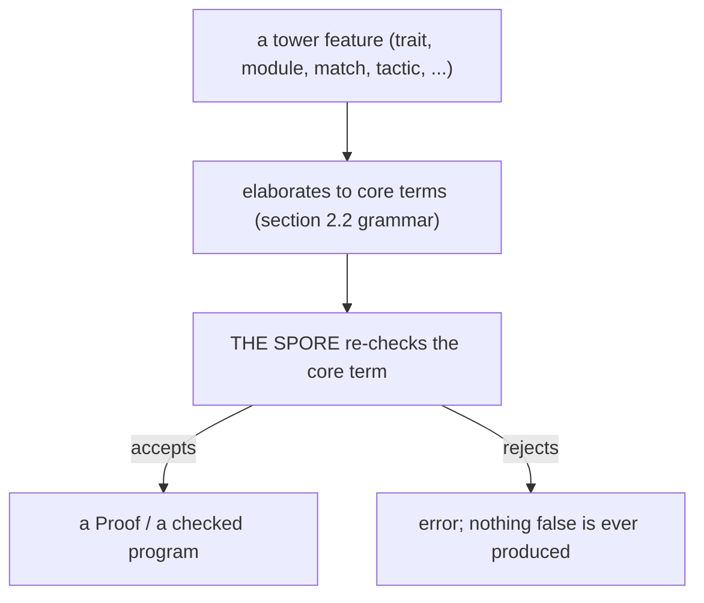
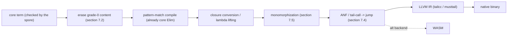
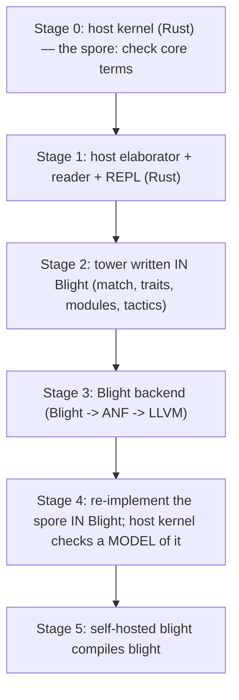
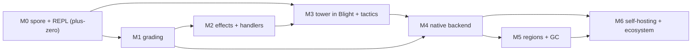

# The Blight Language Design Specification

> **Blight** — "Scheme's soul, a proof assistant's spine, grown from one spore."

Status: **Design v0, implemented.** This document is the canonical specification the
implementation was designed against; see [README.md](../README.md) for current build/milestone
status (M0–M24 and beyond) and [docs/roadmap-post-m6.md](roadmap-post-m6.md) for what has shipped
since. It remains deliberately precise about the *trusted core* (the spore) and deliberately
open-ended about the *tower* grown above it — most of §9's roadmap below is historical narrative
for milestones that are now implemented and tested, not a forward-looking plan.

- **Language:** Blight
- **The trusted kernel:** "the spore" — the tiny thing the blight grows from
- **File extension:** `.bl`
- **Compiler / CLI binary:** `blight` (alias `blc`)
- **Host (bootstrap):** a small implementation in a host language, then self-hosted

---

## Table of contents

1. [Manifesto and philosophy](#1-manifesto-and-philosophy)
2. [The kernel (the spore): the trusted base](#2-the-kernel-the-spore-the-trusted-base)
3. [The grading spine](#3-the-grading-spine)
4. [Effects and handlers](#4-effects-and-handlers)
5. [Surface syntax and elaboration](#5-surface-syntax-and-elaboration)
6. [The tower: grown, not trusted](#6-the-tower-grown-not-trusted)
7. [Runtime and compilation](#7-runtime-and-compilation)
8. [Bootstrap and self-hosting](#8-bootstrap-and-self-hosting)
9. [Roadmap (M0..Mn)](#9-roadmap-m0mn)
10. [Frontier risks and prior art](#10-frontier-risks-and-prior-art)

---

## 1. Manifesto and philosophy

### 1.1 The one idea

Blight has exactly one load-bearing idea, and everything else is a consequence of it:

> **Trust is bounded; power is not.**
> There is a microscopic *trusted kernel* — the **spore** — and *everything else in the
> language is grown from it, in the language itself, where you can read it, extend it, and
> replace it.*

This is the LCF discipline (Milner, 1972) applied not just to theorem proving but to an
entire programming language. In LCF there is one abstract type `Theorem`, and the *only*
way to construct a value of that type is through a handful of primitive inference rules.
No matter how baroque the automation built on top becomes, it cannot manufacture a false
theorem, because the type is abstract and the kernel is the only door.

Blight takes the same move and pushes it as far as it will go: the abstract type is
`Proof` (equivalently, "a well-typed term"), the kernel is a dependent type theory, and
the "automation" is *the entire surface language* — data types, pattern matching, traits,
modules, effects, tactics, even the type-*checker*-for-conveniences. All of it is ordinary
Blight code that bottoms out in kernel rules.

### 1.2 The spore-and-blight metaphor

The name is the thesis. A blight begins as a microscopic spore and silently spreads until
it has consumed the whole organism. That is precisely how the language is built:

- **The spore** is the trusted kernel — small enough to audit, the only thing you must
  believe. "Trusted" here is the precise, load-bearing sense: *implicitly trusted* — relied on
  without any external check. That is a liability, not a compliment: a bug in it could silently
  certify something false.
- **The blight** is everything the spore grows into — an unbounded tower of features, none
  of which is privileged, all of which spread *from* the spore and can never contradict it. The
  tower is *untrusted* in the equally precise sense: *explicitly checked* — every term it produces
  is re-verified by the spore, so its bugs are caught rather than believed.

A buggy thing in the tower is not a soundness hole; it is, at worst, a feature that *fails
to grow* (fails to produce a `Proof`). It can never grow something *false*, because the
spore is the only thing that constructs `Proof`s and it checks every one.

### 1.3 The governing rule

There is one rule that disciplines the entire design:

> **Nothing is a privileged built-in unless it is irreducible kernel machinery.**

Concretely:

- If a feature *can* be derived in-language from the kernel primitives, it **must** be —
  it lives in the tower, not the spore. (Traits, modules, `do`-notation, records,
  tactics, even most of the "type system as experienced by users" are tower code.)
- A feature earns a place in the spore **only** if it is genuinely irreducible — it cannot
  be expressed by the existing primitives without itself being a primitive. (Dependent
  functions, the universe hierarchy, the cubical equality machinery, the graded-context
  discipline, and the effect-handler typing judgement are the irreducible core; see §2.)

This rule is what keeps the spore small *and honest*. It is also why this document is
careful, in §2, to enumerate the kernel exhaustively and, in §6, to show how each tower
feature reduces to it.

### 1.4 What Blight is, in one breath

A **homoiconic, Scheme-souled, REPL-first language** whose trusted core is a **dependent
(cubical) type theory with a graded-semiring resource discipline and algebraic-effect
handlers**, and whose entire surface — including the experience of "having a type system" —
is grown from that core as ordinary, inspectable, replaceable code.

You can write untyped-feeling Scheme in it and grow a program interactively. You can also
attach a *type*, or a full *proof*, to any term — and when you do, the **same** kernel
checks it. Reliability is opt-in and monotonic: unproven code is just code; proven code is
just code carrying more compile-time facts. There is no gradual-typing contract tax, and no
separate "proof layer" bolted to the side.

### 1.5 How Blight differs from its neighbors

Blight is downstream of a lot of excellent work. The differences are precise, not vague
"we're better" claims:

#### vs. Typed Racket — *no apparatus boundary*

Typed Racket bolts a type system onto an existing dynamically typed language. The seams
show: the type system must retroactively describe every dynamic idiom already in the wild;
macros and the type checker live in different worlds (a macro expands to code, *then* the
checker runs, so neither can reason about the other's intent); and the typed/untyped
boundary inserts **runtime contracts**, so "reliability" can manifest as a runtime contract
violation far from the actual bug.

Blight has **no boundary** because types are not a separate apparatus. A type *is* a term;
a proof *is* a program; the checker is the kernel that runs on the same terms as everything
else. Adding a type adds *compile-time facts*, never a runtime check.

#### vs. Haskell — *no closed engine*

GHC's type system is a large, fixed, closed apparatus implemented inside the compiler in a
language you are not writing in (a separate constraint solver). You cannot see it, grow it,
or replace it; you can only petition the GHC team for an extension. It is marble.

Blight's "type system" is **clay**: it is grown in the tower (§6), as Blight code over the
kernel. Want refinement types, a termination checker variant, a bespoke effect discipline?
You build it on the spore, the way a Lisper writes a macro or a Forth programmer defines a
word. The trusted part stays napkin-sized; the apparatus above is yours to shape.

#### vs. Lean / Agda / Coq — *a grown, in-language frontend*

These are the closest relatives: real dependent-type kernels with serious power. The
difference is *where the frontend lives*. Their elaborators and surface conveniences are,
for the most part, **fixed and compiler-authored** (Lean 4 is a notable partial exception
with its macro/elaboration extensibility — and is the system to study hardest). Blight's
frontend is, by the governing rule, **tower code grown from the spore** and meant to be
user-extensible from the start. Blight is also homoiconic and REPL-first by design, where
Agda/Coq are not.

The one honest concession (see §2, §10): we chose **full cubical** equality for univalence
and higher inductive types, which makes the spore *bigger* than an LCF napkin. We accept
that. The discipline is not "the spore is tiny no matter what" — it is "the spore contains
*only irreducible machinery*, and **everything else** grows from it." Cubical machinery is
irreducible if you want univalence; convenience is not.

### 1.6 Reader's guide

§2–§4 specify the spore (the trusted base) and are the parts that must be exactly right.
§5 shows the surface syntax and how it elaborates *into* the spore. §6 is the heart of the
philosophy in practice: it shows the tower features reduced to kernel primitives. §7–§9 are
engineering (runtime, bootstrap, roadmap). §10 is intellectual honesty: where Blight sits
at the research frontier, what is unproven, and the concrete fallback for each risk.

---

## 2. The kernel (the spore): the trusted base

This section is the trusted base. It is the part you must believe to believe anything Blight
tells you. Everything else in the language (§5, §6) is checked *by* this; nothing else is
trusted.

The spore is a **dependent cubical type theory** with three irreducible extensions baked in:
**cumulative universe polymorphism**, a **graded-semiring resource discipline** on contexts
(§3), and an **algebraic-effect-handler typing judgement** (§4). We list the term grammar,
the judgement forms, and the complete set of inference rules. The exhaustiveness is the
point: if a rule is not here, it is not trusted, and any feature that seems to need it must
either be reduced to these rules or justified for inclusion in the spore under the governing
rule of §1.3.

### 2.1 The abstract `Proof` and the only door

```text
opaque Proof          -- abstract; NO public constructor, ever
concl  : Proof -> Judgement     -- read a proof's conclusion (safe to expose)
```

`Proof` is an opaque type. A value of type `Proof` can be produced *only* by the inference
rules in §2.5–§2.10. There is no `mkProof`, no escape hatch, no `unsafe`. The host
implementation (§8) must enforce this with module-level abstraction: the `Proof` constructor
is private to the kernel module. This single invariant is what makes the whole discipline
sound:

> A `Proof` in hand is a guarantee that *these rules, and only these rules, were followed.*

`concl` is the one safe observation: given a proof, you may read what it proves (a
`Judgement`). You can never go the other way.

### 2.2 Terms

Terms and types are the same syntactic category (this is the "types are terms" of dependent
theory). Blight terms are, at the surface, s-expressions (§5); the kernel works on the
elaborated core grammar below. We write the core grammar abstractly:

```text
Term, Type ::=
  -- core dependent layer
  | x                              -- variable
  | Univ ℓ                         -- universe at level ℓ (see §2.4)
  | Pi  (x :^ρ A) B                -- dependent function type; ρ is a grade (§3)
  | Lam x t                        -- function
  | App f a                        -- application
  | Sigma (x : A) B                -- dependent pair type
  | Pair a b                       -- pair
  | Fst p | Snd p                  -- projections

  -- data / recursion (kernel-level inductive families; see §2.7)
  | Data D params indices          -- a (higher) inductive type
  | Con  c args                    -- a constructor
  | Elim D motive methods scrutinee-- the eliminator / dependent recursor

  -- cubical layer (see §2.6)
  | Interval                       -- the interval type 𝕀  (a pretype, not in any Univ)
  | I0 | I1                        -- interval endpoints 0, 1
  | IMin r s | IMax r s | INeg r   -- De Morgan interval algebra (∧, ∨, ¬)
  | Path A x y                     -- path type:  PathP over a constant family
  | PathP (i. A) x y               -- dependent path over a line of types A : 𝕀 → Type
  | PLam i t                       -- path abstraction  (λ i. t)
  | PApp p r                       -- path application  (p @ r), r : 𝕀
  | Partial φ A                    -- partial element of A on cofibration φ
  | PSys [ (φᵢ ↦ tᵢ) ]             -- a system: term defined on a cofibration cover
  | Comp (i. A) φ u a0             -- Kan composition
  | HComp A φ u a0                 -- homogeneous composition (special case)
  | Transp (i. A) φ a0             -- transport
  | Glue A φ T e                   -- Glue type
  | glue ... | unglue ...          -- Glue intro/elim
  | ua e                           -- univalence:  Equiv A B → Path (Univ ℓ) A B

  -- effects (see §4 and §2.10)
  | Op  op args                    -- perform an algebraic operation
  | Handle h t                     -- run t under handler h
  | Cont k                         -- a captured (delimited) continuation value
```

Cofibrations `φ` (the "where is this partial element defined" constraints) have their own
small grammar:

```text
Cofib φ ::= (r = 0) | (r = 1) | φ ∧ φ | φ ∨ φ | ⊤ | ⊥        -- r : 𝕀
```

Notes that matter:

- `Interval` (`𝕀`) is a **pretype**: it has elements (`I0`, `I1`, variables, De Morgan
  combinations) but is **not** a member of any universe `Univ ℓ`. You may not quantify over
  `𝕀` to form a *type* and you may not store interval values at runtime; they are
  compile-time-only dimension data. This is the standard CCHM restriction and it is what
  keeps `𝕀` from polluting the value world.
- `Path A x y` is sugar for `PathP (i. A) x y` where the line `A` is constant in `i`.
- Grades `ρ` (on `Pi` binders and in contexts) are specified in §3; the cubical and effect
  rules below thread grades through but we keep grade bookkeeping in §3 to avoid clutter
  here.

### 2.3 Judgements

The kernel has the following judgement forms. Each is a `Judgement` that a `Proof` may
conclude (so `concl : Proof -> Judgement` ranges over these):

```text
⊢ Γ                         -- Γ is a well-formed context
Γ ⊢ A type                  -- A is a well-formed type (A : Univ ℓ for some ℓ)
Γ ⊢ t : A                   -- t has type A   (the central judgement)
Γ ⊢ A ≡ B                   -- A and B are definitionally equal types
Γ ⊢ s ≡ t : A               -- s and t are definitionally equal terms at A
Γ ⊢ r : 𝕀                   -- r is a well-formed interval term
Γ ⊢ φ cofib                 -- φ is a well-formed cofibration
Γ, φ ⊢ ...                  -- judgement under an assumed cofibration (φ ⊢ ⊤)
Γ ⊢ t ! E : A               -- t has type A and may perform effects in row E (§4)
```

Contexts carry grades (§3):

```text
Context Γ ::= · | Γ, x :^ρ A           -- ρ is the grade/multiplicity of x
```

The graded judgement is really `Γ ⊢ t :^σ A` ("t uses its context with the resource vector
recorded in Γ, and is itself demanded at grade σ"); §3 gives the resource arithmetic. In
§2.5–§2.10 we suppress σ where it is `ω` (unrestricted) for readability and call out grades
only where they bite.

### 2.4 Universes: cumulative + polymorphic

To avoid Girard's paradox (`Type : Type` is inconsistent) the kernel has a hierarchy:

```text
Γ ⊢ Univ ℓ : Univ (ℓ+1)                          (U-Type)

Γ ⊢ A : Univ ℓ      ℓ ≤ ℓ'
---------------------------------                 (U-Cumul)  -- cumulativity
Γ ⊢ A : Univ ℓ'
```

Levels `ℓ` are themselves first-class enough to be quantified over (**universe
polymorphism**), via a separate sort of level variables:

```text
Level ℓ ::= 0 | suc ℓ | ℓ ⊔ ℓ' | u        -- u a level variable
```

```text
Γ, u : Level ⊢ A : Univ (f u)
-----------------------------------------         (U-Poly)
Γ ⊢ (∀ u. A) : Univ ω_lvl
```

(Here `ω_lvl` is the limit *level* that dominates every `f u` — the level of a
level-polymorphic type. It is a universe level, not the resource grade `ω` of §3; the
reuse of the symbol `ω` in the two unrelated lattices is unfortunate, so we subscript the
level form as `ω_lvl`.)

A definition may be **level-polymorphic**: `id : ∀ u. (A : Univ u) → A → A`. The tower (§6)
relies on this so that derived constructions (lists, traits, modules) are generic over
universe level rather than duplicated per level. Cumulativity (`U-Cumul`) lets a `Univ ℓ`
inhabitant be used where a higher universe is expected without explicit lifting.

> **Design note (Prop / proof irrelevance).** Because we chose univalence (§2.6), we
> **cannot** have definitional UIP (it contradicts univalence). Proof irrelevance, where we
> want it, comes from cubical machinery (truncation as a HIT, e.g. propositional truncation
> `‖A‖`) and/or a designated sub-universe of *propositions* `Prop ℓ ⊂ Univ ℓ` whose members
> are provably h-propositions. `Prop` here is **not** an impredicative Coq-style `Prop`; it
> is the cubical "is-a-proposition" notion. This is called out again in §10.

### 2.5 Core dependent rules

Variable / `axiom` (the LCF "a variable is its own type in context"). The grade side
condition is given in full in §3.2; here (suppressing grades, i.e. at the unrestricted
demand `σ = ω`) it is simply:

```text
⊢ Γ      (x :^ρ A) ∈ Γ
-----------------------------------               (Var / axiom)
Γ ⊢ x : A
```

The graded refinement (§3.2) requires the available grade `ρ` to dominate the demanded grade
`σ` (`ρ ≥ σ`); crucially this permits a `0`-graded variable to be used at grade `0` (in
types), which is what the erasure story of §3.3 relies on. Do **not** read the simplified
rule above as forbidding `0`-graded use.

Dependent functions (Π):

```text
Γ ⊢ A : Univ ℓ      Γ, x :^ρ A ⊢ B : Univ ℓ'
-----------------------------------------------   (Pi-Form)
Γ ⊢ Pi (x :^ρ A) B : Univ (ℓ ⊔ ℓ')

Γ, x :^ρ A ⊢ t : B
-----------------------------------------------   (Pi-Intro / λ)
Γ ⊢ Lam x t : Pi (x :^ρ A) B

Γ ⊢ f : Pi (x :^ρ A) B      Γ ⊢ a : A'      Γ ⊢ A' ≡ A
-----------------------------------------------   (Pi-Elim / app)
Γ ⊢ App f a : B[a/x]
```

(The argument needs a type `A'` *definitionally equal* to the domain `A`; we fold the
`Conv` step into the rule explicitly here and leave it implicit elsewhere.)

Dependent pairs (Σ), with the usual forms:

```text
Γ ⊢ A : Univ ℓ      Γ, x : A ⊢ B : Univ ℓ'
-----------------------------------------------   (Sigma-Form)
Γ ⊢ Sigma (x : A) B : Univ (ℓ ⊔ ℓ')

Γ ⊢ a : A      Γ ⊢ b : B[a/x]
-----------------------------------------------   (Sigma-Intro)
Γ ⊢ Pair a b : Sigma (x : A) B

Γ ⊢ p : Sigma (x : A) B
-----------------------------------------------   (Sigma-Elim)
Γ ⊢ Fst p : A        Γ ⊢ Snd p : B[Fst p / x]
```

Conversion — the rule that lets computation drive typing:

```text
Γ ⊢ t : A      Γ ⊢ A ≡ B
-----------------------------------------------   (Conv)
Γ ⊢ t : B
```

`Conv` is where the kernel must **compute**: deciding `A ≡ B` requires normalizing terms.
The kernel's normalizer (definitional equality) includes:

- **β** (`App (Lam x t) a ≡ t[a/x]`), **η** for functions and pairs,
- **ι** (eliminators applied to constructors reduce: see §2.7),
- the **cubical computation rules** for `Transp`/`Comp`/`HComp`/`Glue` (§2.6),
- congruence and the equational theory of the **De Morgan interval** (`∧`, `∨`, `¬` with
  `I0`/`I1`).

Definitional equality is **decidable** for the non-effectful, total fragment (this is the
standard CCHM result; see §10 for the caveat that combining it with grades and effects is at
the research frontier). Normalization is by NbE (normalization by evaluation) in the host
implementation (§8).

### 2.6 The cubical layer

This is the largest single piece of the spore, and we include it deliberately to obtain
**function extensionality, univalence, and higher inductive types** — with equality that
*computes* rather than being an axiom. The cost (a big kernel, no definitional UIP) is
accepted per §1.5 and revisited in §10.

Interval and cofibrations:

```text
Γ ⊢ I0 : 𝕀        Γ ⊢ I1 : 𝕀        (x : 𝕀) ∈ Γ ⊢ x : 𝕀
Γ ⊢ r : 𝕀   Γ ⊢ s : 𝕀
-----------------------------------------------
Γ ⊢ IMin r s : 𝕀   Γ ⊢ IMax r s : 𝕀   Γ ⊢ INeg r : 𝕀
```

with the De Morgan lattice equations (`r ∧ 0 ≡ 0`, `r ∨ 1 ≡ 1`, `¬0 ≡ 1`, idempotence,
commutativity, associativity, absorption) discharged definitionally.

Path types give equality:

```text
Γ, i : 𝕀 ⊢ A : Univ ℓ      Γ ⊢ x : A[I0/i]      Γ ⊢ y : A[I1/i]
-----------------------------------------------------------------   (PathP-Form)
Γ ⊢ PathP (i. A) x y : Univ ℓ

Γ, i : 𝕀 ⊢ t : A
-----------------------------------------------------------------   (Path-Intro)
Γ ⊢ PLam i t : PathP (i. A) (t[I0/i]) (t[I1/i])

Γ ⊢ p : PathP (i. A) x y      Γ ⊢ r : 𝕀
-----------------------------------------------------------------   (Path-Elim)
Γ ⊢ PApp p r : A[r/i]
```

with boundary computation: `PApp p I0 ≡ x`, `PApp p I1 ≡ y`. `refl` is `PLam i x` (the
constant path); function extensionality is *provable* (`funext f g h = PLam i (λ x. h x @ i)`)
rather than an axiom — this is the payoff that motivated cubical.

Partial elements and systems (the machinery Kan operations need):

```text
Γ ⊢ φ cofib      Γ, φ ⊢ A : Univ ℓ
-----------------------------------------------   (Partial-Form)
Γ ⊢ Partial φ A : Univ ℓ

-- a "system" gives a value on each piece of a cofibration cover, agreeing on overlaps
Γ, φᵢ ⊢ tᵢ : A        (agree on φᵢ ∧ φⱼ)
-----------------------------------------------   (System)
Γ ⊢ PSys [φᵢ ↦ tᵢ] : Partial (⋁ φᵢ) A
```

Kan operations — the heart of "equality computes." Transport, homogeneous composition, and
general composition:

```text
Γ, i : 𝕀 ⊢ A : Univ ℓ    Γ ⊢ φ cofib   (A constant on φ)   Γ ⊢ a0 : A[I0/i]
-----------------------------------------------------------------------------   (Transp)
Γ ⊢ Transp (i. A) φ a0 : A[I1/i]

Γ ⊢ A : Univ ℓ   Γ ⊢ φ cofib   Γ, i:𝕀, φ ⊢ u : A   Γ ⊢ a0 : A  (u agrees with a0 at i=0)
-----------------------------------------------------------------------------   (HComp)
Γ ⊢ HComp A φ (i. u) a0 : A

Γ, i:𝕀 ⊢ A : Univ ℓ   Γ ⊢ φ cofib   Γ, i:𝕀, φ ⊢ u : A   Γ ⊢ a0 : A[I0/i]
-----------------------------------------------------------------------------   (Comp)
Γ ⊢ Comp (i. A) φ (i. u) a0 : A[I1/i]
```

Each Kan operation has **computation rules per type former** (how `Comp` behaves at `Pi`,
`Sigma`, `Path`, `Data`, `Univ`, `Glue`). These are numerous and are the single most
error-prone part of the kernel; the implementation (§8) treats them as a closed, heavily
tested table. `Comp` reduces to `HComp` + `Transp` in the standard way.

Glue and univalence:

```text
Γ ⊢ A : Univ ℓ   Γ ⊢ φ cofib   Γ, φ ⊢ T : Univ ℓ   Γ, φ ⊢ e : Equiv T A
-----------------------------------------------------------------------------   (Glue-Form)
Γ ⊢ Glue A φ T e : Univ ℓ
```

with `glue`/`unglue` intro/elim and the boundary rule `Glue A ⊤ T e ≡ T`. Univalence is then
realized computationally: from an equivalence `e : Equiv A B` we obtain a path
`ua e : Path (Univ ℓ) A B`, and transporting along it computes via `Glue`. (`ua` need not be
primitive if `Glue` is; we list it for clarity and the implementation may derive it.)

### 2.7 Inductive families and higher inductive types

The kernel supports **indexed inductive families** with a strict-positivity check, plus
**higher inductive types (HITs)** with path constructors (these are why we paid for cubical).

A data declaration introduces a type former `Data D`, constructors `Con c`, and a
**dependent eliminator** `Elim D` with its ι (computation) rules:

```text
-- schematic; D has parameters, indices, point constructors, and (for HITs) path constructors
Γ ⊢ Data D params indices : Univ ℓ                         (Data-Form)
Γ ⊢ Con c args : Data D params (idxs c args)               (Data-Intro)

Γ ⊢ motive : (idxs : ...) → Data D params idxs → Univ ℓ'
Γ ⊢ methods : <one per constructor, incl. path constructors>
Γ ⊢ scrut : Data D params idxs
-----------------------------------------------------------------------------   (Data-Elim)
Γ ⊢ Elim D motive methods scrut : motive idxs scrut

-- ι rule (point constructors):
Elim D motive methods (Con c args) ≡ methods.c args (Elim D motive methods on recursive args)
```

For HITs, the eliminator's methods for **path constructors** must produce *paths* in the
motive (and the ι rules use the Kan operations of §2.6 to compute transports across them).
Strict positivity and the well-formedness of path-constructor boundaries are checked by the
kernel; ill-formed declarations are rejected (they never produce a `Proof`).

> **Totality hook.** The eliminator is the *only* kernel recursion principle, and it is
> structurally terminating by construction (it recurses on subterms). General recursion in
> the surface language (§5) is **not** a kernel primitive: it is either compiled to `Elim`
> (when structural) or quarantined behind the **partiality grade/effect** (§3, §4) when not.
> This is how "total by default, partiality opt-in" is enforced at the trusted level.

### 2.8 Definitional equality (summary of what the kernel computes)

Collected for auditing, the relation `≡` decided by the kernel comprises: α (handled by a
nameless representation), β, η (Π and Σ), ι (per §2.7), the De Morgan interval theory, the
boundary rules for paths/systems/Glue, and the per-type-former Kan computation rules. It is
**congruent** and, on the total non-effectful fragment, **decidable**. The kernel exposes
only the *checking* direction (given two terms, decide `≡`); it never needs to *search*.

### 2.9 Graded contexts (forward reference)

Every context entry carries a grade `ρ` from a semiring, and every rule above implicitly
performs resource arithmetic on the context (addition when a variable is used in multiple
positions, scaling at application). This is specified in full in §3; it is part of the spore
because erasure, linearity, regions, and effect/partiality grading all derive from it and it
cannot be added after the fact without re-deriving substitution.

### 2.10 Effect-handler typing (forward reference)

The judgement `Γ ⊢ t ! E : A` ("t produces an `A`, possibly performing operations in the
graded effect row `E`"), together with the typing of `Op`, `Handle`, and captured
continuations `Cont`, is part of the spore. It is specified in §4. We flag in §10 that making
handlers a *kernel primitive* (rather than a derived encoding) interacts with the
normalization proof, and we state the fallback there.

### 2.11 What is deliberately NOT in the spore

By the governing rule (§1.3), the following are **tower** features, not kernel primitives,
and are derived in §6: pattern matching with nested/overlapping patterns (compiles to
`Elim`), `let`/`where`, records and record subtyping, type classes / traits, ML-style
modules and functors, `do`-notation, tactics, type inference conveniences, and the entire
surface macro system. None of them can manufacture a `Proof`; they can only *assemble* terms
that the spore then checks.

---

## 3. The grading spine

The grading spine is the single most important *unifying* idea in Blight after the spore
itself. It is the observation — due to the graded-modal-types literature
(Gaboardi–Katsumata–Orchard; Granule; QTT per Atkey/McBride/Idris 2) — that **erasure,
linearity, regions, effects, and partiality are all the same mechanism**: a
semiring-graded modality threaded through the typing context. Blight commits to that
unification hard: there is *one* resource discipline in the spore, and the things that look
like separate "systems" in other languages are all *instances* of it.

This is the §1.3 governing rule paying off: rather than several parallel apparatuses (an
erasure analysis, a linearity checker, a region inferencer, an effect system, a termination
checker), there is one graded judgement and five *readings* of it (§3.3–§3.6).

### 3.1 The semiring

Each context entry `x :^ρ A` carries a grade `ρ` drawn from an ordered semiring
`(R, +, ·, 0, 1, ≤)`. The default instantiation is the **zero–one–many** semiring used by
QTT:

```text
R = {0, 1, ω}      with    0 < 1 < ω
addition (+):  resource demands combine (two uses)
multiply (·):  application scales the argument's demand by the function's demand
0 = no use (erased)      1 = exactly one use (linear)      ω = unrestricted
```

with the table:

```text
  +  | 0 1 ω         ·  | 0 1 ω
 ----+-------       ----+-------
  0  | 0 1 ω         0  | 0 0 0
  1  | 1 ω ω         1  | 0 1 ω
  ω  | ω ω ω         ω  | 0 ω ω
```

The two algebraic properties that make grading *sound under substitution* (and that any
alternative semiring we plug in must satisfy) are:

- **positivity:** `ρ + π = 0  ⟹  ρ = 0 ∧ π = 0`
- **zero-product:** `ρ · π = 0  ⟹  ρ = 0 ∨ π = 0`

These are exactly the McBride/Atkey conditions; they guarantee resource accounting is
preserved when the kernel substitutes terms for variables.

> **Why a semiring and not just a flag.** Because the *same* arithmetic that tracks "how
> many times is this used" also tracks "which effects may happen" (§4) and "may this
> diverge" (§3.6). Effects are a graded *monad*; usage/linearity is a graded *comonad*; both
> are semiring-graded modalities. One mechanism, read in two polarities.

### 3.2 Graded judgement and resource arithmetic

The central judgement, written in full, is:

```text
Γ ⊢ t :^σ A          -- t is demanded at grade σ, and Γ records the resulting demand vector
```

Operations on graded contexts:

- **scaling** `ρ · Γ` multiplies every entry's grade by `ρ`,
- **addition** `Γ₁ + Γ₂` adds entrywise (requires the same variables/types),
- the **zero context** `0 · Γ` marks everything erased.

The graded forms of the key rules (compare §2.5):

```text
(x :^ρ A) ∈ Γ      ρ ≥ σ
-----------------------------------               (Var, graded)
(0·Γ), x :^σ A ⊢ x :^σ A

Γ, x :^ρ A ⊢ t :^σ B
-----------------------------------               (Lam, graded)
Γ ⊢ Lam x t :^σ Pi (x :^ρ A) B

Γ₁ ⊢ f :^σ Pi (x :^ρ A) B       Γ₂ ⊢ a :^(σ·ρ) A
-----------------------------------------------------   (App, graded)
Γ₁ + Γ₂ ⊢ App f a :^σ B[a/x]
```

In `(App, graded)` the demand on the argument is `σ·ρ` (the caller's demand `σ` scaled by the
binder's grade `ρ`), so `Γ₂` already records the scaled usage; the conclusion's context is
then the entrywise sum `Γ₁ + Γ₂` (§3.2). The `(Var, graded)` rule zeroes the rest of the
context (`0·Γ`) and charges only `x` at the demanded grade `σ`, which — with `ρ ≥ σ` —
permits `σ = 0` use in types (the erasure case, §3.3).

The slogan: **the binder's grade `ρ` in `Pi (x :^ρ A) B` says how many times the argument is
consumed**, and application *scales* the argument's demand accordingly. A function
`(x :^1 A) → B` is linear in `x`; `(x :^0 A) → B` uses `x` only for typing (erased); the
default `(x :^ω A) → B` is ordinary unrestricted use.

### 3.3 Reading 1 — Erasure (grade 0)

Grade `0` is **erasure**. A `0`-graded variable may appear in *types* but contributes
nothing at runtime and may not appear in runtime-relevant term position.

This is the crucial QTT move (and the subtle one): type formation happens in the **erased
fragment** (everything checked at grade `0`), so:

- `0 + ρ = ρ` — a type-level occurrence adds nothing to computational demand, and
- `0 · ρ = 0` — any usage nested inside a type is annihilated to `0`.

Hence anything that appears *only* in types (indices, proofs of propositions, dictionary
phantom data) is automatically erasable. The compiler (§7) erases all grade-`0` content
before code generation. This is how dependent indices and proofs cost nothing at runtime.

> **The "0-in-types" subtlety (called out honestly).** A value used *linearly* (`1`) at the
> term level still appears at grade `0` when it occurs in a *type*. Reconciling "this is
> linear computationally" with "this is freely usable in types" is a genuine source of
> rule-design friction (it is a known QTT pain point). Blight resolves it the standard way:
> type-checking sub-derivations run in the `0` fragment, and the substitution lemma is proved
> against the semiring laws of §3.1. See §10 for the deeper open issue of how this interacts
> with cubical.

### 3.4 Reading 2 — Linearity (grade 1)

Grade `1` is **exactly-once** use. This gives linear types for free: resources that must not
be duplicated or dropped (file handles, channels, unique mutable buffers, capabilities) are
typed at grade `1`, and the additive context discipline (§3.2) statically forbids using them
twice or zero times. No separate linear-type system is needed; it is the `1` of the semiring.

A consequence: **typestate** and protocol-correctness (must-close-the-file, use-after-free
prevention) are expressible directly, in the same way Idris 2 does it, but unified with
erasure and effects.

### 3.5 Reading 3 — Regions (derived from grades)

Region-based memory management — the "fanciest practical" memory story — is **derived** from
grades rather than being a separate region-inference apparatus. The idea:

- A **region** is a scope with a grade-tracked capability token (a grade-`1` value that
  represents "permission to allocate in region r").
- Allocations within the scope are tied to the token; because the token is linear (`1`), the
  kernel statically knows its lifetime, so the region's memory can be freed (arena-style)
  when the token is consumed at scope exit.
- Values *proven* (by grades) not to escape the region are arena-allocated and never touch
  the GC; values that may escape fall back to the GC (§7).

So "region inference" in Blight is a tower-level analysis (§6) that *reads off* grade
information the kernel already tracks, plus a runtime arena (§7). It is not new trusted
machinery — it is an *interpretation* of the spine. (MLKit-style region inference is the
intellectual ancestor; Blight differs by getting the lifetime facts from quantitative grades
rather than a bespoke region-and-effect inference.)

### 3.6 Reading 4 — Partiality and effects (forward to §4)

The same semiring grades the **effect row** and the **partiality** marker:

- An **effect row** `E` (§4) is itself a graded structure: each effect in the row carries a
  grade saying how the surrounding computation may use it (e.g. an effect invoked at most
  once vs. arbitrarily).
- **Partiality** ("may diverge") is just a distinguished effect/grade. Total-by-default means
  the *ambient* partiality grade is `0` (no divergence permitted, so proofs are total);
  opting into general recursion raises it, quarantining non-termination in the type exactly
  like any other effect. This is the Capretta delay-monad idea expressed through grading: a
  possibly-diverging computation has type `Delay^p A` where `p` is the partiality grade, and
  the kernel refuses to accept such a thing where a *proof* (grade-`0` partiality) is
  required.

The upshot is the unification promised at the top: erasure, linearity, regions, effects, and
partiality are five readings of one graded judgement.

### 3.7 Dependent argument multiplicity (the sharp rule)

The trickiest interaction is the grade of a **dependent** function argument: in
`Pi (x :^ρ A) B`, the binder `x` may occur both in the *codomain type* `B` (where it is used
at grade `0`, for typing) and in the *body* (where it is used at the term grade demanded by
the body). A single binder thus serves two masters. The kernel's rule (per §3.2) is:

- the **type** `B` is formed in the `0` fragment, so `x`'s occurrences in `B` impose `0`
  demand;
- the **body** imposes its own demand `ρ_body`;
- the binder's declared grade `ρ` must satisfy `ρ ≥ ρ_body` (the function promises to use the
  argument no more than `ρ` times computationally), while typing is always free.

This is the rule that makes, e.g., `(n :^0 Nat) → Vec A n → ...` work: `n` is erased
computationally (`0`) yet freely available to *index* the type of the vector. It is also the
locus of the known QTT friction (§3.3) and of the cubical open problem (§10).

### 3.8 What grades buy, summarized

| Grade reading | Mechanism | Gives you |
|---|---|---|
| `0` erasure | type-fragment checking | zero-cost indices/proofs; dependent types with no runtime overhead |
| `1` linearity | additive context | resources, typestate, no use-after-free, unique mutation |
| region | linear capability token + arena | GC-free allocation where lifetimes are statically known |
| effect grade | graded monad (row, §4) | which effects, how often; handler discipline |
| partiality grade | distinguished effect | total-by-default proofs; opt-in general recursion |

One semiring, threaded through one judgement, in the spore. Everything else reads it.

---

## 4. Effects and handlers

Effects are Blight's modern headline: a single algebraic-effects-and-handlers mechanism that
subsumes `IO`, mutable `State`, exceptions, nondeterminism, async, generators, and
(critically) **partiality**. They are *typed and inferred* — the effect row appears in the
type and is tracked by the grading spine of §3 — and handlers are realized as **delimited
continuations**.

The lineage: Plotkin–Power (algebraic effects), Plotkin–Pretnar (handlers), Eff, Koka
(row-typed effect inference), Frank (`Do Be Do Be Do`), and — for the dependently typed
setting — Brady's `Effects`. Blight's distinctive bet is that effect grading *reuses the §3
semiring* rather than being a parallel system.

### 4.1 The effectful judgement

The spore's effectful judgement (§2.10) is:

```text
Γ ⊢ t ! E : A          -- t computes an A, possibly performing operations in row E
```

A **pure** term is the special case `E = ⟨⟩` (empty row). The row `E` is a
**graded effect row**: a collection of effect labels, each carrying a grade from the §3
semiring describing how the computation may use that effect (e.g. *at most once*, *linearly*,
*arbitrarily*). Rows are unordered, support a row variable for **effect polymorphism** (à la
Koka), and combine by graded union.

```text
Row E ::= ⟨⟩ | ⟨ ℓ :^ρ ; E ⟩ | ε        -- ℓ an effect label, ρ a grade, ε a row variable
```

### 4.2 Effect declarations and operations

An effect declares a set of **operations**, each with a (dependent) type. The canonical
example, `State`:

```text
effect State s where
  get : Unit       -> s
  put : s          -> Unit
```

`get`/`put` elaborate to kernel `Op` nodes. Performing an operation is typed by:

```text
(op : Π(x : A). B) ∈ effect ℓ        Γ ⊢ a : A
-----------------------------------------------------------   (Op)
Γ ⊢ Op op a ! ⟨ ℓ :^ρ ; ε ⟩ : B[a/x]
```

i.e. performing `op` requires `ℓ` to be in the ambient row, and contributes the operation's
grade `ρ`.

### 4.3 Handlers as delimited continuations

A **handler** interprets the operations of an effect by giving, for each operation, access to
the **delimited continuation** `k` (the rest of the computation up to the `handle`). This is
the kernel `Handle`/`Cont` machinery (§2.2). The typing rule (schematic):

```text
Γ ⊢ body ! ⟨ ℓ :^ρ ; E ⟩ : A
Γ, x:Aᵢ, k:(Bᵢ → C ! E) ⊢ clauseᵢ ! E : C         (one clause per operation of ℓ)
Γ, v:A ⊢ ret ! E : C                               (return clause)
-----------------------------------------------------------------------------------   (Handle)
Γ ⊢ Handle {opᵢ x k ↦ clauseᵢ; return v ↦ ret} body ! E : C
```

The handler *discharges* `ℓ` from the row (the result row `E` no longer mentions `ℓ`), turning
an effectful computation into one with fewer effects — exactly how `runState`, `catch`,
`collect` (for nondeterminism), etc. are all the same construct. `k` is a first-class
(delimited) continuation value; calling it resumes the suspended computation.

The classic `State` handler, written in the surface language (§5), threads state by calling
`k`:

```scheme
(handle body
  [(get _ k)  (lam (s) ((k s)  s))]     ; resume with current state, keep state
  [(put s' k) (lam (_) ((k unit) s'))]  ; resume with unit, update state
  [(return v) (lam (s) v)])             ; ignore final state, yield value
;; result has type  s -> A   (state-passing), with the State effect discharged
```

### 4.4 Interaction with totality (the sharp edge)

Handlers capture continuations, and a clause may invoke `k`:

- **zero times** (exceptions: abort the computation),
- **once** (state, reader, most "linear" effects),
- **many times** (nondeterminism, generators, backtracking).

This directly threatens termination, which is dangerous in a language whose proofs must be
total. Blight controls it with the **grading spine**:

- The grade on an effect label in the row records *how many times its continuation may be
  invoked.* A `1`-graded effect's handler must call `k` exactly once; a `0`-graded one (abort)
  must not call it; an `ω`-graded one may call it freely.
- **Totality is preserved** because invoking `k` "many times" is itself an effect with a
  grade, and code that must be a *proof* runs in the row where the only permitted grades keep
  the computation terminating (in particular, the **partiality grade is `0`** for proofs).
- General recursion / unbounded looping is therefore *just* the partiality effect at a
  nonzero grade (next subsection), uniformly tracked.

> This is precisely the frontier corner flagged in §1 and §10: dependently typed handlers +
> totality + grading does not yet have a published normalization proof. §10 states the
> fallback (encode effects in the tower via a free monad / CPS, keeping the spore pure) if
> the primitive version resists a proof.

### 4.5 Partiality as an effect

"Total by default, partiality opt-in" is realized by making non-termination an effect:

```text
effect Partial where
  -- the only operation is the ability to loop; modeled as Capretta's delay
  later : (Unit -> a) -> a
```

A possibly-diverging computation has a nonzero **partiality grade** in its row; its type
records "this may not terminate." Concretely a general-recursive definition elaborates to a
*corecursive* production of a `Delay` (Capretta), which is a **total** corecursive definition
inside the kernel — "running" it is the partial effect.

- A **proof** is required at partiality grade `0`: the kernel refuses a `Delay`-typed term
  where a total proof is demanded, so logical soundness is never compromised by a loop.
- A **program** may opt into partiality grade `> 0`, getting Turing-complete general recursion
  whose non-termination is quarantined in its type — exactly like any other effect.

The known difficulty (the delay monad's native equality is "too intensional" — it counts
`later` steps; quotienting by weak bisimilarity needs countable choice, resolved via a QIIT
in Altenkirch–Danielsson–Kraus) is acknowledged in §10; because we already have HITs (§2.7),
the QIIT route is available to us, at kernel cost.

### 4.6 Why effects unify with grading (the payoff)

Effects are a graded **monad** (Katsumata's parametric effect monads; Orchard–Petricek–Mycroft):
`Tₑ A` indexed by the effect `e`. Usage/coeffects (§3) are a graded **comonad**. Gaboardi et
al. (*Combining Effects and Coeffects via Grading*, ICFP 2016) show the two live in one graded
framework, interacting via graded distributive laws; Granule (Orchard–Liepelt–Eades, ICFP
2019) implements *both* a graded possibility modality (effects) and a graded necessity modality
(usage). Blight inherits this: **the §3 semiring is the common currency for both producer
effects and consumer coeffects.** That is why Blight does not have "an effect system" and "a
linearity system" and "an erasure analysis" — it has one graded modality, read in two
polarities. (The dependent + multi-modality + handlers + normalization-proof combination is
the open frontier; §10.)

---

## 5. Surface syntax and elaboration

Blight's surface is **homoiconic s-expressions**, like Scheme. This is not nostalgia: it is
what makes the macro/elaboration tower (§6) possible, because code is data the tower can
manipulate. The surface is *not* the kernel; it **elaborates** into the core grammar of §2.2,
and only the elaborated core is checked by the spore.

### 5.1 Reading the surface

```scheme
;; comments are ;; to end of line
(define name expr)              ; top-level binding (non-recursive; shadows)
(define-rec name expr)          ; recursive binding (name in scope in its own body)
(lam (x) body)                  ; lambda;  (lam (x y) b) curries
(app f a)                       ; application; usually just (f a)
(the T e)                       ; type ascription: e checked against T
(Pi ((x A)) B)                  ; dependent function type, default grade ω
(Pi ((x A 0)) B)                ; ... with an explicit grade (0 = erased, 1 = linear)
(Sigma ((x A)) B)               ; dependent pair type
(match e [pat body] ...)        ; pattern matching (tower-derived, compiles to Elim)
(defdata D (params) clauses)    ; (higher) inductive type declaration
(effect E ops)                  ; effect declaration
(handle e clauses)              ; effect handler
```

The Lisp soul is intact: you may write untyped-feeling code and grow it in the REPL; types
and proofs are *opt-in* and attached with `the` (ascription) or surfaced by `defdata`/proof
obligations.

### 5.2 Elaboration

Elaboration is the (tower, §6) function that turns surface s-expressions into core terms,
inserting implicit arguments, solving metavariables (unification), compiling `match` to
`Elim`, and resolving traits/modules. Crucially, **elaboration is not trusted**: its output
is a core term that the spore re-checks from scratch. A buggy elaborator can only produce a
term the kernel *rejects*; it can never sneak a false `Proof` past the kernel.


### 5.3 The worked example, end to end (cubical style)

We build `Nat`, `plus`, and a proof that `plus n Zero = n`. **Important:** because Blight's
equality is **cubical** `Path` (§2.6), the proof is written in *cubical* style — `refl` is the
constant path and congruence is *path action* `(λ i. Succ (p @ i))`, **not** the
intensional-MLTT `cong` spelling used in informal sketches.

#### Data and function

```scheme
(defdata Nat ()                 ; Nat : Type 0, no parameters
  (Zero)                        ; Zero : Nat
  (Succ (n Nat)))               ; Succ : Nat -> Nat

(define-rec plus
  (lam (a b)
    (match a
      [(Zero)    b]
      [(Succ n)  (Succ (plus n b))])))
```

`match` here is **tower sugar**: it elaborates to the kernel eliminator `Elim Nat`. The
`define-rec` is structurally recursive on `a`, so it compiles to `Elim` and is accepted as
**total** (partiality grade `0`); see §6.2. Definitionally, the kernel then knows:

```text
plus Zero      b  ≡  b                         (ι on Zero)
plus (Succ n)  b  ≡  Succ (plus n b)           (ι on Succ)
```

#### The theorem (a type) and the proof (a term)

The theorem is a **type**; the proof is a **term** of that type — the dependent-types unity.
In cubical style, `Eq A x y` is `Path A x y`, `refl x` is `(plam (i) x)`, and "congruence
under `Succ`" is the path `(plam (i) (Succ (p @ i)))`.

```scheme
;; plus-zero : (Pi ((n Nat)) (Path Nat (plus n Zero) n))
(define-rec plus-zero
  (lam (n)
    (match n
      ;; base: plus Zero Zero  ≡  Zero  definitionally, so the CONSTANT path suffices.
      [(Zero)    (plam (i) Zero)]                 ; refl : Path Nat (plus Zero Zero) Zero

      ;; step: need  Path Nat (plus (Succ k) Zero) (Succ k).
      ;;   plus (Succ k) Zero ≡ Succ (plus k Zero)   (ι), so the endpoints are
      ;;     Succ (plus k Zero)  and  Succ k.
      ;;   (plus-zero k) : Path Nat (plus k Zero) k, so apply Succ pointwise along the path:
      [(Succ k)  (plam (i) (Succ ((plus-zero k) @ i)))])))
```

#### Why this typechecks (the kernel's view)

- **Base.** `plam (i) Zero` has type `PathP (i. Nat) Zero Zero` = `Path Nat Zero Zero`. The
  goal is `Path Nat (plus Zero Zero) Zero`; since `plus Zero Zero ≡ Zero` by ι (§2.7), the
  `Conv` rule (§2.5) accepts it. No UIP needed — just definitional computation plus a constant
  path.
- **Step.** Let `p = plus-zero k : Path Nat (plus k Zero) k`. Then `(p @ i) : Nat` with
  `p @ I0 ≡ plus k Zero` and `p @ I1 ≡ k`. So `(plam (i) (Succ (p @ i)))` has type
  `Path Nat (Succ (plus k Zero)) (Succ k)`. The goal is
  `Path Nat (plus (Succ k) Zero) (Succ k)`; since `plus (Succ k) Zero ≡ Succ (plus k Zero)` by
  ι, `Conv` makes the left endpoints match. The recursive call **is** the induction; the
  `plam`/`@` **is** the path action (cubical congruence).

This single example exercises the whole spine: a kernel inductive type, ι computation,
`Conv`-driven definitional equality, and cubical `Path`/`PLam`/`PApp` — and it is the M0
acceptance test (§9): the kernel plus a REPL must check exactly this.

### 5.4 Grades and effects at the surface

Grades and effect rows are surface-visible but usually inferred:

```scheme
;; an erased index (grade 0): n costs nothing at runtime but indexes the type
(define head
  (the (Pi ((a Type) (n Nat 0) (v (Vec a (Succ n)))) a)
       (lam (a n v) ...)))

;; a linear resource (grade 1): the handle must be used exactly once
(define with-file
  (the (Pi ((path String) (k (Pi ((h Handle 1)) (! IO Unit)))) (! IO Unit))
       ...))

;; an effectful computation: the row ! (State Nat) is inferred and shown in the type
(define tick
  (lam (_) (put (Succ (get unit)))))     ; tick : Unit -> Unit ! (State Nat)
```

The `!` marks the effect row (§4); `0`/`1`/(default `ω`) are grades (§3). Both elaborate into
the graded, effectful kernel judgements; neither is new trusted machinery.

---

## 6. The tower: grown, not trusted

This section is the philosophy made operational. Everything here is **ordinary Blight code**
that produces core terms the spore checks. None of it is trusted; a bug in any of it is, at
worst, a feature that fails to grow. We give, for each tower feature, the *reduction to kernel
primitives* — the proof that it earns no place in the spore.

The general shape of every tower feature:



### 6.1 The elaborator (`infer` / `check`)

The bidirectional elaborator is itself a Blight program: two mutually recursive functions
over surface terms.

```scheme
;; infer : Ctx -> Surface -> (CoreTerm , CoreType)        -- synthesize a type
;; check : Ctx -> Surface -> CoreType -> CoreTerm         -- check against a type
(define-rec infer
  (lam (ctx e)
    (match e
      [(Var x)        (lookup ctx x)]
      [(App f a)      (let ([(cf tf) (infer ctx f)])
                        (match (whnf tf)
                          [(Pi dom cod) (let ([ca (check ctx a dom)])
                                          (pair (CApp cf ca) (subst cod ca)))]))]
      [(The t e)      (let ([ct (check-type ctx t)])
                        (pair (check ctx e ct) ct))]
      ...)))
```

The output `CoreTerm` is handed to the spore. **The elaborator is untrusted**: if `infer`
returns a wrong core term, the spore rejects it. So even the "type checker the user
experiences" is tower code — the §1.3 rule applied to the checker itself. (Racket's
`turnstile` is the proof-of-concept that a type system can be implemented *as* macros; Blight
generalizes it over a dependent kernel.)

### 6.2 `defdata` / `define-rec` / `deftotal`

- **`defdata`** is a macro expanding a surface data declaration into a kernel inductive family
  (§2.7): it emits the `Data` former, the `Con` constructors, and the dependent `Elim`. For
  HITs it also emits path constructors. The spore performs the strict-positivity check.
- **`match`** is a macro compiling nested/overlapping surface patterns into nested `Elim`
  applications (pattern-match compilation à la Augustsson/Maranget), producing a core term.
  Coverage/exhaustiveness is checked here in the tower; a non-exhaustive match fails to
  elaborate.
- **`define-rec`** for a *structurally* recursive definition compiles to `Elim` (total,
  partiality grade `0`). For a non-structural definition it elaborates into the **partiality
  effect** (§4.5): the result type gains a nonzero partiality grade, quarantining the
  divergence. `deftotal` is `define-rec` that *requires* the structural/`Elim` compilation to
  succeed (partiality grade must be `0`), erroring otherwise — this is the surface knob for
  "I assert this is total, prove it."

### 6.3 Tactics

A **tactic** is just a function that tries to build a core term of a given type (a `Proof`).
Tactics are tower code; they cannot forge proofs (they call the elaborator/kernel).

```scheme
;; a goal is a (Ctx, Type); a tactic maps a goal to a core term (or fails)
;; tactic : Goal -> CoreTerm
(define (refl-tac goal)              ; closes  Path A x x  via the constant path
  (match (goal-type goal)
    [(Path A x _)  (CPLam 'i (core x))]))

(define (induction-tac var goal)     ; reduces a goal to per-constructor subgoals via Elim
  ... emits (CElim D motive methods scrut), recursively solving methods ...)
```

`induction`, `rewrite` (transport along a `Path` using `Transp`, §2.6), `refl`, `assumption`,
`exact`, and a tactic combinator language (`then`, `orelse`, `repeat`) are all library
functions. A buggy tactic produces a term the spore rejects — never a false theorem. This is
the LCF guarantee restated for Blight.

### 6.4 Traits / type classes

Traits are **derived**, not primitive. A trait is a record of methods (a `Sigma`/record type),
an `impl` is a value of that record, and **instance resolution** is an elaboration-time search
that inserts the right record as an implicit argument. Two compilation strategies, both tower:

```scheme
(trait Show (a)
  (show (Pi ((x a)) String)))
;; elaborates to a record type:
;;   ShowDict : Type -> Type
;;   ShowDict a = (Sigma ((show (Pi ((x a)) String))) Unit)

(impl (Show Nat)
  (show nat->string))
;; elaborates to a dictionary value  showNat : ShowDict Nat

;; a constrained function:
(define label (the (Pi ((a Type) (d (ShowDict a) 0?) (x a)) String)
                   (lam (a d x) (string-append "value = " ((fst d) x)))))
```

- **Dictionary passing:** the constraint `Show a =>` becomes an (often grade-`0`-erasable)
  implicit dictionary argument; resolution fills it in. Small binaries, separate compilation.
- **Monomorphization:** whole-program specialization inlines the dictionary and erases it
  entirely (zero-cost, MLton-style). §7 picks the default.

Either way: **no kernel changes.** Traits are records + implicit search, both tower-level.
Coherence/overlap rules are tower policy.

### 6.5 ML modules and functors

Modules are **dependent records**; signatures are **record types**; functors are **functions
between records**. Because the kernel is dependent, this is direct (the 1ML / first-class-
modules observation: ML modules *are* dependent records):

```scheme
(signature ORD (a)                       ; => a record TYPE
  (compare (Pi ((x a) (y a)) Ordering)))

(module Nat-Ord                          ; => a record VALUE of that type
  (compare nat-compare))

(functor RedBlackTree ((E ORD))          ; => a FUNCTION from a record to a record
  (module ... uses (compare E) ...))
```

`functor` is `lam` over a record; `signature` is a `Sigma`-style record type; applying a
functor is application. Sharing constraints, `where type`, and abstraction (sealing) are tower
elaboration features over the same record machinery. Traits (§6.4) and modules thus coexist as
*two ergonomic interfaces to the same dependent-record substrate* — the "Rust-meets-OCaml"
design, but unified at the core rather than bolted together.

### 6.6 Hygienic macros and `do`-notation

Because Blight is homoiconic, macros are functions from syntax to syntax with hygiene (à la
Scheme `syntax-rules`/`syntax-case`, and Lean 4's hygienic macros). They run at
expansion-time, *before* elaboration, so they are the most "Lisp" layer. `do`-notation for any
effect/monad, list comprehensions, `let*`, records-with-update, and even new binding forms are
macros — added by users, not the compiler team. A macro can be **type-aware** by invoking the
elaborator on subterms (typed metaprogramming, à la MetaOCaml/Template Haskell/Lean
elaboration), which is the cure for Typed Racket's "macros and types are strangers" problem
(§1.5).

### 6.7 The discipline, restated

| Tower feature | Reduces to | Trusted? |
|---|---|---|
| `infer`/`check` elaborator | produces core terms; spore re-checks | no |
| `match` / patterns | nested `Elim` (§2.7) | no |
| `defdata` | `Data`/`Con`/`Elim` emission | no (spore checks positivity) |
| `define-rec`/`deftotal` | `Elim` (total) or `Partial` effect | no |
| tactics (`induction`, `rewrite`, ...) | core-term builders calling the kernel | no |
| traits / classes | records + implicit search | no |
| modules / functors | dependent records + functions | no |
| `do`-notation, comprehensions | hygienic macros | no |

Every row reduces to §2. The spore never grew. That is the whole game.

---

## 7. Runtime and compilation

The spore is about *truth*; this section is about *speed*. Blight aims to be a genuinely fast
compiled language, not just a proof assistant, and the design is chosen so that the proof
machinery costs nothing at runtime.

### 7.1 The compilation pipeline



Everything downstream of the spore is *untrusted* compilation: it must preserve behavior, but
it cannot affect soundness (the term was already proved well-typed). A miscompilation is a bug,
not an unsoundness.

### 7.2 Erasure via grade 0

The first post-check pass **erases all grade-`0` content** (§3.3): type indices, proofs,
dictionaries proven phantom, and any binder used only in types. Because the grading discipline
guarantees `0`-graded data is never runtime-relevant, erasure is sound by construction. The
result is that dependent types, indexed families (`Vec a n`), and embedded proofs have **zero
runtime footprint** — you pay only for the data you actually compute with. This is the QTT /
Idris 2 erasure story, here flowing directly from the §3 spine.

### 7.3 Memory: GC, with region elision

Default is a **precise tracing garbage collector** (start with a simple copying/semi-space
collector; evolve toward generational/compacting). On top of that, **region elision** (§3.5)
uses grade information to arena-allocate values whose lifetimes are statically known and free
them deterministically without ever tracing them:

- values proven (via linear region tokens, §3.5) not to escape a scope → arena alloc/free, no
  GC;
- everything else → GC.

So the GC mostly has nothing to do in region-disciplined code (the "fanciest practical"
memory: a collector that idles). The runtime owns the heap, so we control object layout,
stack maps, and safepoints (next).

### 7.4 Guaranteed tail calls and unbounded stacks

Iteration in Blight *is* tail recursion, so TCO is **mandatory**, not optional. Two tiers,
both guaranteed:

1. **Self / mutual tail recursion → jumps, in our own IR.** A tail-call-to-`goto` pass runs on
   the **ANF** core (where every call is named and tail position is syntactically obvious),
   turning self- and mutual-tail-calls into loops *before* LLVM. This guarantee does not depend
   on LLVM's mood.
2. **General tail calls → `tailcc` + `musttail`.** Calls in tail position to unknown functions
   lower to LLVM's `tailcc` calling convention with `musttail`, so a missed tail call is a
   **compile error**, not a silent stack overflow.

Because the runtime is ours, the **stack is segmented/growable** (Go-early-style), so even
non-tail deep recursion and effect-handler continuations (§4.3, which are delimited
continuations over this stack) never hit a fixed limit.

**The sharp interaction — safepoints vs. `musttail`.** A GC safepoint that must run *after* a
logically-final call breaks `musttail`'s "call is the last thing" requirement. Blight's rule
(baked in from the start, not discovered later): **poll for GC at loop back-edges and function
entry, never immediately before a tail call.** This keeps tail position clean for `musttail`
while still bounding GC latency. Effect-handler continuation capture also respects this by
saving roots at entry/back-edges only.

### 7.5 Polymorphism representation

Default: **whole-program monomorphization** (MLton-style). Generic functions and trait methods
are specialized per concrete type, giving unboxed data, direct calls, and zero-cost traits
(§6.4). This is the "target something fast" decision; it is what lets a dependently typed
functional language hit native speed.

Trade-offs accepted: no separate compilation, larger binaries, slower compiles — fine for the
language's goals; mitigated later by a dictionary-passing fallback for code size-sensitive
builds (the §6.4 alternative strategy), selectable per build.

### 7.6 Backends

- **Primary:** LLVM (via `inkwell`-style bindings from the host language, §8), `tailcc`/
  `musttail` for tails.
- **Secondary (later):** WASM, essentially for free because the ANF IR is retargetable; the
  custom runtime (GC, segmented stack, effect trampoline) ports to WASM with the usual caveats.
- The custom runtime exists precisely to provide what LLVM alone cannot promise: segmented
  stacks, safepoints, and the effect/continuation trampoline.

---

## 8. Bootstrap and self-hosting

The romantic goal (chosen in design discussion) is to **self-host as soon as possible**: the
blight should grow from its own spore. But you cannot write Blight in Blight before Blight
exists, so there is a bootstrap path.

### 8.1 Host language

The bootstrap implementation is written in **Rust** (with `inkwell`-style LLVM bindings for the
backend, §7). Rust is chosen for: excellent LLVM tooling, strong support for the tree-walking
and NbE the kernel needs, and the ability to enforce the `Proof` abstraction boundary at the
module level (private constructor — §2.1).

### 8.2 Bootstrap stages



- **Stage 0 (the spore, in Rust).** Implement only §2–§4: core term representation, NbE
  normalizer, the inference rules, graded contexts, the cubical Kan table, the effect-handler
  judgement. This is the trusted base and is kept deliberately small and heavily tested.
- **Stage 1 (host frontend).** Reader (s-expr parser), bidirectional elaborator, and a REPL,
  in Rust. Enough to type `plus-zero` (§5.3) at a prompt and have the Stage-0 spore check it.
  This is **M0** (§9).
- **Stage 2 (tower in Blight).** Rewrite the tower (§6) — `match`, `defdata`, traits, modules,
  tactics — *in Blight itself*, as ordinary code over the kernel. The host elaborator bootstraps
  this.
- **Stage 3 (backend).** The §7 compiler (erasure, ANF, monomorphization, LLVM) — initially in
  Rust, later re-expressible in Blight.
- **Stage 4 (self-verifying spore).** Implement a model of the spore *in Blight* and have the
  trusted host kernel **check** that model (proving, inside Blight, properties of Blight's own
  kernel — the metacircular payoff). This is the "spore that knows itself."
- **Stage 5 (full self-hosting).** Blight compiles Blight; the Rust host is retained only as a
  bootstrap seed and an independent re-checker.

### 8.3 The trusted base and auditing

The whole point of the spore is that the **trusted computing base (TCB)** is small and
auditable. "Trusted" is meant precisely: *implicitly trusted* — believed without any external
check (a bug there is silent and could mint a false `Proof`), as opposed to the tower, which is
*explicitly re-checked* (a bug there is caught). The TCB consists of exactly:

1. the Stage-0 kernel (§2–§4): term rep, normalizer, inference rules, Kan table, grading
   arithmetic, effect judgement;
2. the `Proof` abstraction boundary (the private constructor invariant, §2.1);
3. the host language's soundness (Rust) and the hardware/OS — unavoidable, shared by all tools.

**Not** in the TCB: the elaborator, macros, tactics, pattern-match compiler, traits/modules,
the backend/codegen, and the REPL. A bug anywhere in that list cannot produce a false `Proof`;
it can only fail to produce one, or (for the backend) miscompile a program already proven
well-typed.

Auditing story:

- The kernel is kept under a hard line-count budget and reviewed as a unit; the cubical Kan
  table is the riskiest part and gets exhaustive conformance tests (against Cubical Agda's
  expected reductions where applicable).
- **Independent re-checking:** because `concl` exposes the conclusion and proofs are core
  terms, a second, independent implementation of *only the spore* (e.g. the Stage-4 Blight
  model, or a minimal external checker) can re-verify any proof. Two small checkers agreeing is
  far stronger evidence than one big trusted compiler.
- The honest caveat (§10): the *combination* of cubical + grading + effects in one kernel does
  not yet have a published normalization/decidability proof, so "the TCB is sound" currently
  rests on the component results plus testing, not a single end-to-end metatheorem. The
  stratification/encoding fallbacks (§10) exist precisely so that, if the unified proof proves
  out of reach, we can retreat to a configuration that *is* proved sound.

---

## 9. Roadmap (M0..Mn)

"Go-big vision, but make something run early." The ambition is the full system; the *delivery*
is ordered so a binary executes as soon as possible and each milestone is independently
demonstrable.

### M0 — The spore + a REPL that checks `plus-zero`

The acceptance test for M0 is exactly the §5.3 example: a user types `Nat`, `plus`, and the
cubical `plus-zero` proof at a REPL and the kernel accepts it.

- Stage-0 kernel (§2): core terms, NbE normalizer, Π/Σ/`Univ`/`Conv`, inductive families +
  `Elim` with ι, and the **cubical layer** (interval, `Path`, `PLam`/`PApp`, a minimal Kan
  table sufficient for `plus-zero`).
- Stage-1 frontend (§8): reader, a minimal bidirectional elaborator, `defdata`/`match`/`define-rec`,
  and a REPL.
- **Done when:** `plus-zero` checks, and a non-proof (e.g. a wrong `Succ` step) is *rejected*.

### M1 — Grading spine

- Add graded contexts (§3): the `{0,1,ω}` semiring, graded Var/Lam/App, erasure of grade-`0`.
- Surface grades (`(x A 0)`, `(x A 1)`), the dependent-argument-multiplicity rule (§3.7).
- **Done when:** `Vec a n` with an erased `n` checks and `n` is confirmed erased; a
  linear-resource misuse (use-twice) is rejected.

### M2 — Effects and handlers

- The effectful judgement `! E` (§4), effect declarations, `Op`, `Handle`, delimited
  continuations; graded effect rows; the `State` example (§4.3).
- Partiality as an effect (§4.5); `deftotal` enforcing partiality grade `0`.
- **Done when:** the `State` counter runs under its handler; a divergent `define-rec` is
  typed with a nonzero partiality grade and rejected where a proof is required.

### M3 — The tower in Blight + tactics

- Rewrite tower features (§6) in Blight: richer `match`, traits (§6.4), modules/functors
  (§6.5), hygienic macros (§6.6).
- Tactic library (§6.3): `refl`, `induction`, `rewrite`, combinators.
- **Done when:** `plus-zero` is provable *by tactics*; a `Show`/`Ord` trait and a functorized
  `RedBlackTree` typecheck.

### M4 — Native backend

- Erasure pass, closure conversion, monomorphization, ANF, tail-call-to-jump, LLVM (`tailcc`/
  `musttail`), the runtime (copying GC, segmented stack, effect trampoline) — §7.
- **Done when:** a Blight program compiles to a native binary that runs, with a
  million-deep tail-recursion that does not overflow, and grade-`0` content confirmed absent
  from the binary.

### M5 — Region elision + GC maturation

- Region tokens (§3.5) and arena allocation driven by grades; generational/compacting GC.
- **Done when:** a region-disciplined workload shows allocations bypassing the GC.

### M6 — Self-hosting + ecosystem

- Stage-4/5 (§8): the spore modeled in Blight and checked; Blight compiling Blight.
- Stdlib, package manager ("spores"/"strains"), docs, error-message quality, WASM backend.
- **Done when:** the bootstrap Rust host is needed only as a seed/re-checker.

### M7–M14 — post-M6 hardening

Capability and soundness hardening after self-hosting — console/foreign/heap/int codegen, re-checker
completeness (effects at the type level, full N-parameter / M-index families, partiality), the
dependent-match **refinement port into the trusted kernel** (closing the kernel↔re-checker
asymmetry), evidence-backed metatheory notes (§10.3/§10.4), and the intrinsically-typed self-host
sketch — is tracked with per-milestone acceptance tests in
[docs/roadmap-post-m6.md](roadmap-post-m6.md). The only deliberate TCB growth in this band is
primitive ints (M10) and dependent-match refinement (M12), both reviewed and isolated.

### M15–M19 — multicore + distributed runtime

Share-nothing concurrency and a data-only distributed transport, built entirely in the untrusted
tower/runtime: per-thread runtime state (M15, `BL_THREAD_LOCAL`), a `std/actor.bl` actor/CSP surface
as graded effects whose resume-once safety is kernel-enforced (M16), a native share-nothing worker
pool (M17), a structural data-only (de)serializer (M18), and an untrusted Rust TCP transport
(`blight-net`, M19) reusing the serializer's wire format. **Zero TCB growth and zero new `foreign`
axioms** — the kernel never sees a thread or a socket. Per-milestone acceptance tests (including the
`worker_pool_scales_with_cores` and `serializer_throughput_reported` performance proofs) are in
[docs/roadmap-post-m6.md](roadmap-post-m6.md); see also [docs/performance.md](performance.md)
§"Multicore".

### Dependency view



The critical first step is unambiguous: **M0 is the spore and a REPL that checks the cubical
`plus-zero`.** Nothing in the tower is built until that core idea executes.

---

## 10. Frontier risks and prior art

Intellectual honesty section. None of Blight's *individual* ingredients are new; each is
battle-tested somewhere. What is novel — and therefore *risky* — is the **specific
combination** of all of them in one kernel. This section names the prior art Blight steals
from, isolates the two genuinely unproven corners, and commits to a concrete degradation path
for each, so that a research dead-end becomes a fallback rather than a project-killer.

### 10.1 Prior art (what each piece comes from)

| Ingredient | Canonical prior art | One-line idea Blight borrows |
|---|---|---|
| Dependent types, proofs-as-programs | Martin-Löf type theory; Agda, Coq, Lean, Idris | the type is the theorem; the program is the proof |
| Cubical equality, univalence, HITs | CCHM (Cohen–Coquand–Huber–Mörtberg); Cubical Agda; redtt/cooltt | equality is a `Path`; univalence and HITs *compute* via Kan ops |
| Quantitative grading (0/1/ω) | McBride *Plenty o' Nuttin'*; Atkey *Syntax & Semantics of QTT* (LICS'18); Idris 2 (Brady, ECOOP'21) | one semiring unifies erasure + linearity |
| Graded effects + coeffects together | Gaboardi–Katsumata–Orchard et al. (ICFP'16); Granule (ICFP'19) | effects = graded monad, usage = graded comonad, one framework |
| Algebraic effects + handlers | Plotkin–Power; Plotkin–Pretnar; Eff; Koka; Frank | effects are operations; handlers are delimited-continuation interpreters |
| Dependently typed effects | Brady, *Programming and Reasoning with Algebraic Effects and DT* (ICFP'13) | effects embedded in a dependent language; typestate |
| Totality + partiality-as-effect | Turner *Total FP*; Capretta delay monad; Altenkirch–Danielsson–Kraus (FoSSaCS'17, partiality as a QIIT) | total by default; divergence quarantined as an effect |
| Region memory from static lifetimes | MLKit region inference; Cyclone | free arenas when lifetimes are statically known |
| Tiny trusted kernel (LCF discipline) | Milner's LCF; HOL Light (~400-line kernel) | one abstract `Theorem`/`Proof`, one locked door |
| Type system *as macros* | Racket `turnstile`; Lean 4 elaboration | the checker/elaborator can be grown in-language |
| Whole-program monomorphization | MLton | specialize generics → native speed, zero-cost abstractions |
| Homoiconic, macro-first, REPL-grown soul | Scheme/Lisp; Forth (concatenative kernel-grows-words) | code is data; grow the language from a tiny core |

Nearest *whole-language* neighbors to study hardest: **Lean 4** (homoiconic-ish macros +
powerful kernel + extensible elaboration — the closest to Blight's "grow the frontend"
ethos), **Idris 2** (QTT in practice), **Cubical Agda** (the cubical kernel reference), **Koka
/ Frank / Eff** (effects), **Granule** (graded modalities), and **Effekt** (effects + a notion
of regions/second-class values). Blight's claim to novelty is not any one of these but their
*union*: strict-ish dependent **cubical** core + **QTT grading** + **graded algebraic-effect
handlers** + **regions-from-grades** + **total-by-default-with-partiality-as-effect** +
**LCF-style tiny trusted door** + **homoiconic, in-language tower** + **monomorphizing native
backend**. That exact intersection appears to be unexplored.

### 10.2 Nearest living relatives (the systems to benchmark against)

Two existing systems are close enough that Blight should be measured against them
continuously, not just cited. Both were re-checked against their primary docs/papers while
writing this section.

**Lean 4 — the nearest relative on the "grow the frontend from a small kernel" thesis.** The
Lean 4 system description and reference docs describe, almost point-for-point, the architecture
Blight commits to:

- *"Lean has a relatively small trusted kernel ... the rich API allows users to ... implement
  their own reference checkers."* — Blight's spore + independent re-checking (§8.3).
- *"Termination is guaranteed by elaborating all recursive functions into uses of primitive
  recursors"*, and the kernel *"does not include a syntactic termination checker, nor does it
  perform unification."* — exactly Blight's `Elim`-only kernel (§2.7) with an **untrusted**
  elaborator doing unification/coverage (§6.1).
- *"Lean 4 is fully extensible: users can modify and extend the parser, elaborator, tactics,
  decision procedures, pretty printer, and code generator,"* via a **hygienic macro system.** —
  Blight's tower-grown frontend (§6) and homoiconic macros (§6.6).

So Lean 4 is *proof the discipline works at scale.* Blight's intended differentiators over Lean
are: **(1)** full **cubical** equality (Lean uses intensional identity + quotients, not paths/
univalence); **(2)** **QTT quantities in the core** (Lean has no multiplicities); **(3)** effects
as a first-class **graded** notion (Lean uses monads/`IO`); and **(4)** a more radical
homoiconic, REPL-first, "everything is grown" stance. Lean's decisive advantage over Blight is
the obvious one: *it exists, is mature, and is proven sound.* Any Blight design decision that
diverges from Lean should be able to say *why* the divergence is worth it.

**Effekt — the nearest relative on effects + regions.** Effekt combines algebraic effect
handlers with **second-class** values and a notion of **regions**, using capability-passing to
compile handlers efficiently. That is the closest existing pairing to Blight's "graded effects
(§4) + regions-from-grades (§3.5)" story — closer than Koka (effects but no regions) or MLKit
(regions but no effects). Blight differs by deriving regions from the *same* quantitative grades
that drive erasure/linearity rather than from a separate second-class/region discipline, and by
sitting on a dependent cubical core. Effekt is the system to study for *how effect handlers and
region-like lifetime control coexist in a real compiler.*

(The other reference points remain: **Idris 2** for QTT-in-practice, **Cubical Agda** for the
cubical kernel, **Koka/Frank/Eff** for effect rows and handlers, **Granule** for multiple graded
modalities at once, **HOL Light** for the napkin-sized kernel, **MLton** for monomorphization,
and **Racket `turnstile`** for "a type system implemented as macros.")

### 10.3 Risk 1 — Quantities × cubical in one kernel (unproven)

**The problem.** There is no mainstream system fully combining a QTT resource semiring with
cubical or observational equality, and the interaction has genuine open questions:

- What is the **multiplicity of an interval variable** `i : 𝕀`? Is using a path "once" `1` or
  `ω`? Interval variables are not ordinary data (they are erased dimension info), so the
  semiring accounting for them is unclear.
- What **usage** do `hcomp`/`comp` impose on their **faces** (the system `u`)?
- Does **grade-`0` erasure survive `transp` actually computing at runtime**? In QTT, `0` means
  "no runtime presence"; in cubical, `transp`/`comp` *are* runtime computations driven by
  type-level path data — the "types are erased" story collides with "type-level equalities
  compute."

Closest existing work (verified against primary sources):

- **Mitchell Riley, *A Bunched Homotopy Type Theory for Synthetic Stable Homotopy Theory*
  (PhD thesis, 2022)** and the related *Linear Homotopy Type Theory* line (with Schreiber's
  earlier program): linear type formers added to HoTT via a *bunched* dependent type theory.
  This is semantic/foundational, **not** a decidable practical implementation, and the bunched
  context structure interacts delicately with the interval/path structure.
- **Maximilian Doré, *Linear Types with Dynamic Multiplicities in Dependent Type Theory*
  (functional pearl, ICFP'25)** and the companion *Dependent Multiplicities in Dependent
  Linear Type Theory* (2025): the most current evidence on this exact frontier. Crucially, Doré
  obtains quantities by **deeply embedding** linear logic *inside* Cubical Agda — representing a
  variable supply as a HIT of finite multisets — rather than building a standalone
  quantitative-cubical *kernel*. Multiplicities become open terms of the host theory ("dynamic
  multiplicities"), going beyond QTT's static `{0,1,ω}`, but the embedded system is **not closed
  under linear function types**, and it leans on the host's cubical features rather than fusing
  the two in one trusted core.

The takeaway is favorable to Blight's posture: the *only* known way to get quantities and
cubical together today is to **layer** one over the other (Doré embeds quantities over a cubical
host) — which is precisely Blight's committed fallback below, with published precedent.

**Mitigation / degradation path (committed).** If a *unified* normalization/decidability story
for quantities × cubical cannot be made to work, Blight **stratifies**: the cubical fragment
and the graded/quantitative fragment are *layered* rather than fused — quantities are tracked
in a non-cubical layer, and the cubical equality machinery lives in the unrestricted (`ω`)
fragment where the standard CCHM metatheory applies unchanged. This loses some elegance (two
fragments instead of one) but preserves soundness on proven ground. The §3 spine is designed so
this retreat is a configuration change, not a redesign.

### 10.4 Risk 2 — Graded effects + QTT coeffects in a dependent kernel, with a normalization proof (unproven)

**The problem.** The Gaboardi et al. combined effects+coeffects calculus is **simply typed**
and handles essentially **one** graded monad and one graded comonad. Lifting this to a
**dependently typed** kernel with **multiple** interacting graded modalities, **full handlers**
(continuations invoked 0/1/many times, §4.4), **and** a normalization/decidability proof is not
done. Handlers capturing continuations also directly threaten the totality that dependent
proofs require (§4.4).

**Mitigation / degradation path (committed).** If effect handlers as a **kernel primitive**
resist a normalization proof, Blight pushes effects **into the tower**: effects are *encoded*
(free monad / CPS, à la Brady's dependently typed `Effects` embedding) as ordinary Blight code
over a **pure** dependent-cubical kernel, behind the same `Proof` door. The surface syntax
(`effect`, `handle`, `!`) is unchanged for users; only the *implementation locus* moves from
spore to tower. This keeps the spore provably sound (it is then "just" cubical QTT) while
retaining the effect ergonomics, at some runtime cost that the §7 backend can optimize.

For **partiality** specifically (§4.5): the delay monad's "too-intensional" equality is
resolved by the **QIIT** construction (Altenkirch–Danielsson–Kraus), which we can express
because we already pay for HITs (§2.7) — so partiality-as-effect has a known-good realization
even in the conservative configuration.

> **Measured status.** Both corners now have evidence-backed notes in
> [docs/metatheory.md](metatheory.md): §1 reports the *actual* kernel behavior at grade 0/1 across
> `transp`/`hcomp`/interval binders (erasure survives `transp`, additive face usage, ungraded
> dimensions), and §2 records the strong-normalization sketch for the tail-resumptive fragment and
> the shipped pure-kernel-plus-tower locus separation.

### 10.5 Honest status summary

- **Good design, unproven language.** The taste is defensible and the pieces are real; whether
  the *union* composes cleanly (and fast) is exactly what building M0–M4 will tell us.
- **The two corners above are the research bets.** Everything else is engineering on paved
  road.
- **The fallbacks are real, not rhetorical.** Stratify quantities-vs-cubical; move effects into
  the tower over a pure kernel. Either retreat lands on published, sound ground while keeping
  the *surface language and the spore discipline* intact.
- **The discipline is the insurance.** Because only the spore is trusted and everything else is
  grown and re-checked, even aggressive experimentation in the tower cannot make Blight
  *unsound* — at worst it fails to grow. That is the entire reason the kernel-grows-the-language
  architecture is worth the ambition.

---

*End of specification (v0). M0 (§9) — the spore and a REPL that checks the cubical `plus-zero` of
§5.3 — and the milestones after it are implemented; see [README.md](../README.md) for current
status.*
