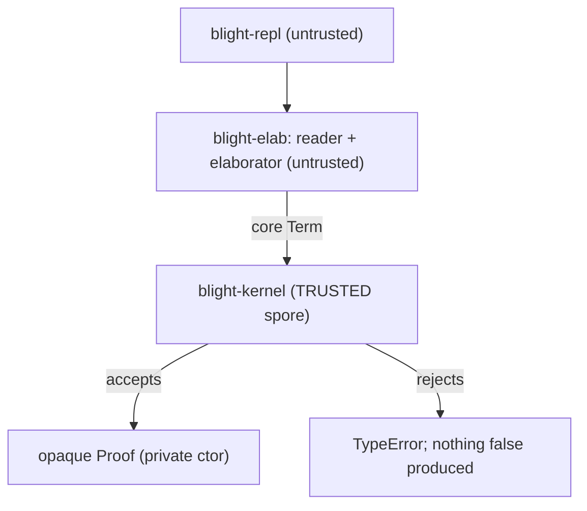
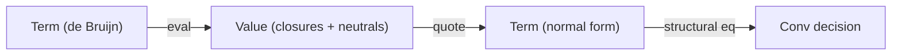
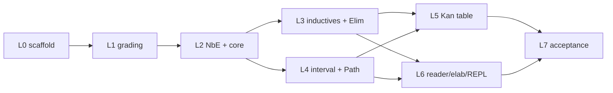

# Blight Implementation Strategy

> Companion to [`blight-spec.md`](blight-spec.md). The spec says *what* Blight is; this
> document says *how* we build it, in what order, and under what engineering discipline.

> **User-facing surface.** For building, running, and a feature tour, start at the repo root
> [`README.md`](../README.md). Runnable programs and a sample `spores` package live in
> [`examples/`](../examples/) (loaded and checked by `crates/blight-repl/tests/examples.rs`, so they
> cannot rot). Contribution guidelines — especially the trusted-base rule — are in
> [`CONTRIBUTING.md`](../CONTRIBUTING.md).

Status: **M0-M6 implemented and green** (`cargo test --workspace`, with and without the `llvm`
feature). This document is the engineering plan we implement against. It is deliberately concrete
about the trusted-base boundary, the host representation, and the test-first workflow, and it
restates the spec's roadmap (spec §9) with engineering risks.

---

## Table of contents

1. [Host and workspace](#1-host-and-workspace)
2. [The TCB boundary](#2-the-tcb-boundary)
3. [Core representation](#3-core-representation)
4. [The grading spine in the host](#4-the-grading-spine-in-the-host)
5. [The cubical Kan table](#5-the-cubical-kan-table)
6. [TDD workflow and the test ledger](#6-tdd-workflow-and-the-test-ledger)
7. [Milestone map (M0..M6)](#7-milestone-map-m0m6)
8. [Testing and auditing strategy](#8-testing-and-auditing-strategy)
9. [M6 status: self-hosting + ecosystem](#9-m6-status-self-hosting--ecosystem)

---

## 1. Host and workspace

The bootstrap host is **Rust** (spec §8.1), chosen for three reasons that matter to *this*
project specifically:

- **Module privacy enforces the TCB.** Rust's `pub`/private boundary lets us make the `Proof`
  constructor unreachable outside the kernel module — the language enforces spec §2.1's "only
  door" at compile time, not by convention.
- **LLVM tooling.** `inkwell`-style bindings are available for the eventual native backend
  (spec §7), so the host language does not have to change between M0 and M4.
- **Performance for NbE.** The kernel's hot path is normalization-by-evaluation; Rust gives us
  control over allocation and sharing (`Rc`/arenas) without a GC fighting us.

The project is a **Cargo workspace** whose crate split *is* the trust boundary:

```text
Cargo.toml                 # [workspace]
crates/
  blight-kernel/           # TRUSTED. the spore: terms, NbE, all spec section 2 rules + Kan table
  blight-elab/             # UNTRUSTED. reader, surface AST, bidirectional elaborator
  blight-repl/             # UNTRUSTED. the `blight` binary
tests/                     # workspace integration tests (black-box, kernel public API only)
```

Edition 2021, `#![forbid(unsafe_code)]` in `blight-kernel` (the trusted base must contain no
`unsafe`), and `#![deny(warnings)]` in CI.

---

## 2. The TCB boundary

This is the single load-bearing engineering decision. The **trusted computing base** is exactly
`blight-kernel`; everything else can have bugs that *fail to produce* a `Proof` but can never
*manufacture a false one* (spec §8.3).



Mechanically:

- `Proof` is a struct with a **private** field, defined in `proof.rs`. There is no `pub fn` that
  builds one outside the kernel's own checking routines. The *only* way an external crate obtains
  a `Proof` is to hand the kernel a `Term` and a `Type` and have `check` succeed.
- `Judgement` is public and `concl(&Proof) -> &Judgement` is the one safe observation (spec §2.1).
  You can read what a proof concludes; you can never construct one backwards.
- `blight-elab` and `blight-repl` depend on `blight-kernel` but cannot reach inside it. A wrong
  core term from the elaborator is simply rejected.

What is **in** the TCB (audited as a unit, kept under a line budget): term representation, NbE
normalizer, the inference rules (spec §2.5–§2.7), graded-context arithmetic (§3), the cubical Kan
table (§2.6). What is **not**: the reader, the elaborator, `match`-compilation, the REPL, and (in
later milestones) the backend.

---

## 3. Core representation

- **Nameless terms (de Bruijn indices).** α-equivalence becomes structural equality, and
  substitution is well-understood. The interval layer gets its own de Bruijn space for *dimension*
  variables, kept distinct from ordinary term variables (spec §2.6: `𝕀` is a pretype, never stored
  at runtime, never a member of a universe).
- **NbE for definitional equality.** `Conv` (spec §2.5) is decided by *normalization by
  evaluation*: `eval : Term -> Value` into a semantic domain of closures and neutrals, then
  `quote : Value -> Term` back to a normal form, and compare normal forms. This is the standard,
  robust way to get β/η/ι plus the cubical computation rules right (spec §2.8).
- **The De Morgan interval as a normalized algebra.** Interval terms (`I0`, `I1`, `IMin`, `IMax`,
  `INeg`, dim vars) are normalized to a canonical form (e.g. a min-of-max normal form) so the
  lattice equations of spec §2.6 (`r ∧ 0 ≡ 0`, `¬0 ≡ 1`, idempotence, absorption) are decided by
  normalization rather than ad-hoc rewriting.
- **Cofibrations** (`(r=0) | (r=1) | φ∧φ | φ∨φ | ⊤ | ⊥`) get a small normal form too, so face
  satisfaction and "agree on overlaps" checks (spec §2.6 systems) are decidable.



---

## 4. The grading spine in the host

The `{0,1,ω}` semiring (spec §3.1) is wired in from day one, because spec §2.9 is explicit that
grading cannot be retrofitted without re-deriving substitution.

- A `Grade` type (`Zero | One | Omega`) with `add`/`mul` matching the spec §3.1 tables and the
  `0 < 1 < ω` order, satisfying **positivity** (`ρ+π=0 ⟹ ρ=0 ∧ π=0`) and **zero-product**
  (`ρ·π=0 ⟹ ρ=0 ∨ π=0`).
- A generic `Semiring` trait so the default `{0,1,ω}` instantiation can later be swapped for a
  richer semiring (spec §3.1 says any semiring satisfying those two laws is admissible).
- **Graded contexts**: each context entry carries a grade; the rules perform `scale` (`ρ·Γ`),
  `add` (`Γ₁+Γ₂`), and `zero` (`0·Γ`). The graded `Var` rule (spec §3.2) permits a `0`-graded
  variable to be used at grade `0`, which is what makes erasure (§3.3) and "indices in types cost
  nothing" work.

For M0 the grades are *tracked and checked* but no erasure pass runs (that is M4, spec §7.2);
M0's job is to get the accounting correct, not yet to exploit it at runtime.

---

## 5. The cubical Kan table

This is the largest and riskiest single piece of the spore (spec §2.6/§8.3), so it gets special
engineering treatment:

- It is a **closed table**: a finite set of "how does `transp`/`hcomp`/`comp` reduce at each type
  former" cases (Pi, Sigma, Path, Data, Univ, Glue). New type formers are the only thing that ever
  extend it.
- `Comp` is implemented as `HComp` + `Transp` in the standard CCHM decomposition (spec §2.6), so
  the irreducible primitives are `Transp` and `HComp`.
- **Conformance-tested against Cubical Agda.** For each case we pin the expected normal form
  against what Cubical Agda produces, so the table is checked against a mature reference
  implementation rather than only against our own intuition.
- **`ua` is derived from `Glue`**, not primitive (spec §2.6 notes this is permissible), shrinking
  the irreducible surface.
- **The reachable heterogeneous cases are implemented**, not stubbed: `transp` over a non-constant Π
  domain, a dependent Σ first component, and a non-constant `PathP` line, plus `hcomp` over a
  genuinely varying partial face, all reduce structurally by their CCHM component rules
  (`crates/blight-kernel/src/kan.rs`), each gated by its own conformance golden. The independent
  re-checker mirrors this table in its value layer, so these cubical Kan operations are *Checked*
  (not `Declined`). The cells the corpus never reaches (e.g. `hcomp` over `Glue`/`Univ`, `transp`
  over a non-`ua`-shaped `Glue` line or a non-constant indexed `Data`/`Int`/`Eff` line) are
  documented unreachable-from-corpus and guarded by **fail-safe panics** — they never silently
  accept. The one `Glue` line `ua` actually reaches (`transp` over the single-face `i=0` line) is
  implemented and guarded; `Glue`/`ua` *judgements* are `Declined` by the re-checker (it declines
  `Glue` at the term-translation boundary, so it never reaches its own Kan-`Glue` path). See
  [docs/metatheory.md](metatheory.md) §1.5 for the full reachability table and fail-safe discipline.

The critical scheduling note (see §6): the M0 acceptance proof `plus-zero` does **not** exercise
the Kan table, so the table is driven by its *own* conformance suite, never by the acceptance test.

---

## 6. TDD workflow and the test ledger

A dependent type-checker is an excellent TDD target: behavior is a set of judgements with crisp
accept/reject outcomes, and `Conv` is a pure, decidable function (spec §2.8). We therefore build
the kernel **test-first**, red → green → refactor, one layer at a time.

**The one caveat:** a Rust test must *compile* to *fail*. So the scaffolding step stubs every
public type and API signature with `todo!()`/`unimplemented!()`, so test modules compile and fail
at *runtime* (red) rather than failing to build.

**The finding that shapes the order:** `plus-zero` (spec §5.3) is a constant path in its base case
and a path application in its step. It exercises inductive `Elim` + ι + `Conv` + `Path`/`PLam`/
`PApp`, but it **never forces `transp`/`hcomp`/`comp`/`Glue`/`ua`**. The Kan table — the riskiest
trusted code — would be left undriven if we leaned on the acceptance test. So the Kan table gets
first-class conformance tests of its own (L5 below).

### Test ledger (write red first, in dependency order)

- **L0 scaffold** — stub public types + API with `todo!()` so all test modules compile; everything
  red.
- **L1 semiring/grading** — `+`/`·` tables (§3.1), positivity & zero-product laws, `0<1<ω`,
  graded-context `scale`/`add`/`zero`.
- **L2 NbE + core rules** — eval/quote roundtrip; β and η (Π, Σ); `Conv` accepts equal / rejects
  unequal; `Univ` cumulativity + level polymorphism (§2.4); Π/Σ form+intro+elim; graded `Var`
  permits `0`-use in types (§3.2).
- **L3 inductives + Elim** — declare `Nat`; `Zero`/`Succ` typecheck; ι reduces `plus Zero b ≡ b`
  and `plus (Succ n) b ≡ Succ (plus n b)`; strict-positivity rejects a bad declaration; one HIT
  path-constructor eliminator case (§2.7).
- **L4 interval + Path** — De Morgan equations; `Path`/`PathP` formation; `PApp p I0 ≡ x`,
  `PApp p I1 ≡ y`; `refl ≡ PLam i x` (§2.6).
- **L5 Kan table** *(driven independently of `plus-zero`)* — `transp`/`comp`/`hcomp` per type
  former; `Glue A ⊤ T e ≡ T`; `unglue ∘ glue ≡ id`; `ua e` transports as `e`; **`funext`
  proved**. Goldens vs. Cubical Agda (§8.3).
- **L6 reader/elaborator/REPL** — s-expr parse goldens; `match → Elim Nat`; `define-rec →`
  structural `Elim`; end-to-end `&str -> Result<Proof>`.
- **L7 acceptance** — §5.3 program: kernel **accepts** `plus-zero`, **rejects** the mutated step
  `(plam (i) k)`. Green = M0 done.



---

## 7. Milestone map (M0..M6)

Restating spec §9 with engineering emphasis and risk callouts.

| Milestone | Deliverable | Acceptance test | Primary risk |
|---|---|---|---|
| **M0** | Stage-0 kernel (full cubical) + reader/elab/REPL | `plus-zero` accepted, wrong step rejected; Kan table green on its own suite | Kan table correctness (mitigated: conformance vs Cubical Agda) |
| **M1** | Grading exploited at the surface | erased `Vec a n` checks with `n` confirmed erased; use-twice rejected | quantities × cubical interaction (spec §10.3) |
| **M2** | Effects + handlers judgement `! E` | `State` counter runs under its handler; divergent `define-rec` rejected where a proof is required | handlers + totality + normalization proof (spec §10.4) |
| **M3** | Tower rewritten *in Blight* + tactics | `plus-zero` provable by tactics; `Show`/`Ord` trait + functorized `RedBlackTree` typecheck | elaborator-in-Blight bootstrap ergonomics |
| **M4** | Native backend (LLVM) | native binary runs; million-deep tail recursion no overflow; grade-0 content absent from binary | safepoints vs `musttail` (spec §7.4) |
| **M5** | Region elision + GC maturation | region-disciplined workload bypasses GC | escape analysis from grades (spec §3.5) |
| **M6** | Self-hosting + ecosystem | Rust host needed only as seed/re-checker | metacircular spore model (spec §8.2 stage 4) |

The dependency structure (spec §9): M0→M1→M2; M0→M3; M2→M3→M4; M1→M4; M4→M5; M4/M5→M6.

**Post-M6 (M7–M14).** Capability and soundness hardening that landed after self-hosting —
console/foreign/heap/int codegen, re-checker completeness (effects type-level + N-param/M-index +
partiality), the dependent-match refinement port into the trusted kernel, evidence-backed metatheory
notes, and the intrinsically-typed self-host sketch — is tracked in
[docs/roadmap-post-m6.md](roadmap-post-m6.md), with the only deliberate TCB growth (primitive ints;
dependent-match refinement) flagged there.

---

## 8. Testing and auditing strategy

- **Kernel under a line budget.** The trusted base is reviewed as a unit; the Kan table is the
  riskiest part and carries the densest tests.
- **White-box vs black-box.** Kernel unit tests live in `#[cfg(test)]` modules next to the code
  (they may see the private `Proof` constructor to build fixtures). Workspace `tests/` are
  black-box: they touch only the kernel's public API, so they also serve as a check that the TCB
  boundary is usable from outside.
- **Golden definitional-equality tests.** Normal forms are pinned as goldens; a change in the
  normalizer that alters a normal form is surfaced immediately.
- **Independent re-checking (spec §8.3).** Because `concl` exposes the conclusion and proofs are
  core terms, a second minimal checker (later, the Stage-4 Blight model) can re-verify any proof.
  Two small checkers agreeing is stronger evidence than one big trusted compiler.
- **Honest caveat (spec §10).** The *combination* of cubical + grading + effects in one kernel has
  no published end-to-end normalization proof; M0 soundness rests on the component results plus
  testing. The spec §10 stratification/encoding fallbacks exist precisely so we can retreat to a
  proved-sound configuration if the unified proof proves out of reach.

---

## 9. M6 status: self-hosting + ecosystem

M6 (spec §8.2 stages 4-5, §9 M6) is implemented at full ambition across five deliverables. The
Rust host is now needed only as the *seed compiler* and the *independent re-checker*; the standard
library, the package surface, and a model of the core are all expressed in Blight.

### D1 — standard library reorganized into a `std/` tree

The flat prelude was split into composable modules under `crates/blight-prelude/std/`:

| Module | Provides | Depends on |
|---|---|---|
| `std/nat.bl` | `Nat`, `plus`, `mult`, `pred` | — |
| `std/bool.bl` | `Bool`, `not`, `and`, `or` | — |
| `std/order.bl` | `nat-le`, `nat-eq`, `Show`/`Ord` traits + `Nat`/`Bool` instances, `show`, `cmp`, `ORD`/`Nat-Ord` | `std/nat`, `std/bool` |
| `std/list.bl` | `List`, `length`, `append` | `std/nat` |
| `std/tree.bl` | `Tree`, `TreeSig`, `tree-if`, `tree-insert`, `RedBlackTree` functor, `NatTree` | `std/order` |
| `std/prelude.bl` | aggregator (loads `std/tree` + `std/list`) | the DAG above |

The historical flat entry points (`modules.bl`, `traits.bl`, `tactics.bl`) are kept as thin
compatibility shims that `(load …)` their `std/` successors. `(instance …)` registration is *not*
idempotent (re-registering the same `(class, head)` is an overlapping-instance error), so the
aggregator encodes the dependency DAG by hand and loads each instance-bearing module exactly once.
`crates/blight-repl/tests/stdlib.rs` loads every module in isolation and the aggregate.

### D2 — `spores` package manager

`crates/blight-elab/src/spores.rs` parses a `spore.toml` manifest into a `PackageManifest` and
resolves `pkg/mod` module references to source. `Program` gained `imported: HashSet`/`importing:
Vec` tracking plus `Program::with_package`, and an idempotent `(import "pkg/mod")` form that dedups
(re-import is a no-op) and detects cycles (the in-progress import stack). The five duplicated test
resolvers were consolidated into `crates/blight-repl/tests/support/mod.rs`. Tests:
`spores_resolver_loads_dependency`, `import_resolves_std`, `import_is_idempotent`,
`import_cycle_detected`.

### D3 — WASM object backend

A `Target` enum (`Native | Wasm32`) is threaded through `emit_object`/`driver`; `llvm.rs`'s
`write_object` is parameterized to call `Target::initialize_webassembly` and retarget to
`wasm32-unknown-unknown` (CPU/features cleared) for the wasm path. `blight build --target=wasm32`
emits a WebAssembly object and, when a wasm-capable `clang` + `wasm-ld` are present (overridable via
`BLIGHT_WASM_CC` / `BLIGHT_WASM_LD`), links a runnable `.wasm` module exporting `bl_main` against a
minimal freestanding wasm ABI shim (`runtime/wasm_rt.c`: a bump allocator over linear memory + no-op
GC/stack stubs). Without that toolchain it falls back to object-only. The llvm-gated test
`emits_wasm_object_for_main` asserts the `\0asm` magic bytes.

### E — re-checker coverage matrix

The independent re-checker (`blight-recheck`) was generalized past the bare core fragment. Its
current honest coverage:

| Construct | Re-checker | Notes |
|---|---|---|
| Var / Univ / Pi / Lam / App | ✅ checked | full core |
| Sigma / Pair / Fst / Snd | ✅ checked | full core |
| `Elim` over non-indexed data | ✅ checked | motive `λs. M`, method types reconstructed |
| `Elim` over multi-parameter / multi-index families | ✅ checked | `infer_elim`/`method_type` build the indexed motive (`λ i… s. M`), apply the motive to all indices + the scrutinee, and reconstruct indexed recursive-argument IHs — mirroring the kernel for N parameters and M indices (the ≤1 cap is lifted) |
| Cubical Kan (`Transp`/`HComp`/`Comp`) | ✅ checked | the re-checker now models the Kan table in its own value layer (`crates/blight-recheck/src/kan.rs`), independently of the kernel |
| Native `Int` (`IntTy`/`IntLit`/`IntPrim`, M10) | ✅ checked | the re-checker models the primitive integer type and its operations directly (`int+`/`int*`/… are typed `Int → Int → Int`); `std/int.bl` wrappers and `int_arith.bl`/`int_sum.bl`/`calculator.bl` are all re-checker-accepted |
| `Glue` / `ua` | ⛔ `Declined` (counted) | the univalence machinery is not modeled in the re-checker value layer |
| Effects/handlers (`Op`/`Handle`/`EffTy`) | ✅ checked (type-level) | the re-checker re-derives the types of `perform`/`handle`/`! E A` from the signature; it does not track effect rows or continuation grades (the kernel's job) — so it offers a genuine second opinion at the type level rather than declining |
| Partiality (`Delay`/`Now`/`Later`/`Force`) | ✅ checked | a second, independent NbE over the delay layer with `force (now a) ⇝ a` and guarded `later`; the proof-boundary `Partial` discipline stays the kernel's job |

`recheck_agrees_with_kernel_on_M0_M5` drives the M0-M6 corpus (Nat arithmetic, linear grades,
traits, modules, tactics, cubical paths, regions) plus indexed/multi-parameter eliminators
(`recheck_agrees_on_indexed_elim`, `recheck_agrees_on_multi_param_and_multi_index`) and a cubical
Kan term (`recheck_checks_transp_not_declined`), asserting **0 `Rejected`** results; `Declined`
constructs are counted and reported rather than silently skipped. Two small checkers agreeing across
this corpus is the §8.3 evidence story.

### E — `spore.bl` growth and the kernel index cap

`spore.bl` models the kernel's core term language extrinsically as `BTerm` and now carries, beyond
the `bsize` measure and de Bruijn weakening `bshift`: single-variable substitution `bsubst`
(`t[u/j]`, weakening the replacement under each binder, the model analogue of the kernel's
`subst0`) and a well-scopedness predicate `bwellscoped`. `spore_meta.bl` proves three metatheorems
by tactics (re-checked through the kernel door): `bconv-refl` (conv reflexivity), `bctx-append-nil`
(context right-unit), and `bctx-len-append` (`bctx-len` is a homomorphism over append — a genuine
two-quantifier induction, with the second context `h` introduced *before* the induction variable so
the `Elim` motive abstracts only `g`).

**Stage 5 — the intrinsic core and a self-host sketch (cap lifted, intrinsic `BTm` realized).** The
≤1 parameter / ≤1 index cap that previously blocked an intrinsically-typed term model is now
**lifted** end-to-end — the surface `declare_data`, the kernel's `Data` formation and
`infer_elim`/`method_type`, and the independent re-checker all handle full N-parameter / M-index
telescopes (see `std/either.bl` for a two-parameter inductive and `std/vec.bl` for an indexed family,
both re-checked by the independent checker). The intrinsic encoding the spore used to only *describe*
is now **realized** in `crates/blight-prelude/spore_intrinsic.bl` and kernel-certified by the
`spore_intrinsic_loads` test (`crates/blight-repl/tests/spore.rs`):

- `BTy` — object types (`Base`, `Arr`), with a structural `bty-size`.
- `BTyCtx` — typing contexts as snoc-lists of `BTy`.
- `BVarIn : (g BTyCtx) (a BTy) → Type` — intrinsic de Bruijn membership (a **two-index** family);
  `VZ`/`VS` make only in-scope variables expressible.
- `BTm : (g BTyCtx) (a BTy) → Type` — **well-typed-syntax-by-construction** (the headline two-index
  family); `TVar`/`TLam`/`TApp` admit only well-typed, well-scoped terms, with a dependent `btm-size`
  fold (a `match` over a two-index family) that the kernel certifies.

This is the seed of a Blight-in-Blight pipeline. A concrete Stage-5 plan from here:

1. **Surface→core elaborator-in-Blight.** Extend `spore_intrinsic.bl` with an object-language
   surface AST (`BSurf`) and a total `belaborate : BTyCtx → BSurf → Maybe (Σ a. BTm g a)` that
   either rejects or produces an intrinsically-typed core term — the Blight analogue of `blight-elab`
   restricted to the modeled fragment. Because the result is a `BTm`, *acceptance is a typing
   proof*.
2. **Core→ANF backend-in-Blight.** Define an ANF/CPS target datatype `BAnf` and a total
   `bcompile : BTm g a → BAnf` that lowers the intrinsic core, plus a `banf-size` measure; this is
   the Blight analogue of `blight-codegen`'s lowering on the modeled fragment.
3. **Metatheorems.** State and prove (in `spore_meta.bl`, by tactics, re-checked by the kernel) a
   handful of laws: `belaborate` is type-sound by construction (immediate from the `BTm` index),
   `bcompile` preserves `btm-size`-bounded structure, and a weakening lemma for `BVarIn`.

The extrinsic `BTerm`/`bwellscoped` model in `spore.bl` is retained alongside — it is the form the
existing `spore_meta.bl` metatheorems reason over, and the two encodings are complementary.

## Performance

See [docs/performance.md](performance.md) for the cost model (compile pipeline + runtime value
representation, GC, the `Later`/`Fix` trampoline, region arenas, the wasm runtime), measured numbers
from the in-tree benchmark harness, and the honest advantages/disadvantages. The harness is:
`crates/blight-codegen/benches/pipeline.rs` (pure-Rust pipeline stages, criterion),
`crates/blight-codegen/benches/runtime.rs` (runtime + GC/arena counters, `--features llvm`), and
`bench/run.sh` (hyperfine over built binaries).
