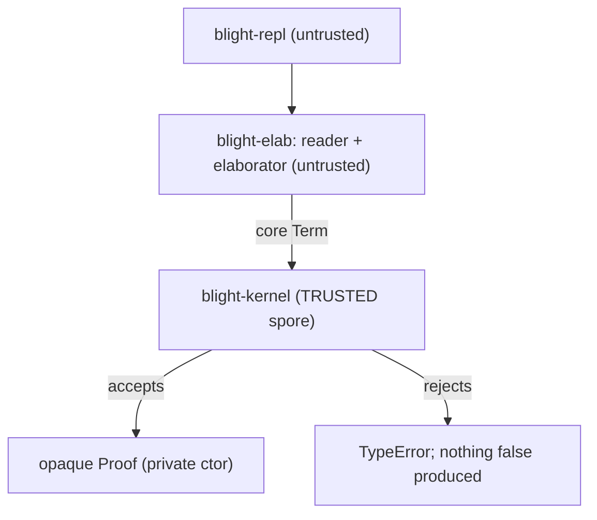
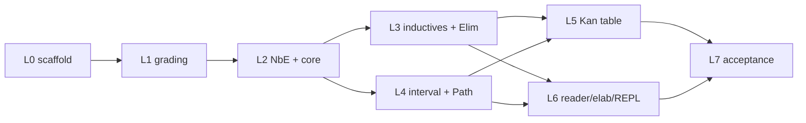

# Blight Implementation Strategy

> Companion to [`blight-spec.md`](blight-spec.md). The spec says *what* Blight is; this
> document says *how* we build it, in what order, and under what engineering discipline.

> **User-facing surface.** For building, running, and a feature tour, start at the repo root
> [`README.md`](../README.md). Runnable programs and a sample `spores` package live in
> [`examples/`](../examples/) (loaded and checked by `crates/blight-repl/tests/examples.rs`, so they
> cannot rot). Contribution guidelines — especially the trusted-base rule — are in
> [`CONTRIBUTING.md`](../CONTRIBUTING.md).

Status: **M0–M6 implemented and green**, with post-M6 work (M7–M14 hardening; M15–M19 share-nothing
multicore + distributed runtime) tracked in [docs/roadmap-post-m6.md](roadmap-post-m6.md)
(`cargo test --workspace`, with and without the `llvm` feature). This document is the engineering
plan we implement against. It is deliberately concrete about the trusted-base boundary, the host
representation, and the test-first workflow, and it restates the spec's roadmap (spec §9) with
engineering risks.

---

## Table of contents

1. [Host and workspace](#1-host-and-workspace)
2. [The TCB boundary](#2-the-tcb-boundary)
3. [Core representation](#3-core-representation)
4. [The grading spine in the host](#4-the-grading-spine-in-the-host)
5. [The cubical Kan table](#5-the-cubical-kan-table)
6. [TDD workflow and the test ledger](#6-tdd-workflow-and-the-test-ledger)
7. [Milestone map (M0..M6)](#7-milestone-map-m0m6)
8. [Testing and auditing strategy](#8-testing-and-auditing-strategy)
9. [M6 status: self-hosting + ecosystem](#9-m6-status-self-hosting--ecosystem)

---

## 1. Host and workspace

The bootstrap host is **Rust** (spec §8.1), chosen for three reasons that matter to *this*
project specifically:

- **Module privacy enforces the TCB.** Rust's `pub`/private boundary lets us make the `Proof`
  constructor unreachable outside the kernel module — the language enforces spec §2.1's "only
  door" at compile time, not by convention.
- **LLVM tooling.** `inkwell`-style bindings are available for the eventual native backend
  (spec §7), so the host language does not have to change between M0 and M4.
- **Performance for NbE.** The kernel's hot path is normalization-by-evaluation; Rust gives us
  control over allocation and sharing (`Rc`/arenas) without a GC fighting us.

The project is a **Cargo workspace** whose crate split *is* the trust boundary:

```text
Cargo.toml                 # [workspace]
crates/
  blight-kernel/           # TRUSTED. the spore: terms, NbE, all spec section 2 rules + Kan table
  blight-elab/             # UNTRUSTED. reader, surface AST, bidirectional elaborator
  blight-repl/             # UNTRUSTED. the `blight` binary
tests/                     # workspace integration tests (black-box, kernel public API only)
```

Edition 2021, `#![forbid(unsafe_code)]` in `blight-kernel` (the trusted base must contain no
`unsafe`), and `#![deny(warnings)]` in CI.

---

## 2. The TCB boundary

This is the single load-bearing engineering decision. The **trusted computing base** is exactly
`blight-kernel`; everything else can have bugs that *fail to produce* a `Proof` but can never
*manufacture a false one* (spec §8.3). In the precise vocabulary: the kernel is *implicitly trusted*
(relied on without an external check — a bug there is silent and catastrophic), while every other
crate is *untrusted* meaning *explicitly checked* (its output is re-verified, so a bug there is
caught, not believed). "Built on top of the kernel" is a dependency relationship and is orthogonal
to trust — the tower depends on the kernel precisely *as* the checker that re-derives every verdict.



Mechanically:

- `Proof` is a struct with a **private** field, defined in `proof.rs`. There is no `pub fn` that
  builds one outside the kernel's own checking routines. The *only* way an external crate obtains
  a `Proof` is to hand the kernel a `Term` and a `Type` and have `check` succeed.
- `Judgement` is public and `concl(&Proof) -> &Judgement` is the one safe observation (spec §2.1).
  You can read what a proof concludes; you can never construct one backwards.
- `blight-elab` and `blight-repl` depend on `blight-kernel` but cannot reach inside it. A wrong
  core term from the elaborator is simply rejected.

What is **in** the TCB (audited as a unit, kept under a line budget): term representation, NbE
normalizer, the inference rules (spec §2.5–§2.7), graded-context arithmetic (§3), the cubical Kan
table (§2.6). What is **not**: the reader, the elaborator, `match`-compilation, the REPL, and (in
later milestones) the backend.

---

## 3. Core representation

- **Nameless terms (de Bruijn indices).** α-equivalence becomes structural equality, and
  substitution is well-understood. The interval layer gets its own de Bruijn space for *dimension*
  variables, kept distinct from ordinary term variables (spec §2.6: `𝕀` is a pretype, never stored
  at runtime, never a member of a universe).
- **NbE for definitional equality.** `Conv` (spec §2.5) is decided by *normalization by
  evaluation*: `eval : Term -> Value` into a semantic domain of closures and neutrals, then
  `quote : Value -> Term` back to a normal form, and compare normal forms. This is the standard,
  robust way to get β/η/ι plus the cubical computation rules right (spec §2.8).
- **The De Morgan interval as a normalized algebra.** Interval terms (`I0`, `I1`, `IMin`, `IMax`,
  `INeg`, dim vars) are normalized to a canonical form (e.g. a min-of-max normal form) so the
  lattice equations of spec §2.6 (`r ∧ 0 ≡ 0`, `¬0 ≡ 1`, idempotence, absorption) are decided by
  normalization rather than ad-hoc rewriting.
- **Cofibrations** (`(r=0) | (r=1) | φ∧φ | φ∨φ | ⊤ | ⊥`) get a small normal form too, so face
  satisfaction and "agree on overlaps" checks (spec §2.6 systems) are decidable.


---

## 4. The grading spine in the host

The `{0,1,ω}` semiring (spec §3.1) is wired in from day one, because spec §2.9 is explicit that
grading cannot be retrofitted without re-deriving substitution.

- A `Grade` type (`Zero | One | Omega`) with `add`/`mul` matching the spec §3.1 tables and the
  `0 < 1 < ω` order, satisfying **positivity** (`ρ+π=0 ⟹ ρ=0 ∧ π=0`) and **zero-product**
  (`ρ·π=0 ⟹ ρ=0 ∨ π=0`).
- A generic `Semiring` trait so the default `{0,1,ω}` instantiation can later be swapped for a
  richer semiring (spec §3.1 says any semiring satisfying those two laws is admissible).
- **Graded contexts**: each context entry carries a grade; the rules perform `scale` (`ρ·Γ`),
  `add` (`Γ₁+Γ₂`), and `zero` (`0·Γ`). The graded `Var` rule (spec §3.2) permits a `0`-graded
  variable to be used at grade `0`, which is what makes erasure (§3.3) and "indices in types cost
  nothing" work.

For M0 the grades are *tracked and checked* but no erasure pass runs (that is M4, spec §7.2);
M0's job is to get the accounting correct, not yet to exploit it at runtime.

---

## 5. The cubical Kan table

This is the largest and riskiest single piece of the spore (spec §2.6/§8.3), so it gets special
engineering treatment:

- It is a **closed table**: a finite set of "how does `transp`/`hcomp`/`comp` reduce at each type
  former" cases (Pi, Sigma, Path, Data, Univ, Glue). New type formers are the only thing that ever
  extend it.
- `Comp` is implemented as `HComp` + `Transp` in the standard CCHM decomposition (spec §2.6), so
  the irreducible primitives are `Transp` and `HComp`.
- **Conformance-tested against Cubical Agda.** For each case we pin the expected normal form
  against what Cubical Agda produces, so the table is checked against a mature reference
  implementation rather than only against our own intuition.
- **`ua` is derived from `Glue`**, not primitive (spec §2.6 notes this is permissible), shrinking
  the irreducible surface.
- **The reachable heterogeneous cases are implemented**, not stubbed: `transp` over a non-constant Π
  domain, a dependent Σ first component, and a non-constant `PathP` line, plus `hcomp` over a
  genuinely varying partial face, all reduce structurally by their CCHM component rules
  (`crates/blight-kernel/src/kan.rs`), each gated by its own conformance golden. The independent
  re-checker mirrors this table in its value layer, so these cubical Kan operations are *Checked*
  (not `Declined`). The cells the corpus never reaches (e.g. `hcomp` over `Glue`/`Univ`, `transp`
  over a non-`ua`-shaped `Glue` line or a non-constant indexed `Data`/`Int`/`Eff` line) are
  documented unreachable-from-corpus and guarded by **fail-safe panics** — they never silently
  accept. The one `Glue` line `ua` actually reaches (`transp` over the single-face `i=0` line) is
  implemented and guarded; `Glue`/`ua` *judgements* are `Declined` by the re-checker (it declines
  `Glue` at the term-translation boundary, so it never reaches its own Kan-`Glue` path). See
  [docs/metatheory.md](metatheory.md) §1.5 for the full reachability table and fail-safe discipline.

The critical scheduling note (see §6): the M0 acceptance proof `plus-zero` does **not** exercise
the Kan table, so the table is driven by its *own* conformance suite, never by the acceptance test.

---

## 6. TDD workflow and the test ledger

A dependent type-checker is an excellent TDD target: behavior is a set of judgements with crisp
accept/reject outcomes, and `Conv` is a pure, decidable function (spec §2.8). We therefore build
the kernel **test-first**, red → green → refactor, one layer at a time.

**The one caveat:** a Rust test must *compile* to *fail*. So the scaffolding step stubs every
public type and API signature with `todo!()`/`unimplemented!()`, so test modules compile and fail
at *runtime* (red) rather than failing to build.

**The finding that shapes the order:** `plus-zero` (spec §5.3) is a constant path in its base case
and a path application in its step. It exercises inductive `Elim` + ι + `Conv` + `Path`/`PLam`/
`PApp`, but it **never forces `transp`/`hcomp`/`comp`/`Glue`/`ua`**. The Kan table — the riskiest
trusted code — would be left undriven if we leaned on the acceptance test. So the Kan table gets
first-class conformance tests of its own (L5 below).

### Test ledger (write red first, in dependency order)

- **L0 scaffold** — stub public types + API with `todo!()` so all test modules compile; everything
  red.
- **L1 semiring/grading** — `+`/`·` tables (§3.1), positivity & zero-product laws, `0<1<ω`,
  graded-context `scale`/`add`/`zero`.
- **L2 NbE + core rules** — eval/quote roundtrip; β and η (Π, Σ); `Conv` accepts equal / rejects
  unequal; `Univ` cumulativity + level polymorphism (§2.4); Π/Σ form+intro+elim; graded `Var`
  permits `0`-use in types (§3.2).
- **L3 inductives + Elim** — declare `Nat`; `Zero`/`Succ` typecheck; ι reduces `plus Zero b ≡ b`
  and `plus (Succ n) b ≡ Succ (plus n b)`; strict-positivity rejects a bad declaration; one HIT
  path-constructor eliminator case (§2.7).
- **L4 interval + Path** — De Morgan equations; `Path`/`PathP` formation; `PApp p I0 ≡ x`,
  `PApp p I1 ≡ y`; `refl ≡ PLam i x` (§2.6).
- **L5 Kan table** *(driven independently of `plus-zero`)* — `transp`/`comp`/`hcomp` per type
  former; `Glue A ⊤ T e ≡ T`; `unglue ∘ glue ≡ id`; `ua e` transports as `e`; **`funext`
  proved**. Goldens vs. Cubical Agda (§8.3).
- **L6 reader/elaborator/REPL** — s-expr parse goldens; `match → Elim Nat`; `define-rec →`
  structural `Elim`; end-to-end `&str -> Result<Proof>`.
- **L7 acceptance** — §5.3 program: kernel **accepts** `plus-zero`, **rejects** the mutated step
  `(plam (i) k)`. Green = M0 done.



---

## 7. Milestone map (M0..M6)

Restating spec §9 with engineering emphasis and risk callouts.

| Milestone | Deliverable | Acceptance test | Primary risk |
|---|---|---|---|
| **M0** | Stage-0 kernel (full cubical) + reader/elab/REPL | `plus-zero` accepted, wrong step rejected; Kan table green on its own suite | Kan table correctness (mitigated: conformance vs Cubical Agda) |
| **M1** | Grading exploited at the surface | erased `Vec a n` checks with `n` confirmed erased; use-twice rejected | quantities × cubical interaction (spec §10.3) |
| **M2** | Effects + handlers judgement `! E` | `State` counter runs under its handler; divergent `define-rec` rejected where a proof is required | handlers + totality + normalization proof (spec §10.4) |
| **M3** | Tower rewritten *in Blight* + tactics | `plus-zero` provable by tactics; `Show`/`Ord` trait + functorized `RedBlackTree` typecheck | elaborator-in-Blight bootstrap ergonomics |
| **M4** | Native backend (LLVM) | native binary runs; million-deep tail recursion no overflow; grade-0 content absent from binary | safepoints vs `musttail` (spec §7.4) |
| **M5** | Region elision + GC maturation | region-disciplined workload bypasses GC | escape analysis from grades (spec §3.5) |
| **M6** | Self-hosting + ecosystem | Rust host needed only as seed/re-checker | metacircular spore model (spec §8.2 stage 4) |

The dependency structure (spec §9): M0→M1→M2; M0→M3; M2→M3→M4; M1→M4; M4→M5; M4/M5→M6.

**Post-M6 (M7–M14).** Capability and soundness hardening that landed after self-hosting —
console/foreign/heap/int codegen, re-checker completeness (effects type-level + N-param/M-index +
partiality), the dependent-match refinement port into the trusted kernel, evidence-backed metatheory
notes, and the intrinsically-typed self-host sketch — is tracked in
[docs/roadmap-post-m6.md](roadmap-post-m6.md), with the only deliberate TCB growth (primitive ints;
dependent-match refinement) flagged there.

**Multicore + distributed (M15–M19).** Share-nothing concurrency built entirely in untrusted
tower/runtime: per-thread runtime state (`BL_THREAD_LOCAL`), a `std/actor.bl` actor/CSP surface as
graded effects (resume-once enforced by kernel grades), a native worker pool (`worker.c`), a
data-only structural (de)serializer (`serialize.c`), and an untrusted Rust TCP transport
(`blight-net`). It grows the TCB by zero and adds no new `foreign` axioms (the kernel never sees a
thread or socket), and its scaling/throughput are measured by `worker_pool_scales_with_cores` /
`serializer_throughput_reported` (run via `bench/multicore.sh`). Tracked in
[docs/roadmap-post-m6.md](roadmap-post-m6.md); performance in [docs/performance.md](performance.md).

---

## 8. Testing and auditing strategy

- **Kernel under a line budget.** The trusted base is reviewed as a unit; the Kan table is the
  riskiest part and carries the densest tests.
- **White-box vs black-box.** Kernel unit tests live in `#[cfg(test)]` modules next to the code
  (they may see the private `Proof` constructor to build fixtures). Workspace `tests/` are
  black-box: they touch only the kernel's public API, so they also serve as a check that the TCB
  boundary is usable from outside.
- **Golden definitional-equality tests.** Normal forms are pinned as goldens; a change in the
  normalizer that alters a normal form is surfaced immediately.
- **Independent re-checking (spec §8.3).** Because `concl` exposes the conclusion and proofs are
  core terms, a second minimal checker (later, the Stage-4 Blight model) can re-verify any proof.
  Two small checkers agreeing is stronger evidence than one big trusted compiler.
- **Honest caveat (spec §10).** The *combination* of cubical + grading + effects in one kernel has
  no published end-to-end normalization proof; M0 soundness rests on the component results plus
  testing. The spec §10 stratification/encoding fallbacks exist precisely so we can retreat to a
  proved-sound configuration if the unified proof proves out of reach.

---

## 9. M6 status: self-hosting + ecosystem

M6 (spec §8.2 stages 4-5, §9 M6) is implemented at full ambition across five deliverables. The
Rust host is now needed only as the *seed compiler* and the *independent re-checker*; the standard
library, the package surface, and a model of the core are all expressed in Blight.

### D1 — standard library reorganized into a `std/` tree

The flat prelude was split into composable modules under `crates/blight-prelude/std/`:

| Module | Provides | Depends on |
|---|---|---|
| `std/nat.bl` | `Nat`, `plus`, `mult`, `pred` | — |
| `std/bool.bl` | `Bool`, `not`, `and`, `or` | — |
| `std/order.bl` | `nat-le`, `nat-eq`, `Show`/`Ord` traits + `Nat`/`Bool` instances, `show`, `cmp`, `ORD`/`Nat-Ord` | `std/nat`, `std/bool` |
| `std/list.bl` | `List`, `length`, `append` | `std/nat` |
| `std/tree.bl` | `Tree`, `TreeSig`, `tree-if`, `tree-insert`, `RedBlackTree` functor, `NatTree` | `std/order` |
| `std/prelude.bl` | aggregator (loads `std/tree` + `std/list`) | the DAG above |

The historical flat entry points (`modules.bl`, `traits.bl`, `tactics.bl`) are kept as thin
compatibility shims that `(load …)` their `std/` successors. `(instance …)` registration is *not*
idempotent (re-registering the same `(class, head)` is an overlapping-instance error), so the
aggregator encodes the dependency DAG by hand and loads each instance-bearing module exactly once.
`crates/blight-repl/tests/stdlib.rs` loads every module in isolation and the aggregate.

### D2 — `spores` package manager

`crates/blight-elab/src/spores.rs` parses a `spore.toml` manifest into a `PackageManifest` and
resolves `pkg/mod` module references to source. `Program` gained `imported: HashSet`/`importing:
Vec` tracking plus `Program::with_package`, and an idempotent `(import "pkg/mod")` form that dedups
(re-import is a no-op) and detects cycles (the in-progress import stack). The five duplicated test
resolvers were consolidated into `crates/blight-repl/tests/support/mod.rs`. Tests:
`spores_resolver_loads_dependency`, `import_resolves_std`, `import_is_idempotent`,
`import_cycle_detected`.

### D3 — WASM object backend

A `Target` enum (`Native | Wasm32`) is threaded through `emit_object`/`driver`; `llvm.rs`'s
`write_object` is parameterized to call `Target::initialize_webassembly` and retarget to
`wasm32-unknown-unknown` (CPU/features cleared) for the wasm path. `blight build --target=wasm32`
emits a WebAssembly object and, when a wasm-capable `clang` + `wasm-ld` are present (overridable via
`BLIGHT_WASM_CC` / `BLIGHT_WASM_LD`), links a runnable `.wasm` module exporting `bl_main` against a
minimal freestanding wasm ABI shim (`runtime/wasm_rt.c`: a bump allocator over linear memory + no-op
GC/stack stubs). Without that toolchain it falls back to object-only. The llvm-gated test
`emits_wasm_object_for_main` asserts the `\0asm` magic bytes.

### D4 — `blight-lsp` and manifest-aware resolution (roadmap Wave 1 / A1, A2)

**A1 — diagnostics API + LSP server.** `Program::check_all_diagnostics` (`crates/blight-elab/src/
program.rs`) is a continue-on-error sibling of `run`/`run_with_diagnostics`: it snapshots `ElabEnv`
(now `Clone`, along with `MacroEnv`) plus the import bookkeeping before every top-level form and
restores the snapshot verbatim on that form's failure, so a form that mutates state before failing
(e.g. `defdata` registers each constructor as it elaborates that constructor's fields, before the
datatype itself is declared) cannot leak partial state into the forms after it. This makes it sound
to report *every* failing form in one pass rather than stopping at the first — the shape an editor
needs. `crates/blight-lsp` is a new `lsp-server`-based binary built on top of it: whole-buffer
diagnostics, hover (elaborates the identifier under the cursor exactly like the REPL's `:type`, so
it only resolves globals — no local-scope support), and go-to-definition over a lightweight
form-head span index (no elaborator change). `editors/vscode-blight` gained a TypeScript
`vscode-languageclient` wrapper that spawns it. A real protocol-level bug was caught by an
integration test that spawns the actual binary and speaks raw stdio JSON-RPC
(`crates/blight-lsp/tests/lsp_protocol.rs`): `lsp_server::Connection::handle_shutdown` itself
blocks on and consumes the follow-up `exit` notification, so a server that just `return`s afterward
and relies on `io_threads.join()` hangs until the client happens to close its stdin pipe — fixed by
calling `std::process::exit(0)` directly once the shutdown handshake completes.

**A2 — manifest + embedded-prelude fallback, `blight.lock`, `blight add`.**
`Program::with_package` bound `(load …)` resolution *strictly* to the manifest, silently breaking
the CLI's embedded-prelude fallback (`(load "std/nat.bl")` with no source checkout) the moment a
project adopted a `spore.toml`. `Program::with_package_and_fallback` fixes this: `(load …)` tries
the manifest first (so a pinned dependency always wins) and only falls through to a supplied
fallback resolver for paths the manifest doesn't know; `(import …)` is unaffected (always strictly
manifest-resolved, matching its "one of my declared dependencies" semantics). `blight-repl` now
walks up from the entry file's directory (or the REPL's cwd) looking for `spore.toml`
(`find_spore_manifest`) and, when found, uses this constructor with `cli_load` as the fallback —
both `blight build` and the REPL benefit. `blight.lock` (`PackageManifest::lock_entries`/
`render_lock`/`parse_lock`) records, per package (this one + every dependency), a dependency-free
FNV-1a digest over the sorted `.bl` files under its root, refreshed on every manifest-backed run —
enough to detect drift without pulling in a hashing crate or committing to `std`'s unspecified
`DefaultHasher`. `blight add <name> <path>` (`PackageManifest::add_dependency`) adds or updates a
path dependency in `spore.toml`, creating a minimal manifest first if none exists yet (round-trips
through `toml::Value`, so it does not preserve hand-written comments/formatting on an edit — a
known, acceptable limitation for a generated config file).

### D5 — trusted-base coverage floor + fuzz corpus replay gate (roadmap Wave 1 / D1)

Two additions to CI, both in the spirit of "raise the correctness floor" without introducing new
flakiness. First, `cargo llvm-cov report --fail-under-lines N` only supports a single, global
workspace threshold, so `coverage.yml` now emits a *second* scoped report from the same
instrumentation run — `-p blight-kernel -p blight-recheck --fail-under-lines 75` — a stricter bar
than the 65% workspace floor specifically for the two crates an unsound bug would actually live in
(measured combined baseline ~77.24% lines; see `docs/testing.md` for the per-file breakdown and the
lowest-covered files, which are the natural next targets). Second, `ci.yml` gained a
`fuzz-corpus-replay` job that runs each `cargo-fuzz` target with `-runs=0` — a deterministic,
sub-minute replay of every file in the committed `fuzz/corpus/{reader,elab,kernel}/` directories
(previously listed in `fuzz/.gitignore` and therefore never actually committed or replayed anywhere)
— and fails the build on any crash. This is intentionally distinct from `fuzz.yml`'s existing nightly
job, which does fresh, randomized, time-boxed fuzzing and stays informational because a time-boxed
search finding nothing is not a meaningful "pass": the corpus-replay job is the actual regression
gate, and the documented convention going forward is that any crash the nightly job finds gets
minimized into the corpus (and committed alongside its fix) so the gate pins it permanently.

### D6 — `Arrays` effect: scalar `Int`-valued mutable arrays (roadmap Wave 1 / A3a)

`std/array.bl` adds an `Arrays` effect —`new-array : Nat -> Int`, `array-len : Int -> Nat`,
`get-elem : (Pair Int Nat) -> Int`, `set-elem : (Pair Int (Pair Nat Int)) -> Unit`— that is the
exact mirror of `std/bytes.bl`'s design: an ordinary user effect folded by the same native
top-level deep handler the build driver already installs (`bl_run_console`), with mutable storage
living entirely in C (`BlIntArray`/`g_arrays` in `runtime/effects.c`) outside the GC graph. Pure
code only ever holds the opaque `Int` handle `new-array` returns, so the feature adds **zero** new
kernel surface, **zero** traced object kinds, and **zero** TCB growth — elements are fixed to
machine `Int` specifically because a `malloc`'d table of raw `int64_t`s can never hold a
stale/moved GC pointer, which is what makes this safe with no tracer change. All four ops are
total: an invalid handle or an out-of-range index is a saturating no-op/zero-return rather than a
crash, so the effect never needs to signal failure through the type. `driver.rs`'s `console_inner`
recognizes `"Arrays"` alongside `"Console"`/`"Bytes"` to install the handler; `examples/
array_scratch.bl` (allocate 4, write 7 at index 2, read it back) is covered end-to-end by
`crates/blight-repl/tests/main.rs`'s `example_array_scratch_builds_and_runs` (build + run + assert
stdout), `examples.rs`'s `array_scratch_example_loads` (type-checks), `stdlib.rs`'s
`std_array_loads_in_isolation`, and the `DIFF_CORPUS` differential-testing list. `mono.rs` gained
`effectful_new_array_used_twice_is_not_inlined`, the `Arrays` counterpart of the existing `Bytes`
regression test that pins down that an effectful op performed twice is never illegally
common-subexpression-eliminated into one call. Generic/boxed arrays (`A3b`) remain a separate,
explicitly gated design track (see the capability table in `docs/roadmap.md`): they need a real
GC-traced backing object or a rooting/write-barrier discipline the runtime does not yet have, and
are intentionally not implemented until that go-bar is written and cleared (roadmap Wave 4). The
go-bar itself — the two blocking issues, both candidate designs, and the acceptance checklist that
must be satisfied before implementation starts — is written up in full in
[`docs/design-a3b-boxed-arrays.md`](design-a3b-boxed-arrays.md).

### D7 — registry HTTP(S) transport, git dependencies, `blight publish` (roadmap Wave 9 / T3)

Closes the three gaps `crates/blight-elab/src/registry.rs` and `spores.rs` had explicitly flagged
as go-bars since the registry v1 (A5) pass: remote transport, git dependencies, and a write side
for the registry index.

**HTTP(S) transport.** `fetch_bytes` (tarballs) and `load_index` (the index itself) each gained an
`http`/`https` branch using [`ureq`](https://docs.rs/ureq) (pure-Rust, `rustls` TLS backend,
blocking — the same "small, no async runtime" spirit as the `lsp-server`-over-`tower-lsp` choice,
A1), added only to `blight-elab`. The hash-verification trust story is entirely transport-agnostic:
`fetch_and_vendor` recomputes `hash_bl_tree` after extraction regardless of how the bytes arrived,
so a spoofed/compromised HTTP transport can serve garbage but can never make a tampered tarball
pass as genuine. Tests use a hand-rolled one-shot-per-connection HTTP/1.1 server on loopback
(`registry::tests::serve_http`) — real `ureq` traffic, zero external network dependency.

**Git dependencies.** A `git` dependency now resolves exactly like a `version` (registry) one: to
a local vendor-cache directory, `spores::git_cache_dir(base_dir, dep_name, rev)` —
`<base_dir>/.blight/git/<dep_name>-<rev or HEAD>/`. `PackageManifest::parse` inserts this as a root
alongside `path`/`version` dependencies, so `resolve_path` needs no special case anymore (the old
"git dependencies are not yet fetchable" error is gone). `fetch_git_dependency` shells out to a
system `git` (`git clone` then `git checkout <rev>` if pinned) rather than adding an in-process git
implementation or `libgit2` FFI — the same "vendor a subprocess" choice already made for `blight
fmt`'s formatting-only dependency footprint. `blight add <name> --git <url> [--rev <rev>]` fetches
before ever touching `spore.toml`, so a failed clone/checkout never leaves the manifest pointing at
source that isn't there. Unlike the registry's tarball hash, there is no separate verification
step: pinning a `rev` (a commit SHA) *is* the content-addressing — `git checkout` either lands on
exactly that content or fails outright.

**`blight.lock` drift rejection.** `PackageManifest::check_lock_drift` compares a fresh
`lock_entries()` computation against a previously-written `blight.lock`'s parsed entries (`
parse_lock`, which existed since A2 but was never actually enforced) and rejects if any
*dependency*'s (not the primary package's own — that's expected to change during ordinary
development) hash no longer matches what was locked. `blight build` calls this
(`check_manifest_lock_drift`) *before* `program_with_manifest`'s own best-effort lock refresh has a
chance to silently overwrite the evidence of drift — ordering that matters: checking after the
refresh would make the check unable to ever fire.

**`blight publish`.** `RegistryIndex` gained a writer half (`add_entry`/`render`) to complement its
existing parser; `registry::publish(src_dir, name, version, registry_dir)` packages exactly the
`.bl` files `hash_bl_tree` hashes (`spores::list_bl_files_relative`, now `pub(crate)` so the
tarball and the hash it's checked against can never silently diverge) into
`<registry_dir>/<name>-<version>.tar.gz`, and upserts the corresponding index entry. `blight
publish [--registry <dir>]` (defaulting to `.blight/local-registry` next to the manifest) is the
write-side CLI counterpart to `blight add --version --registry`; deliberately network-free — a
`registry_dir` can be a local directory, a mounted share, or a directory a CI job syncs to a real
HTTP(S) origin, with no separate upload/publish protocol needed on top of what `blight add` already
fetches.

### D8 — wasm target completion: portable runtime port + calling-convention/layout fixes (roadmap Wave 10 / P3)

D3 shipped a wasm object backend that *linked*, but `runtime/wasm_rt.c`'s bump allocator never grew
linear memory and provided only inert no-op stubs for `Delay`/effects/regions — any program using
`later`/`force`, `perform`/`handle`, or `region` would either overrun the heap silently or link
against a stub that did nothing. Closing that gap surfaced two wasm-specific **codegen** bugs (not
runtime bugs) that no native test could ever catch, since they are invisible when pointers are 8
bytes wide:

**The runtime port.** `wasm_rt.c` gained `bl_bump_ensure` (grows linear memory with
`__builtin_wasm_memory_grow` whenever the bump frontier would exceed it — freestanding-safe, no
libc) and direct ports of `delay.c`'s `bl_force` trampoline, `effects.c`'s OpNode-aware
`bl_perform`/`bl_app`/`bl_app_global`/`bl_con_bubble`/`bl_handle_clo`, and `arena.c`'s region
functions (`bl_arena_alloc` collapses to the same growing bump heap as `bl_alloc` — a documented,
correctness-preserving simplification since nothing on this target ever reclaims *any* allocation
regardless of arena/GC tagging; see the file's own header comment for the full "honest scope" of
what remains genuinely unsupported: `Console`/`FileIO`/`Clock`, real packed `String`s, and
multicore). Every ABI-visible parameter that native code passes as a fixed 64-bit count (e.g.
`bl_gc_pop_roots`'s `n`, `bl_handle_clo`'s `n_ops`) is declared `uint64_t`, not `size_t` — `size_t`
is 32-bit on `wasm32-unknown-unknown`, so using it there would silently disagree with the caller's
always-64-bit argument (`llvm.rs::declare_runtime` hardcodes `i64` for these regardless of target).

**Two `llvm.rs` codegen bugs, found by actually executing the linked module.** LLVM's wasm32 backend
rejects the `tailcc` calling convention outright ("WebAssembly doesn't support non-C calling
conventions") and cannot guarantee `musttail` (no wasm tail-call-proposal codegen in this LLVM
version) — `Codegen` now carries a per-target `call_conv`/`musttail_ok` pair (native: `tailcc` +
real `musttail`; wasm32: the ordinary C convention + ordinary calls) instead of hardcoding `tailcc`
everywhere. Fixing *that* exposed a second, more serious bug: `load_field`/`store_field` computed a
closure/tuple/OpNode's field offset as `16 + k*8` — correct on native (8-byte pointers) but wrong on
wasm32 (4-byte pointers), so any object with **2 or more fields** (a multi-capture closure, a
2-tuple, an `OpNode`) read/wrote 4 bytes past where the real field lived once `k ≥ 1`. This was
invisible in every hand-written single-field test (a `Succ`'s one field, most op-clause closures)
and only manifested as a `wasmtime` **"uninitialized element" `call_indirect` trap** deep inside a
genuinely non-structural (`later`-guarded) recursive function's self-rebuilt closure — exactly the
kind of miscompile a `.wasm` object that merely *links* can never catch, since `wasm-ld` has no way
to know the object's own field arithmetic is wrong. `Codegen` now carries a `ptr_bytes` field (`4`
on wasm32, `8` on native) and both offset computations scale by it.

**The exec harness.** `crates/blight-codegen/tests/wasm_exec.rs` is the roadmap's "wasmtime dev-dep
exec harness": a `wasmtime` (cranelift backend, minimal feature set) dev-dependency actually
*instantiates and calls* `bl_main` on the linked module — not just asserting it links — for one
program per runtime feature (plain data forcing `bl_bump_ensure`'s memory growth, the
`later`/`force` trampoline via a genuinely non-structural `define-rec`, tail and non-tail algebraic
effects, and a region-arena scope), asserting the returned i32 matches what the same source produces
on the native backend. Needs a wasm-capable `clang` + `wasm-ld` (`BLIGHT_WASM_CC`/`BLIGHT_WASM_LD`,
same override convention as D3); the `llvm` CI job installs `lld-18` and points both at the
apt.llvm.org LLVM 18 install alongside the existing native toolchain.

### D9 — generic/boxed arrays: rooted handle table + write barrier (roadmap Wave 10 / P1, A3b)

Closes `docs/design-a3b-boxed-arrays.md`'s go-bar. The two blockers that go-bar identified were both
closed by the time this was picked up — Blocker 1 (a polymorphic effect operation) for free, by
Wave 7/E2's parameterized effects (already shipped, unrelated to this change); Blocker 2 (an
off-heap `BlValue[]` is invisible to the precise, moving collector) by this change, implementing the
go-bar's recommended Design 1.

**The design.** A boxed array's storage is a real GC-heap `BL_TUPLE`, allocated the ordinary way
(`bl_alloc`), so the existing precise tracer walks and relocates every element slot with **zero
tracer changes** — `header.nfields` is the length, `fields[i]` is element `i`. A Blight program never
holds that `BL_TUPLE` pointer directly (a GC copy would invalidate it under the mutator's feet the
instant a collection moved it); it holds an opaque `Int` handle (the `g_arrays`/`g_bytes` convention,
A3a/C2) indexing `runtime/boxed_array.c`'s new `g_boxed[]` side table. Because `g_boxed[]` itself
lives outside the GC heap, its entries are edges the tracer would never otherwise see — so
`bl_boxed_array_gc_roots` (called once each from `gc.c`'s `minor_collect` and `major_collect_into`,
immediately after the existing shadow-stack roots loop) evacuates every live entry through that
collection's own `evac_minor`/`evac_major`, exactly like a `g_roots[]` slot, rewriting the table in
place if the backing object moves. `bl_boxed_array_set` calls the existing `bl_write_barrier` on
every write, so a young value stored into an already-promoted backing object is remembered for the
next minor collection — the same discipline codegen-emitted field stores already follow. There is no
minor/major race to reason about: the runtime is single-mutator per (thread-local) heap, so at most
one collection is ever scanning the table.

Two API choices worth calling out: (1) `new-boxed-array` takes an explicit initial value (`(Pair Nat
A) -> Array A`), not a zero-fill like the `Int`-only `Arrays` effect — there is no runtime notion of
"the zero value of `A`" once the element type is erased (Wave 7/E2 erases `type_args` at `lower.rs`,
like a `Data`'s params), so every slot must be filled with something the caller actually provided,
never left as the allocator's zero-initialized `NULL` (a `NULL` flowing into a generic
`case`/`bl_obj_tag` reader would crash — it is not a valid `BlValue`, only a collector-internal
sentinel). (2) an out-of-range `get-boxed` read has the same problem in miniature (no `A` to
fabricate) and returns a fresh inert nullary `Con` instead — total and non-crashing, at the cost of
being observably not-really-an-`A`, but only reachable by a program that already has an out-of-bounds
logic error.

**Surface.** `std/array.bl` gained `Array A` (params `((A (Type 0)))`, ops
`new-boxed-array`/`boxed-len`/`get-boxed`/`set-boxed`) alongside the existing `Arrays`, plus
`boxed-array-new`/`-length`/`-get`/`-set` convenience wrappers threading the type argument explicitly
through `(perform op (T) arg)`, the same pattern `std/list.bl`'s polymorphic functions already use
for their own type parameters. `driver.rs`'s `console_inner` (which decides whether `main`'s effect
row gets folded by the native top-level handler `bl_run_console`) gained an `"Array"` arm alongside
`Console`/`FileIO`/`Bytes`/`Arrays`/`Clock` — the one genuinely easy-to-miss wiring point, since
`bl_run_console`'s op-name dispatch loop itself is effect-name-agnostic (it always was) and silently
returning the unhandled `BL_OPNODE` (rather than a build error) was the only user-visible symptom
before this arm was added.

**Tests.** `runtime/tests/gc_test.c`'s `test_boxed_array_survives_minor_and_major_gc_structurally`
(stores heap `BlValue`s, forces both a minor and a major collection via churn plus an explicit
`bl_gc_force_collect`, asserts every slot is structurally intact — checked by value, not merely "did
not crash") and `test_boxed_array_write_barrier_old_to_young` (promotes the backing object old, then
writes a nursery value into it and forces a **minor-only** collection — deliberately never a major,
which would trivially survive regardless of the barrier); both ASan-clean
(`boxed_array_survives_gc_and_write_barrier_under_asan`, `crates/blight-codegen/src/runtime.rs`).
`examples/boxed_array_scratch.bl` is the end-to-end runtime-execution proof, in the full `BL_NO_*`
differential bit-identity corpus alongside every other example.

### D10 — Graphics FFI: a native-handler effect over SDL2 (roadmap Wave 10 / P2)

Closes `docs/design-wave4-gobars.md` §5's go-bar. Implements Design B verbatim (a `Graphics` effect +
native runtime handler), rejecting Design A (raw `foreign` SDL bindings) for the reasons that go-bar
lays out: n-ary argument-packing pain on every SDL call, an entirely unchecked raw-pointer handle, and
no driving frame loop.

**The design.** `std/graphics.bl` declares `(effect Graphics (init-window …) (poll-input …) (clear …)
(draw-rect …) (present …))` — five ops, each a single `Pair`-packed argument (A3a's convention, no
change to the one-argument-per-op effect surface). `runtime/graphics.c` is the native handler
(`bl_run_graphics`), structurally identical to `bl_run_console`'s loop (root `comp`, while it is a
bubbling `BL_OPNODE` dispatch on `bl_op_name_of` — a new public accessor into `effects.c`'s
private op-name intern table, exposed because `graphics.c` is a separate translation unit — perform
the real SDL call, resume via `bl_apply1`). The window/renderer handle is thread-local state entirely
private to `graphics.c` (mirrors `g_bytes`/`g_arrays`): **no raw pointer or SDL type ever crosses into
Blight-visible code**, closing Design A's safety gap by construction rather than by convention.
`init-window` drains the event queue immediately after `SDL_CreateWindow`/`SDL_CreateRenderer`
(`SDL_PumpEvents` + a discard loop) — window creation itself queues housekeeping events
(`SDL_WINDOWEVENT_SHOWN`/`EXPOSED`) that would otherwise be the first thing a program's own
`poll-input` observes, silently burning one frame's input slot on an event this handler does not even
interpret.

**Build integration.** A new `graphics` cargo feature (`blight-codegen`, implying `llvm`; forwarded by
`blight-repl`) is off by default so the ordinary build/CI stay entirely SDL-free. When enabled,
`driver.rs`'s `build_objects`/`build_lto` compile `runtime/graphics.c` (with `pkg-config sdl2
--cflags`, or `SDL2_CFLAGS` override) and link against SDL2 (`pkg-config sdl2 --libs`, or
`SDL2_LIBS`); `console_inner` (renamed in spirit but not name — it still just answers "is this a
native-handler effect row" — with a new sibling `native_handler_fn` choosing between
`bl_run_console`/`bl_run_graphics`) gained a `Graphics` arm. Requesting `main : (! Graphics A)` without
the `graphics` feature fails the build early with a clear message rather than an undefined-symbol link
error. A dedicated `graphics` CI job (`.github/workflows/ci.yml`) installs `libsdl2-dev` and runs the
whole suite under `SDL_VIDEODRIVER=dummy` (SDL's headless backend — no real display/GPU needed),
separately from the default `llvm` job.

**Tests (the go-bar's required four-layer TDD, plus one).** `std_graphics_loads_in_isolation`
(`crates/blight-repl/tests/stdlib.rs`) — the effect + `gfx-*` wrappers type-check, unconditionally (no
SDL2 needed). `examples/graphics_scratch.bl` + `graphics_scratch_example_loads`
(`crates/blight-repl/tests/examples.rs`) — a `main : (! Graphics Int)` that opens a window, clears,
draws a rect, presents, and polls once, re-checked and buildable. `example_graphics_scratch_builds_and_runs`
(`crates/blight-repl/src/main.rs`, `#[cfg(feature = "graphics")]`) — compiles and runs the binary
under `SDL_VIDEODRIVER=dummy`, asserting the deterministic `-1` (no input queued) `poll-input` result
from having genuinely driven SDL end to end. `mono::tests::effectful_init_window_used_twice_is_not_inlined`
— the double-`init-window` safety regression the go-bar explicitly names, mirroring A3a's
double-allocation guard (the monomorphizer's no-duplicate-effect inlining rule is itself effect-name-agnostic,
so this pins the property by name for `Graphics` specifically). The "plus one":
`runtime/tests/graphics_test.c`'s `graphics_handler_observes_synthetic_input_events_in_order`
(`runtime.rs`) drives `bl_run_graphics` directly over a hand-built OpNode chain and injects two
synthetic events via `SDL_PushEvent` between resumes, asserting `poll-input` observes them in the
exact order pushed (`1` then `0`) — the concrete "deterministic sequence of polled synthetic events"
the go-bar asks for, at the C level rather than through the full compiler pipeline.

### D11 — code mobility: a codegen-emitted function-index table + mobile (de)serialization (roadmap Wave 10 / P5)

Closes `docs/design-code-mobility.md`'s go-bar. Extends `serialize.c`'s M18 data-only structural
(de)serializer to additionally handle `BL_CLOSURE`/`BL_OPNODE`, via a **separate** pair of entry
points (`bl_value_serialize_mobile`/`bl_value_deserialize_mobile`) so the base data-only path (and
everything that deliberately depends on "closures never cross this boundary" — the M17 worker pool,
`blight-net`'s M19 distributed `Actor` transport) is completely unaffected.

**The design.** Two independent stability problems, two independent fixes, both mirroring the
existing `effects.c` `g_ops` intern-table precedent: (1) a closure's `header.aux` is a raw,
per-process, ASLR-randomized function pointer — `driver.rs`'s `code_table_source_for` emits a small
generated C translation unit (`code_table.c`) per compiled binary that declares every lifted
function in `AnfProgram.funcs` order, packs their addresses into a table, and registers it (plus an
FNV-1a `bl_binary_id` fingerprint over the ordered function-name list, `fnv1a_binary_id`) with
`serialize.c` via `bl_code_table_register`, called from a `__attribute__((constructor))` that runs
before `main`; a closure then serializes as `(code_id, captured env)` instead of a bare pointer. (2)
an OpNode's `header.aux` is a *runtime* first-use-order index into `g_ops`, not even guaranteed
stable across two runs of the same binary — so an OpNode instead ships its `(effect, op)` NAME pair
(two new read-only accessors, `bl_effect_name_of`/`bl_op_name_of`) and the receiver re-derives its
own local index via the existing `bl_effect_intern`.

**Registration, not a direct reference.** `serialize.c` never has an `extern` reference to
`code_table.c`'s globals; the dependency runs the other way (`code_table.c` calls
`bl_code_table_register` at startup) so `serialize.c` stays linkable — with a simply-empty table —
into every existing C-only runtime test harness (`runtime.rs`'s `build_and_run_harness*`), none of
which build an actual `program.o`.

**Security model.** Every mobile blob is prefixed with the sender's `bl_binary_id`, checked by
`bl_value_deserialize_mobile` BEFORE any `code_id` is ever resolved to a pointer — a mismatch is a
hard reject (`NULL`), never a dereference into a foreign process's function-pointer space. An
out-of-range `code_id` is a second, independent bounds-checked reject. This is a same-binary sanity
check, not a cryptographic authentication tag; cross-binary/untrusted-peer mobility is a documented,
enforced non-goal (see the design doc's "Security model" section for the full reasoning).

**Build integration.** `serialize.c` and the generated `code_table.c` are now unconditionally
compiled and linked by both `build_objects` and `build_lto` (`driver.rs`) — every real `blight build`
binary registers its table at startup, whether or not the program itself performs any code mobility
(the cost is a few static bytes and one constructor call).

**Tests.** `runtime/tests/mobility_test.c`
(`code_mobility_round_trips_closures_and_opnodes`, `crates/blight-codegen/src/runtime.rs`) — one
process, hand-registered table: plain data via the mobile path, a closure with captured env by
`code_id`, an OpNode by `(effect, op)` name (using a deliberately nonzero local index so a receiver
that incorrectly trusted the raw wire index would be caught), a mismatched-`bl_binary_id` reject, and
an out-of-range-`code_id` reject. `runtime/tests/mobility_pingpong.c`
(`code_mobility_ships_a_closure_across_a_process_boundary`, `runtime.rs`) — the cross-process proof:
two independently-spawned OS processes of the identical compiled test binary ship a real closure
across a loopback TCP socket (the C-runtime analogue of `blight-net`'s `pingpong.rs`); the receiver
applies it and both sides confirm the result. The full `example_*_builds_and_runs` e2e corpus
(`crates/blight-repl`) continues to pass with the new translation units linked into every binary, via
both the `-flto` and `BL_NO_LTO` object-file paths.

### D12 — auto-parallelism: a divide-and-conquer detector, analysis-only (roadmap Wave 10 / P4)

Closes the *detection* half of `docs/roadmap-post-m6.md` P8's go-bar; the parallel-rewrite half
remains a documented sharpened negative (P8's own "Arc II Wave 10 / P4 update", and
`docs/design-wave4-gobars.md` §4). Depends on D11 (P5): the rewrite this pass could one day feed
needs a stable `code_id` to hand a Blight closure to a worker, which is exactly what D11 built.

**What it recognizes.** [`crate::autopar`](../crates/blight-codegen/src/autopar.rs) is a pure
`Cir -> Vec<AutoparCandidate>` scan. A **candidate** is a constructor arm of a canonical structural
eliminator (`Cir::Fix(Lam(Case(Var(0), arms)))`, the exact shape `lower::lower_elim_fn` emits) whose
induction hypothesis is used `fanout >= 2` times — i.e. the arm recurses into two or more independent
sub-structures and combines their results, the way `tree-sum`'s `node l x r -> int+ (int+ (tree-sum l)
x) (tree-sum r)` combines its left and right subtree sums. This is precisely the shape neither existing
`Fix(Lam(Case))` consumer can loop-ify: P3's `build_elim_loop` (3a) needs **at most one** recursive
field to thread a single tail self-`Jump`, and `elimworklist::build_elim_worklist` (3b) likewise
handles only a single recursive field (it reverses the recursive spine onto a heap worklist). Because
both decline, a genuine tree fold like `tree-sum` survives `elimloop` completely unrewritten, reaching
`autopar`'s scan bit-for-bit as `lower_elim_fn` built it.

**Reuse, not re-derivation.** Recovering a `(CtorShape, method)` pair from an eager arm — reading the
per-field recursive flags off its application spine, un-shifting the captured method back to its own
scope — is exactly what `elimloop::recover_arm` already does before attempting a 3a/3b rewrite.
`elimloop.rs` now exposes that recovery as `pub(crate) fn recover_canonical_eliminator`, shared
verbatim by both `try_transform` (the rewrite attempt) and `autopar::walk` (the read-only scan) — a
second, subtly-diverging copy of that recovery logic would be its own bug surface. `autopar::walk`
similarly reuses `lower::visit_children` (also newly exposed `pub(crate)`) for its whole-program
traversal rather than adding a fourth copy of the full `Cir` match (`elimloop`/`cse`/`fusion` each
already keep their own transform-shaped one).

**Why analysis-only.** Turning a candidate into an actual parallel rewrite — submit one recursive call
to `runtime/worker.c`'s pool via D11's `bl_pool_submit_code` while the other runs inline, then join —
needs three things that do not exist: (1) a decrementing fan-out-budget parameter threaded through
every recursive call site (so parallel submission happens only near the root; a real, arity-changing
codegen rewrite with no existing implementation), (2) a pool that cannot deadlock under *recursive*
fan-out (the current fixed-size, purely-blocking `bl_pool_join` can park every worker simultaneously if
a worker's own submitted task tries to submit+join sub-tasks to the same pool — exactly
`roadmap-post-m6.md` P8's finding (a), predating this pass), and (3) proof the rewrite is
observationally identical to the sequential fold (the combiner must be order-independent on any
effect). Per the roadmap's honest-scope convention, `autopar::analyze_gated` ships the sound half —
detection — and never mutates the `Cir` it scans, so `BL_NO_AUTOPAR` is bit-identical *by
construction*: there is nothing yet for the flag to change.

**Wiring.** `crate::driver::build_binary_pipeline` runs `autopar::analyze_gated` right after
`elimloop::elim_loop` (so 3a/3b have already looped away every linear site, leaving only genuine tree
folds) and before `unbox`/`region`/`closure` (so the de Bruijn `Fix(Lam(Case))` shape the recovery
reads is intact). `BL_NO_AUTOPAR` (a real flag now, appended to `blight-repl`'s `DIFF_FLAGS` B1 matrix)
skips the scan outright; `BL_AUTOPAR_STATS=1` prints each recognized candidate
(`ctor=<name> fanout=<n> pure=<bool>`) to stderr — verified on
`bench/games/treesum/treesum_int.bl`, which reports exactly `ctor=node fanout=2 pure=true`.

**Tests.** `autopar::tests` (5 unit tests, hand-built `Cir`): a tree-shaped `fanout=2` arm is
recognized; a `fanout=0`/`disabled`-gate call returns empty; a linear single-recursive-field (list
`cons`) arm is correctly *not* reported (that is 3a/3b's territory); a candidate nested inside an
unrelated `Let` is still found by the whole-program walk; an effectful combiner is reported with
`pure=false`. `differential_smoke_slow_path_matches` and the full (ignored) `DIFF_FLAGS` matrix in
`blight-repl` cover `BL_NO_AUTOPAR` for real compiled programs, including `tree_sum.bl`.

### D13 — RC + in-place reuse: sharpened negative + committed red test (roadmap Wave 10 / P6)

Revisits `docs/roadmap-post-m6.md` P5.1 (the original "no-go for now" research finding) with a
narrower, more precise claim, then still defers — the hardest of the six Wave 10 bets, and pre-declared
in the plan as the likeliest to land this way. Full writeup, go-bar, and finding:
[`docs/design-rc-reuse.md`](design-rc-reuse.md).

**The revision.** P5.1's blocking claim was that Perceus-style slot reuse assumes a non-moving heap,
which Blight's Cheney/compaction collector is not. This pass separates that into two distinct shapes:
*general* Perceus reuse (an opaque, untyped reuse-token address threaded through arbitrary control
flow before a later allocation claims it — genuinely unsound here, exactly as P5.1 found) versus a
*narrower, purely-static* "same eliminator arm" reuse that `linearity.rs`'s existing whole-function
analysis can actually prove: the dying value never becomes an opaque address — it stays an ordinary
GC-traced, rooted `BlValue` from its last read through to the point its fields are overwritten, so a
GC safepoint in between relocates it exactly like any other live value, under the same write-barrier
discipline every other in-place mutation in this runtime already uses. That narrower shape does not,
by itself, need a non-moving GC mode.

**Why it still defers.** The wall for the narrow shape is not memory-safety-by-construction, but the
size of a sound implementation: a new correctness-critical ANF construct + `llvm.rs` emitter path
(mutate-in-place instead of `bl_alloc`, in the one area where a bug is a UAF, not a wrong number), a
real shape-matching consumer pass built on `is_transiently_consumed` (which only classifies one
variable at a time, not "does a same-shape reuse candidate exist here"), and proof it composes
correctly with every backend pass between `lower` and `llvm` (several of which restructure exactly the
`Con`/`Proj`/`Case` shapes a reuse rewrite matches against). Against that cost, the textbook motivating
win — `map`/`foldr` reusing a freshly-built-then-consumed cons spine — is already mostly captured by
**P7 deforestation/fusion** (shipped), which deletes the intermediate list at compile time instead of
building-then-reusing it.

**The committed artifact.** `crates/blight-codegen/runtime/tests/rc_diff.c` — a `gc_diff.c`-shaped
checksum harness over a `map`-style allocation-churn workload — pins the target property (bit-identical
output + a "the mechanism actually fired" accessor + implicitly, via its structure, an ASan-cleanliness
gate) as a genuine RED test: it calls `bl_gc_reused_bytes()`, an observability accessor that does not
exist in `blight_rt.h`/`gc.c`, so it fails to *compile*, not merely to pass. Wired as `#[ignore]`d
`runtime::tests::in_place_reuse_is_observationally_identical` (`crates/blight-codegen/src/runtime.rs`)
— confirmed failing with a clear "undeclared function `bl_gc_reused_bytes`" `clang` error via
`cargo test -p blight-codegen --features llvm -- --ignored in_place_reuse_is_observationally_identical`
— so the default `cargo test` suite stays green (177 passed, 1 ignored) while the gap remains loudly
discoverable rather than silently absent.

### E — re-checker coverage matrix

The independent re-checker (`blight-recheck`) was generalized past the bare core fragment. Its
current honest coverage:

| Construct | Re-checker | Notes |
|---|---|---|
| Var / Univ / Pi / Lam / App | ✅ checked | full core |
| Sigma / Pair / Fst / Snd | ✅ checked | full core |
| `Elim` over non-indexed data | ✅ checked | motive `λs. M`, method types reconstructed |
| `Elim` over multi-parameter / multi-index families | ✅ checked | `infer_elim`/`method_type` build the indexed motive (`λ i… s. M`), apply the motive to all indices + the scrutinee, and reconstruct indexed recursive-argument IHs — mirroring the kernel for N parameters and M indices (the ≤1 cap is lifted) |
| Cubical Kan (`Transp`/`HComp`/`Comp`) | ✅ checked | the re-checker now models the Kan table in its own value layer (`crates/blight-recheck/src/kan.rs`), independently of the kernel |
| Native `Int` (`IntTy`/`IntLit`/`IntPrim`, M10) | ✅ checked | the re-checker models the primitive integer type and its operations directly (`int+`/`int*`/… are typed `Int → Int → Int`); `std/int.bl` wrappers and `int_arith.bl`/`int_sum.bl`/`calculator.bl` are all re-checker-accepted |
| `Glue` / `ua` | ⛔ `Declined` (counted) | the univalence machinery is not modeled in the re-checker value layer |
| Effects/handlers (`Op`/`Handle`/`EffTy`) | ✅ checked (type-level) | the re-checker re-derives the types of `perform`/`handle`/`! E A` from the signature; it does not track effect rows or continuation grades (the kernel's job) — so it offers a genuine second opinion at the type level rather than declining |
| Partiality (`Delay`/`Now`/`Later`/`Force`) | ✅ checked | a second, independent NbE over the delay layer with `force (now a) ⇝ a` and guarded `later`; the proof-boundary `Partial` discipline stays the kernel's job |

`recheck_agrees_with_kernel_on_M0_M5` drives the M0-M6 corpus (Nat arithmetic, linear grades,
traits, modules, tactics, cubical paths, regions) plus indexed/multi-parameter eliminators
(`recheck_agrees_on_indexed_elim`, `recheck_agrees_on_multi_param_and_multi_index`) and a cubical
Kan term (`recheck_checks_transp_not_declined`), asserting **0 `Rejected`** results; `Declined`
constructs are counted and reported rather than silently skipped. Two small checkers agreeing across
this corpus is the §8.3 evidence story.

### E — `spore.bl` growth and the kernel index cap

`spore.bl` models the kernel's core term language extrinsically as `BTerm` and now carries, beyond
the `bsize` measure and de Bruijn weakening `bshift`: single-variable substitution `bsubst`
(`t[u/j]`, weakening the replacement under each binder, the model analogue of the kernel's
`subst0`) and a well-scopedness predicate `bwellscoped`. `spore_meta.bl` proves three metatheorems
by tactics (re-checked through the kernel door): `bconv-refl` (conv reflexivity), `bctx-append-nil`
(context right-unit), and `bctx-len-append` (`bctx-len` is a homomorphism over append — a genuine
two-quantifier induction, with the second context `h` introduced *before* the induction variable so
the `Elim` motive abstracts only `g`).

**Stage 5 — the intrinsic core and a self-host sketch (cap lifted, intrinsic `BTm` realized).** The
≤1 parameter / ≤1 index cap that previously blocked an intrinsically-typed term model is now
**lifted** end-to-end — the surface `declare_data`, the kernel's `Data` formation and
`infer_elim`/`method_type`, and the independent re-checker all handle full N-parameter / M-index
telescopes (see `std/either.bl` for a two-parameter inductive and `std/vec.bl` for an indexed family,
both re-checked by the independent checker). The intrinsic encoding the spore used to only *describe*
is now **realized** in `crates/blight-prelude/spore_intrinsic.bl` and kernel-certified by the
`spore_intrinsic_loads` test (`crates/blight-repl/tests/spore.rs`):

- `BTy` — object types (`Base`, `Arr`), with a structural `bty-size`.
- `BTyCtx` — typing contexts as snoc-lists of `BTy`.
- `BVarIn : (g BTyCtx) (a BTy) → Type` — intrinsic de Bruijn membership (a **two-index** family);
  `VZ`/`VS` make only in-scope variables expressible.
- `BTm : (g BTyCtx) (a BTy) → Type` — **well-typed-syntax-by-construction** (the headline two-index
  family); `TVar`/`TLam`/`TApp` admit only well-typed, well-scoped terms, with a dependent `btm-size`
  fold (a `match` over a two-index family) that the kernel certifies.

This is the seed of a Blight-in-Blight pipeline. The Stage-5 plan from here, and its current status:

1. **Surface→core elaborator-in-Blight — implemented.** `crates/blight-prelude/spore_elab.bl`
   defines the object-language surface AST (`BSurf`) and a total `belaborate : BTyCtx → BSurf →
   Maybe (Σ a. BTm g a)` that either rejects or produces an intrinsically-typed core term — the
   Blight analogue of `blight-elab` restricted to the modeled fragment. Because the result is a
   `BTm`, *acceptance is a typing proof*. Exercised by `elaborator_self_host_loads`
   (`crates/blight-repl/tests/spore.rs`).
2. **Core→ANF backend-in-Blight — implemented.** `crates/blight-prelude/spore_compile.bl` defines
   an ANF/CPS target datatype `BAnf` and a total `bcompile : BTm g a → BAnf` that lowers the
   intrinsic core — the Blight analogue of `blight-codegen`'s lowering on the modeled fragment.
   Exercised by `compiler_self_host_loads`. `crates/blight-prelude/spore_pipeline.bl` composes both
   into `bcheck = belaborate ▷ bcompile`, exercised by `spore_pipeline_loads`.
3. **Metatheorems — partial.** `spore_meta.bl` proves general laws over the extrinsic `BTerm`/
   `bwellscoped` model (conv reflexivity, context/length homomorphisms). The specific laws named
   here (`belaborate` type-soundness by construction, `bcompile` size-preservation, `BVarIn`
   weakening) are not yet separately stated over the intrinsic `spore_elab.bl`/`spore_compile.bl`
   pipeline; `spore_pipeline.bl` instead carries size-fingerprint proof obligations (`refl`-checked)
   as a lighter-weight substitute. Stating the general lemmas remains open follow-up work.

The extrinsic `BTerm`/`bwellscoped` model in `spore.bl` is retained alongside — it is the form the
existing `spore_meta.bl` metatheorems reason over, and the two encodings are complementary.

## Performance

See [docs/performance.md](performance.md) for the cost model (compile pipeline + runtime value
representation, GC, the `Later`/`Fix` trampoline, region arenas, the wasm runtime), measured numbers
from the in-tree benchmark harness, and the honest advantages/disadvantages. The harness is:
`crates/blight-codegen/benches/pipeline.rs` (pure-Rust pipeline stages, criterion),
`crates/blight-codegen/benches/runtime.rs` (runtime + GC/arena counters, `--features llvm`), and
`bench/run.sh` (hyperfine over built binaries).
