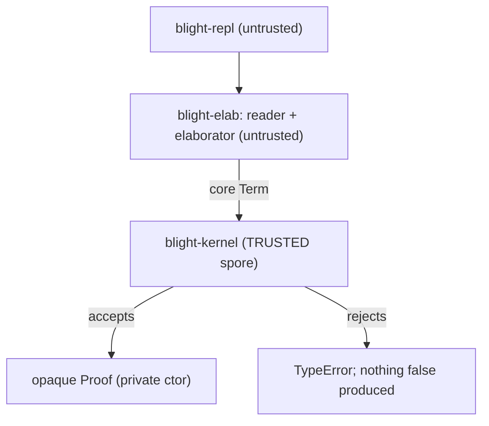
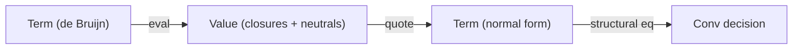
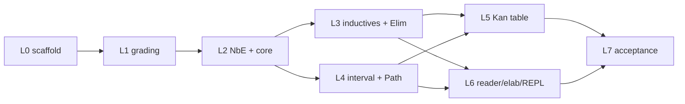

# Blight Implementation Strategy

> Companion to [`blight-spec.md`](blight-spec.md). The spec says *what* Blight is; this
> document says *how* we build it, in what order, and under what engineering discipline.

Status: **M0 in progress.** This document is the engineering plan we implement against. It is
deliberately concrete about the trusted-base boundary, the host representation, and the
test-first workflow, and it restates the spec's roadmap (spec §9) with engineering risks.

---

## Table of contents

1. [Host and workspace](#1-host-and-workspace)
2. [The TCB boundary](#2-the-tcb-boundary)
3. [Core representation](#3-core-representation)
4. [The grading spine in the host](#4-the-grading-spine-in-the-host)
5. [The cubical Kan table](#5-the-cubical-kan-table)
6. [TDD workflow and the test ledger](#6-tdd-workflow-and-the-test-ledger)
7. [Milestone map (M0..M6)](#7-milestone-map-m0m6)
8. [Testing and auditing strategy](#8-testing-and-auditing-strategy)

---

## 1. Host and workspace

The bootstrap host is **Rust** (spec §8.1), chosen for three reasons that matter to *this*
project specifically:

- **Module privacy enforces the TCB.** Rust's `pub`/private boundary lets us make the `Proof`
  constructor unreachable outside the kernel module — the language enforces spec §2.1's "only
  door" at compile time, not by convention.
- **LLVM tooling.** `inkwell`-style bindings are available for the eventual native backend
  (spec §7), so the host language does not have to change between M0 and M4.
- **Performance for NbE.** The kernel's hot path is normalization-by-evaluation; Rust gives us
  control over allocation and sharing (`Rc`/arenas) without a GC fighting us.

The project is a **Cargo workspace** whose crate split *is* the trust boundary:

```text
Cargo.toml                 # [workspace]
crates/
  blight-kernel/           # TRUSTED. the spore: terms, NbE, all spec section 2 rules + Kan table
  blight-elab/             # UNTRUSTED. reader, surface AST, bidirectional elaborator
  blight-repl/             # UNTRUSTED. the `blight` binary
tests/                     # workspace integration tests (black-box, kernel public API only)
```

Edition 2021, `#![forbid(unsafe_code)]` in `blight-kernel` (the trusted base must contain no
`unsafe`), and `#![deny(warnings)]` in CI.

---

## 2. The TCB boundary

This is the single load-bearing engineering decision. The **trusted computing base** is exactly
`blight-kernel`; everything else can have bugs that *fail to produce* a `Proof` but can never
*manufacture a false one* (spec §8.3).



Mechanically:

- `Proof` is a struct with a **private** field, defined in `proof.rs`. There is no `pub fn` that
  builds one outside the kernel's own checking routines. The *only* way an external crate obtains
  a `Proof` is to hand the kernel a `Term` and a `Type` and have `check` succeed.
- `Judgement` is public and `concl(&Proof) -> &Judgement` is the one safe observation (spec §2.1).
  You can read what a proof concludes; you can never construct one backwards.
- `blight-elab` and `blight-repl` depend on `blight-kernel` but cannot reach inside it. A wrong
  core term from the elaborator is simply rejected.

What is **in** the TCB (audited as a unit, kept under a line budget): term representation, NbE
normalizer, the inference rules (spec §2.5–§2.7), graded-context arithmetic (§3), the cubical Kan
table (§2.6). What is **not**: the reader, the elaborator, `match`-compilation, the REPL, and (in
later milestones) the backend.

---

## 3. Core representation

- **Nameless terms (de Bruijn indices).** α-equivalence becomes structural equality, and
  substitution is well-understood. The interval layer gets its own de Bruijn space for *dimension*
  variables, kept distinct from ordinary term variables (spec §2.6: `𝕀` is a pretype, never stored
  at runtime, never a member of a universe).
- **NbE for definitional equality.** `Conv` (spec §2.5) is decided by *normalization by
  evaluation*: `eval : Term -> Value` into a semantic domain of closures and neutrals, then
  `quote : Value -> Term` back to a normal form, and compare normal forms. This is the standard,
  robust way to get β/η/ι plus the cubical computation rules right (spec §2.8).
- **The De Morgan interval as a normalized algebra.** Interval terms (`I0`, `I1`, `IMin`, `IMax`,
  `INeg`, dim vars) are normalized to a canonical form (e.g. a min-of-max normal form) so the
  lattice equations of spec §2.6 (`r ∧ 0 ≡ 0`, `¬0 ≡ 1`, idempotence, absorption) are decided by
  normalization rather than ad-hoc rewriting.
- **Cofibrations** (`(r=0) | (r=1) | φ∧φ | φ∨φ | ⊤ | ⊥`) get a small normal form too, so face
  satisfaction and "agree on overlaps" checks (spec §2.6 systems) are decidable.



---

## 4. The grading spine in the host

The `{0,1,ω}` semiring (spec §3.1) is wired in from day one, because spec §2.9 is explicit that
grading cannot be retrofitted without re-deriving substitution.

- A `Grade` type (`Zero | One | Omega`) with `add`/`mul` matching the spec §3.1 tables and the
  `0 < 1 < ω` order, satisfying **positivity** (`ρ+π=0 ⟹ ρ=0 ∧ π=0`) and **zero-product**
  (`ρ·π=0 ⟹ ρ=0 ∨ π=0`).
- A generic `Semiring` trait so the default `{0,1,ω}` instantiation can later be swapped for a
  richer semiring (spec §3.1 says any semiring satisfying those two laws is admissible).
- **Graded contexts**: each context entry carries a grade; the rules perform `scale` (`ρ·Γ`),
  `add` (`Γ₁+Γ₂`), and `zero` (`0·Γ`). The graded `Var` rule (spec §3.2) permits a `0`-graded
  variable to be used at grade `0`, which is what makes erasure (§3.3) and "indices in types cost
  nothing" work.

For M0 the grades are *tracked and checked* but no erasure pass runs (that is M4, spec §7.2);
M0's job is to get the accounting correct, not yet to exploit it at runtime.

---

## 5. The cubical Kan table

This is the largest and riskiest single piece of the spore (spec §2.6/§8.3), so it gets special
engineering treatment:

- It is a **closed table**: a finite set of "how does `transp`/`hcomp`/`comp` reduce at each type
  former" cases (Pi, Sigma, Path, Data, Univ, Glue). New type formers are the only thing that ever
  extend it.
- `Comp` is implemented as `HComp` + `Transp` in the standard CCHM decomposition (spec §2.6), so
  the irreducible primitives are `Transp` and `HComp`.
- **Conformance-tested against Cubical Agda.** For each case we pin the expected normal form
  against what Cubical Agda produces, so the table is checked against a mature reference
  implementation rather than only against our own intuition.
- **`ua` is derived from `Glue`**, not primitive (spec §2.6 notes this is permissible), shrinking
  the irreducible surface.

The critical scheduling note (see §6): the M0 acceptance proof `plus-zero` does **not** exercise
the Kan table, so the table is driven by its *own* conformance suite, never by the acceptance test.

---

## 6. TDD workflow and the test ledger

A dependent type-checker is an excellent TDD target: behavior is a set of judgements with crisp
accept/reject outcomes, and `Conv` is a pure, decidable function (spec §2.8). We therefore build
the kernel **test-first**, red → green → refactor, one layer at a time.

**The one caveat:** a Rust test must *compile* to *fail*. So the scaffolding step stubs every
public type and API signature with `todo!()`/`unimplemented!()`, so test modules compile and fail
at *runtime* (red) rather than failing to build.

**The finding that shapes the order:** `plus-zero` (spec §5.3) is a constant path in its base case
and a path application in its step. It exercises inductive `Elim` + ι + `Conv` + `Path`/`PLam`/
`PApp`, but it **never forces `transp`/`hcomp`/`comp`/`Glue`/`ua`**. The Kan table — the riskiest
trusted code — would be left undriven if we leaned on the acceptance test. So the Kan table gets
first-class conformance tests of its own (L5 below).

### Test ledger (write red first, in dependency order)

- **L0 scaffold** — stub public types + API with `todo!()` so all test modules compile; everything
  red.
- **L1 semiring/grading** — `+`/`·` tables (§3.1), positivity & zero-product laws, `0<1<ω`,
  graded-context `scale`/`add`/`zero`.
- **L2 NbE + core rules** — eval/quote roundtrip; β and η (Π, Σ); `Conv` accepts equal / rejects
  unequal; `Univ` cumulativity + level polymorphism (§2.4); Π/Σ form+intro+elim; graded `Var`
  permits `0`-use in types (§3.2).
- **L3 inductives + Elim** — declare `Nat`; `Zero`/`Succ` typecheck; ι reduces `plus Zero b ≡ b`
  and `plus (Succ n) b ≡ Succ (plus n b)`; strict-positivity rejects a bad declaration; one HIT
  path-constructor eliminator case (§2.7).
- **L4 interval + Path** — De Morgan equations; `Path`/`PathP` formation; `PApp p I0 ≡ x`,
  `PApp p I1 ≡ y`; `refl ≡ PLam i x` (§2.6).
- **L5 Kan table** *(driven independently of `plus-zero`)* — `transp`/`comp`/`hcomp` per type
  former; `Glue A ⊤ T e ≡ T`; `unglue ∘ glue ≡ id`; `ua e` transports as `e`; **`funext`
  proved**. Goldens vs. Cubical Agda (§8.3).
- **L6 reader/elaborator/REPL** — s-expr parse goldens; `match → Elim Nat`; `define-rec →`
  structural `Elim`; end-to-end `&str -> Result<Proof>`.
- **L7 acceptance** — §5.3 program: kernel **accepts** `plus-zero`, **rejects** the mutated step
  `(plam (i) k)`. Green = M0 done.



---

## 7. Milestone map (M0..M6)

Restating spec §9 with engineering emphasis and risk callouts.

| Milestone | Deliverable | Acceptance test | Primary risk |
|---|---|---|---|
| **M0** | Stage-0 kernel (full cubical) + reader/elab/REPL | `plus-zero` accepted, wrong step rejected; Kan table green on its own suite | Kan table correctness (mitigated: conformance vs Cubical Agda) |
| **M1** | Grading exploited at the surface | erased `Vec a n` checks with `n` confirmed erased; use-twice rejected | quantities × cubical interaction (spec §10.3) |
| **M2** | Effects + handlers judgement `! E` | `State` counter runs under its handler; divergent `define-rec` rejected where a proof is required | handlers + totality + normalization proof (spec §10.4) |
| **M3** | Tower rewritten *in Blight* + tactics | `plus-zero` provable by tactics; `Show`/`Ord` trait + functorized `RedBlackTree` typecheck | elaborator-in-Blight bootstrap ergonomics |
| **M4** | Native backend (LLVM) | native binary runs; million-deep tail recursion no overflow; grade-0 content absent from binary | safepoints vs `musttail` (spec §7.4) |
| **M5** | Region elision + GC maturation | region-disciplined workload bypasses GC | escape analysis from grades (spec §3.5) |
| **M6** | Self-hosting + ecosystem | Rust host needed only as seed/re-checker | metacircular spore model (spec §8.2 stage 4) |

The dependency structure (spec §9): M0→M1→M2; M0→M3; M2→M3→M4; M1→M4; M4→M5; M4/M5→M6.

---

## 8. Testing and auditing strategy

- **Kernel under a line budget.** The trusted base is reviewed as a unit; the Kan table is the
  riskiest part and carries the densest tests.
- **White-box vs black-box.** Kernel unit tests live in `#[cfg(test)]` modules next to the code
  (they may see the private `Proof` constructor to build fixtures). Workspace `tests/` are
  black-box: they touch only the kernel's public API, so they also serve as a check that the TCB
  boundary is usable from outside.
- **Golden definitional-equality tests.** Normal forms are pinned as goldens; a change in the
  normalizer that alters a normal form is surfaced immediately.
- **Independent re-checking (spec §8.3).** Because `concl` exposes the conclusion and proofs are
  core terms, a second minimal checker (later, the Stage-4 Blight model) can re-verify any proof.
  Two small checkers agreeing is stronger evidence than one big trusted compiler.
- **Honest caveat (spec §10).** The *combination* of cubical + grading + effects in one kernel has
  no published end-to-end normalization proof; M0 soundness rests on the component results plus
  testing. The spec §10 stratification/encoding fallbacks exist precisely so we can retreat to a
  proved-sound configuration if the unified proof proves out of reach.
