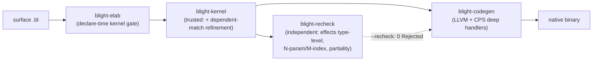

# Blight roadmap — post-M6 (M7–M14)

The M0–M6 milestones (spec §9, [docs/implementation.md](implementation.md) §"Milestones") delivered
the Stage-0 cubical kernel, grades, effects+handlers, the Blight tower + tactics, the native LLVM
backend, region/GC maturation, and self-hosting via the metacircular spore. This file tracks the
work that landed **after** M6 — capability and soundness hardening rather than new spore primitives.

Each milestone names its **acceptance test(s)** (all in-tree and green) and states whether it touched
the **TCB** (the trusted kernel `crates/blight-kernel`).

## Pipeline (post-M6)

## Milestones

| Milestone | Deliverable | Acceptance test(s) | TCB? |
|---|---|---|---|
| **M7 console-effect** | `Console` effect + native handler (`print`/`read`); I/O is library + runtime handler | `examples/game/guess.bl` builds & runs; `effects_demo.bl` | No (tower/runtime) |
| **M8 foreign-hatch** | Untrusted `foreign` postulate hatch (elaborator-only), re-checker declines honestly | `foreign` examples; recheck `Declined` counted | No |
| **M9 growable-heap** | Runtime heap growth + GC maturation under effectful workloads | runtime benches (`crates/blight-codegen/benches/runtime.rs`) | No |
| **M10 int-codegen** | Native `Int` arithmetic via the kernel `IntTy`/`IntLit` primitive + matching re-checker semantics | kernel int tests; `--recheck` agreement | Yes (primitive ints — the one deliberate, documented growth; see roadmap.md "Unboxed Int") |
| **M11 recheck-completeness** | Independent re-checker generalized to effects (type-level), partiality, and full **N-param / M-index** families | `recheck_agrees_on_multi_param_and_multi_index`, `recheck_agrees_with_kernel_on_M0_M5`, `recheck_checks_transp_not_declined` | No (re-checker is untrusted) |
| **M12 indexed-motive soundness** | **Dependent-match refinement ported into the trusted kernel** so `safe-tail`/`vec-map` are kernel-certified, closing the kernel↔re-checker asymmetry | `kernel_certifies_safe_tail_via_dependent_refinement`, `kernel_certifies_vec_map_via_dependent_refinement`, `kernel_rejects_illtyped_dependent_match`, `kernel_refinement_rejects_wrong_length_reachable_branch`; declare-time gate `gate_accepts_dependent_match_refinement_shape` | **Yes** (the one reviewed, isolated TCB growth — see `git diff crates/blight-kernel`) |
| **M13 soundness-corners** | Evidence-backed metatheory notes (quantities × cubical; graded effects normalization), from measured kernel behavior | `transp_*`, `hcomp_*`, `interval_var_carries_no_grade_in_usage_vector`; prose in [docs/metatheory.md](metatheory.md) | No (notes only) |
| **M14 self-host sketch** | Intrinsically-typed core `BTm : (g BTyCtx) (a BTy) → Type` (two-index family), Stage-5 self-host sketch | `spore_intrinsic_loads` (kernel + independent re-checker agree) | No (untrusted `.bl` model) |

## Notable findings

- **The only post-M6 TCB growth is M10 (primitive ints) and M12 (dependent-match refinement).** Both
  are deliberate, reviewed, and isolated. M12 closed a real *asymmetry*: before it, `safe-tail`/
  `vec-map` were certified only by the re-checker, because the trusted kernel lacked the unreachable-
  branch refinement the re-checker had. The kernel is now at least as capable as its second opinion
  on dependent matching.
- **The multi-index cap is lifted end-to-end** (surface `declare_data`, kernel `Data`/`Elim`,
  re-checker `infer_elim`), which unlocked the M14 intrinsic `BTm`.
- **Effects are now a genuine second opinion** at the type level in the re-checker (M11), not a
  blanket decline. The re-checker declines only the constructs genuinely outside its core fragment:
  cubical `Glue`/`ua`/partial-elements, `foreign` postulates (trusted FFI), and universe-*level*
  variables. Higher-order eliminator motives (e.g. the nested-`match` `zip-vec` lowering) are **no
  longer declined** — both the trusted kernel (M12 refinement) and the independent re-checker now
  fully certify them.

## Cross-references

- M0–M6 tables: [docs/implementation.md](implementation.md) §"Milestones" and spec §9.
- Capability axis (TCB vs tower): [docs/roadmap.md](roadmap.md).
- Soundness-corner evidence: [docs/metatheory.md](metatheory.md).
