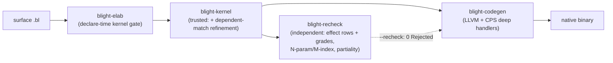

# Blight roadmap — post-M6 (M7–M29)

The M0–M6 milestones (spec §9, [docs/implementation.md](implementation.md) §"Milestones") delivered
the Stage-0 cubical kernel, grades, effects+handlers, the Blight tower + tactics, the native LLVM
backend, region/GC maturation, and self-hosting via the metacircular spore. This file tracks the
work that landed **after** M6 — capability and soundness hardening (M7–M14), the share-nothing
**multicore + distributed runtime** (M15–M19), a **max-performance sweep** (M20–M24:
fast-`Nat`, unboxing, LTO, untrusted `Float`, distributed-actor addressing), and a **post-M24
frontier sweep** (M25–M29: wider recognizer, trampoline-thunk elimination, scalar-replacement-of-
aggregates, a tuned allocator hot path, and linear ANF normalization) — rather than new spore
primitives.

Each milestone names its **acceptance test(s)** (all in-tree and green) and states whether it touched
the **TCB** (the trusted kernel `crates/blight-kernel`).

## Pipeline (post-M6)

## Milestones

| Milestone | Deliverable | Acceptance test(s) | TCB? |
|---|---|---|---|
| **M7 console-effect** | `Console` effect + native handler (`print`/`read`); I/O is library + runtime handler | `examples/game/guess.bl` builds & runs; `effects_demo.bl` | No (tower/runtime) |
| **M8 foreign-hatch** | Untrusted `foreign` postulate hatch (elaborator-only), re-checker declines honestly | `foreign` examples; recheck `Declined` counted | No |
| **M9 growable-heap** | Runtime heap growth + GC maturation under effectful workloads | runtime benches (`crates/blight-codegen/benches/runtime.rs`) | No |
| **M10 int-codegen** | Native `Int` arithmetic via the kernel `IntTy`/`IntLit` primitive + matching re-checker semantics | kernel int tests; `--recheck` agreement | Yes (primitive ints — the one deliberate, documented growth; see roadmap.md "Unboxed Int") |
| **M11 recheck-completeness** | Independent re-checker generalized to effects (type-level), partiality, and full **N-param / M-index** families | `recheck_agrees_on_multi_param_and_multi_index`, `recheck_agrees_with_kernel_on_M0_M5`, `recheck_checks_transp_not_declined` | No (re-checker is untrusted) |
| **M12 indexed-motive soundness** | **Dependent-match refinement ported into the trusted kernel** so `safe-tail`/`vec-map` are kernel-certified, closing the kernel↔re-checker asymmetry | `kernel_certifies_safe_tail_via_dependent_refinement`, `kernel_certifies_vec_map_via_dependent_refinement`, `kernel_rejects_illtyped_dependent_match`, `kernel_refinement_rejects_wrong_length_reachable_branch`; declare-time gate `gate_accepts_dependent_match_refinement_shape` | **Yes** (the one reviewed, isolated TCB growth — see `git diff crates/blight-kernel`) |
| **M13 soundness-corners** | Evidence-backed metatheory notes (quantities × cubical; graded effects normalization), from measured kernel behavior | `transp_*`, `hcomp_*`, `interval_var_carries_no_grade_in_usage_vector`; prose in [docs/metatheory.md](metatheory.md) | No (notes only) |
| **M14 self-host sketch** | Intrinsically-typed core `BTm : (g BTyCtx) (a BTy) → Type` (two-index family), Stage-5 self-host sketch | `spore_intrinsic_loads` (kernel + independent re-checker agree) | No (untrusted `.bl` model) |

### Multicore + distributed runtime (M15–M19)

Share-nothing concurrency and a data-only distributed transport, built **entirely in the untrusted
tower/runtime** — the kernel never sees a thread or a socket. The governing constraint was zero TCB
growth and **zero new `foreign` axioms** (`foreign` is the one hatch that *grows* the trusted base;
none is used here). Blight values are immutable persistent structures, so the only thread-unsafe
state was the C runtime's mutable globals — which M15 makes per-thread.

| Milestone | Deliverable | Acceptance test(s) | TCB? |
|---|---|---|---|
| **M15 thread-local runtime** | `gc.c`/`arena.c`/`stack.c` mutable globals moved to `BL_THREAD_LOCAL` behind the *same* API (codegen + single-runtime M0–M14 behavior byte-identical); `effects.c` op-intern table pre-interned at startup + frozen (`bl_effect_intern_freeze`) so it is immutable under parallelism; `bl_runtime_init` sets up a worker's own heap+stack | `share_nothing_multicore_two_runtimes_isolated` (two OS-thread workers, disjoint heaps, independent GC; tsan-clean under `BL_TSAN=1`) | No (runtime) |
| **M16 actor/CSP API** | `std/actor.bl` declaring `Actor` (`spawn`/`send`/`receive`/`yield`) as graded algebraic effects + an inline cooperative scheduler; resume-once safety is **kernel-enforced** via continuation grades; actors pinned to a worker (handler frames/continuations are thread-local, non-serializable) | `linear_actor_send_double_resume_rejected`, `nondet_actor_fork_multi_resume_ok` (kernel `GradeViolation` tests); `std_actor_loads_in_isolation`; `examples/actor_pingpong.bl` builds & runs | No (tower; kernel diff is test-only) |
| **M17 share-nothing worker pool** | Native pool of N OS threads (`worker.c` / `BlPool`), each with its own thread-local runtime (M15); args/results cross heaps by **structural copy** of immutable values | `share_nothing_worker_pool_parallel_map_reduce` (64 tasks / 4 workers, deterministic sum-of-squares); **`worker_pool_scales_with_cores`** (1/2/4/8-worker `SPEEDUP` table; tsan-clean) | No (runtime) |
| **M18 structural serializer** | `serialize.c` (de)serializer over the 7-tag layout; **data-only** (Con/Tuple/Int) — closures/opnodes carry a raw fn pointer and are rejected | `structural_serializer_round_trips_and_is_data_only` (round-trip equality, deep copy, data-only rejection); **`serializer_throughput_reported`** (MB/s + ns/op) | No (runtime) |
| **M19 distributed transport** | `blight-net` — an **untrusted** Rust crate (no `blight-kernel` dependency, no `foreign`) carrying serialized values over TCP using the **byte-identical** `serialize.c` wire format; reuses the `std/actor.bl` `send`/`receive` surface | `blight-net` unit tests (encode/decode round-trip, data-only + truncation rejection, loopback TCP, **golden** `wire_format_matches_serialize_c_layout`) | No (untrusted Rust; `git diff crates/blight-kernel` is test-only) |

### Max-performance sweep (M20–M24)

A maximalist performance program with the **same governing invariant** as M15–M19: every change lives
in the untrusted tower (`blight-codegen`, `runtime/`, `blight-prelude`, `blight-net`); the trusted
kernel gains **zero non-test lines** and **zero new `foreign` axioms**. Speed is never *trusted* — each
fast path is gated by a **differential test** against the inductive semantics over a fuzzed range, so a
buggy recognizer/representation can only ever produce a *wrong number*, never a *false proof* (the
kernel + `--recheck` still check the original `Zero`/`Succ`/`Int`/`Data` definitions).

| Milestone | Deliverable | Acceptance test(s) | TCB? |
|---|---|---|---|
| **M20 fast-`Nat` recognizer** | A `Cir→Cir` recognizer (`recognize.rs`) that structurally fingerprints the prelude `plus`/`mult`/`pred`/`sub` eliminator shapes and rewrites them to `Cir::NatPrim` machine-word ops (`bl_nat_*` in `numeric.c`), observationally identical to the `Succ`/`Zero` chain (deconstructable on demand); fully-canonical chains fold to a single word `NatLit`. Conservative: a redefined `plus` falls back to the generic O(n) eliminator | `fast_nat_matches_unary_semantics` (runtime differential, fuzzed); **`nat_arithmetic_is_fast`** (end-to-end: same `value`, O(n)→O(1) — recognized arm collects **0** times where the unary baseline is forced to GC) | No (recognizer + runtime; kernel diff test-only) |
| **M21 tagged-pointer unboxing** | Machine-word `Nat`/`Int` and nullary constructors ride in the `BlValue` pointer as low-bit-tagged immediates (no heap box); the GC tracer skips tagged immediates | codegen suite green through the immediate path (`opt_levels_emit_runnable_objects`, the full `--features llvm` example corpus); int/nat differential tests unchanged | No (runtime/codegen) |
| **M22 cross-object LTO** | `blight build` ships Blight program **and** C runtime as LLVM bitcode and links `clang -flto`, inlining hot runtime helpers (`bl_alloc`/`bl_app`/`bl_force`/`bl_nat_*`) into compiled Blight; `BL_NO_LTO` keeps the separate-object path as a fallback | `nm` shows runtime symbols inlined away (module-local / dead-stripped); ~1.15x on an allocation-heavy `Int` fold, **bit-identical** output both ways (docs/performance.md §2f); full `--features llvm` suite green via LTO by default | No (driver + `llvm.rs` bitcode path; kernel diff empty) |
| **M23 untrusted `Float`** | `std/float.bl` defines `Float` as ordinary inductive `Data` (`(mkfloat (mantissa Int))`, a fixed-point rational scaled by 10^6) built only from the trusted `Int` base — **no kernel `FloatTy`**. The backend recognizer rewrites each `float-*` wrapper to an O(1) `bl_float_*` helper computing the *same* fixed-point semantics | `std_float_*` (loads + re-checks as plain `Int`/`Data`); `float_diff.c` (bit-identical differential of the `bl_float_*` helpers vs. the fixed-point reference, fuzzed); `float_arith_example_loads_and_rechecks` + `example_float_arith_builds_and_runs` (end-to-end, recognizer on vs. off identical) | No (library + recognizer + runtime; re-checker *accepts* it — nothing new to trust) |
| **M24 distributed actor addressing** | `blight-net` gains a remote-addressing layer (`NodeId`/`ActorAddr`/`Router`) that interprets the `std/actor.bl` `send`/`receive` ops as routed `send_to`/`recv_from` over per-node `Transport`s, with an addressed `Tuple(actor, payload)` envelope — still data-only wire bytes, still no kernel term and no `foreign` axiom | `router_addresses_and_delivers_to_the_right_actor`, `router_send_to_unlinked_node_errors`, `open_envelope_rejects_non_envelope`; **`two_process_pingpong_over_loopback_tcp`** (two genuinely separate OS processes exchange ping/pong over a real socket; transcripts must agree) | No (untrusted Rust; `git diff crates/blight-kernel` test-only) |

### Post-M24 frontier sweep (M25–M29)

The same invariant continues: untrusted-tower only, zero kernel non-test lines, every fast path
differentially gated and verified **bit-identical** against the inductive semantics over the full
example/stdlib corpus. This sweep widened the existing fast paths (M25/M25b/M26/M27/M28) and removed
the two standing *algorithmic* bottlenecks the earlier docs called out (M29's O(n²) ANF re-shift).

| Milestone | Deliverable | Acceptance test(s) | TCB? |
|---|---|---|---|
| **M25 / M25b structural Nat-loop recognizer** | Widened the M20 recognizer: a non-canonical `(Succ k)` peels to an O(1) `Add(k,1)`, and new `bl_nat_min`/`bl_nat_max` runtime helpers behind `NatPrimOp`s. A frame-safe-GC-rooting fix repaired a recognized-loop miscompile (`sum_nat` 500500→55 on a HEAD). Peel stays opt-in + fuzzed | recognizer unit tests (non-canonical peel); `fast_nat_matches_unary_semantics`; `sum_nat` matches golden 500500 | No (recognizer + runtime) |
| **M26 trampoline thunk elimination** | An ANF peephole fuses `Let(MkClosure(f,[]), TailCall(Var0,arg))` into a direct `Jump`/`TailCallGlobal`, so a self-tail-recursive guarded step no longer heap-allocates a closure thunk. Also fixed an effect-soundness miscompile: the `Succ`-peel/`NatPrim` rewrite now tracks per-binder effectfulness so a var bound to a `perform` is never folded into a non-effect-aware `bl_nat_*` | ANF peephole unit tests; `actor_pingpong` corrected (1→5 regression fixed); suite green | No (ANF + recognizer) |
| **M27 scalar-replacement-of-aggregates** | New bottom-up `Cir→Cir` pass (`unbox.rs`) folds `Proj`-of-`Tuple`/`Con`, `Case`-of-`Con`, and the build-then-destructure literal-product idiom in place so the intermediate never allocates. Gated by `BL_NO_UNBOX`. A cross-call eliminator-inline extension was prototyped, **caught miscompiling by the differential check, and reverted** | 11 `unbox::tests::*` TDD units; full corpus bit-identical with the pass on | No (codegen) |
| **M28 tuned allocator/force hot path** | New `BL_HOT`/`BL_COLD`/`BL_LIKELY`/`BL_UNLIKELY`/`BL_ALWAYS_INLINE` hint macros (no-ops off clang/gcc); `bl_alloc` split into a lean inlinable nursery bump-and-init fast path + out-of-line cold `alloc_slow`; `bl_force`/`bl_gc_poll`/`bl_arena_alloc` marked hot with branch hints. Makes the M22 LTO inlining land on a tighter path | full codegen C-harness suite + repl example/stdlib differential tests green; byte-for-byte identical (`sum_nat` 500500) | No (runtime) |
| **M29 linear ANF normalization** | Replaced the eager full-subtree de Bruijn re-shift in `seq`/`Let`/`Case` lowering with a *deferred* `Shift` (persistent cons-list of frames + lift-counter, kept sorted by effective cutoff so shallow-var lookup is O(1)) applied once at `Var` leaves, plus a streamed shared `Vec<Comp>` bind accumulator (no per-level copy). Turns the long-documented super-linear ANF stage linear | **`deep_let_chain_normalizes_linearly`** (RED→GREEN scaling: ~48-75× → <30× at 8× depth); shape tests (`seq_shifts_earlier_atoms`, `anf_names_all_calls`, `tags_survive_anf`) stay green; full corpus bit-identical, kernel diff empty | No (codegen) |
| **M30 packed-byte `String` (A2)** | A recognized *backend* representation for `String` (still the kernel `empty`/`push` cons-list of `Nat` codepoints): `recognize.rs` folds a fully-canonical string literal to `Cir::StrLit`, lowered (ANF `Comp::StrLit` → `llvm.rs`) to one `bl_string_from_codepoints` call building a zero-field `BL_STRING` object (tag 9) over a program-lifetime, GC-untraced `BlStrData { cps, off, len }` side buffer — the M20 `BL_NAT` trick, so **zero GC + zero kernel growth**. `bl_string_to_con` materializes one `empty`/`push` layer on demand (chained after `bl_nat_to_con` in `emit_case`); direct runtime readers (`bl_print_string`, `bl_emit_string`, `bl_string_to_cstr`) read O(1)/codepoint and tolerate *mixed* spines (inductive head + packed tail, as `string-append` builds). Gated `BL_NO_STRPACK` | **`packed_string_matches_inductive_semantics`** (`string_diff.c`: packed vs. inductive vs. every mixed-spine prefix, all observations + `to_con`-peel bit-identical) + packed-string GC-survival test; `differential_fast_paths_are_bit_identical` green over the full corpus incl. stdin programs `greet.bl`/`game/guess.bl` | No (recognizer/runtime) |

**Landed — M30 (packed-byte `String`, A2).** The planned next step — backing `String` with a packed
codepoint buffer instead of a unary-codepoint cons list — is now **landed**, and *without* the
invasiveness the original deferral feared. The key was to **not** change the kernel-checked inductive
type or the elaborator's literal sugar at all: instead of a new kernel representation, A2 reuses the
**M20 `BL_NAT` trick** — a recognized *backend* representation of a still-inductive type. The
recognizer (`recognize.rs`) folds a fully-canonical `push cp0 (push cp1 … empty)` literal to a
`Cir::StrLit`, which lowers (ANF `Comp::StrLit` → `llvm.rs`) to one `bl_string_from_codepoints` call
building a single **zero-field `BL_STRING`** object (tag 9) whose `header.aux` points at a
program-lifetime, GC-untraced `BlStrData { cps, off, len }` side buffer. Because the object is
0-field, the precise `nfields`-driven tracer copies it by size and never touches `aux` — **zero GC
change, zero kernel growth, no byte-array substrate dependency**. The coherence shim
`bl_string_to_con` materializes one `empty`/`push` layer on demand and is chained after `bl_nat_to_con`
in `emit_case`, so a packed string destructures correctly through any generic eliminator. The direct
runtime spine-walkers (`bl_print_string`, the Console `print` decoder, `bl_string_to_cstr`) read a
`BL_STRING` in O(1)/codepoint and tolerate a **mixed** spine (inductive `push` cells ending in a packed
tail — the exact shape `string-append`'s `(empty) t` arm splices in; this mixed-spine case was the one
subtle bug, caught by the differential harness on the stdin-reading `greet.bl`/`game/guess.bl` and now
covered by `string_diff.c`'s per-prefix mixed-spine checks). Gated by `BL_NO_STRPACK`, wired into the
B1 differential matrix, and bit-identical across the whole corpus with packing on or off. The M27
reverted-inliner precedent held: the representation change shipped only once the differential gate was
green end-to-end.

**Proving the sweep — `treesum` + `BL_GC_STATS`.** Because the fib/sum loops run in registers and
barely allocate, an alloc-churn benchmark was added to actually exercise M27/M28/GC:
[bench/games/treesum/](../bench/games/treesum/) builds a full depth-18 binary tree (~2^19 nodes) and
folds it, bit-identical (262143) across C/Rust/OCaml/Haskell/Python and `treesum_int.bl`, wired into
`bench/game.sh`'s default set. Any compiled binary run with `BL_GC_STATS=1` prints
`BL_GC_STATS collections=N` to stderr (never stdout). See
[docs/benchmarks-game.md](benchmarks-game.md) §"Alloc-churn: treesum" and
[docs/performance.md](performance.md) §2h.

### Self-hosting substrate (C1 — `FileIO`, C2 — `Bytes`)

With the performance frontier consolidated, the next thread is the substrate a self-hosted
lexer/parser/elaborator will need — built, as always, in the untrusted tower with **zero kernel
growth**.

| Milestone | Deliverable | Acceptance test(s) | TCB? |
|---|---|---|---|
| **C1 `FileIO` effect** | A second user effect in [std/io.bl](../crates/blight-prelude/std/io.bl) alongside `Console`: `read-file : String → String` (whole file by path; a missing/unreadable file yields the empty `String`, never a crash) and `write-file : (Pair String String) → Unit` (truncating write). It is folded by the **same** native top-level deep handler the `Console` effect uses — `bl_run_console` (runtime/effects.c) grew `read-file`/`write-file` branches backed by `fopen`/`fread`/`fwrite` plus a `bl_string_to_cstr` decoder; the build driver's `console_inner` now installs that handler for any `main` whose row carries `Console` **or** `FileIO`. Whole-file (not fd/handle) ops are deliberate: they are the minimal substrate `read-file "foo.bl"` needs and avoid threading a mutable handle through pure code | `std_io_loads_in_isolation` (effect + wrappers declared, `Pair` spliced); `file_roundtrip_example_loads`; **`example_file_roundtrip_builds_and_runs`** (writes a payload to a temp path, reads it back, prints it byte-identically) | No (effect lives in the tower; re-checked at the type level by the independent re-checker post-B2, exactly like `Console` — see [docs/metatheory.md](metatheory.md) §2.2) |
| **C2 `Bytes` effect** | A mutable, runtime-backed byte buffer in [std/bytes.bl](../crates/blight-prelude/std/bytes.bl): `new-bytes : Nat → Int` (zero-filled, returns a handle; `-1` on alloc failure), `bytes-len : Int → Nat`, `get-byte : (Pair Int Nat) → Nat` (0 out of range), `set-byte : (Pair Int (Pair Nat Nat)) → Unit` (no-op out of range). Folded by the **same** `bl_run_console` (four new branches over a thread-local `BlByteBuf` table). The pure Blight value is just an opaque `Int` HANDLE indexing the C-side table; the mutable storage lives entirely **outside the GC graph** (like a file lives in the OS for `FileIO`), so it adds **zero traced object kinds and zero TCB**. Handles are monotonic (never recycled), so a stale handle is always detectably out of range. This is the substrate C3's lexer scans: copy a file's bytes in once, then read with O(1) `get-byte` instead of rebuilding a unary-`Nat` cons-list per char | `std_bytes_loads_in_isolation` (effect + wrappers declared, `Int`/`Pair` spliced); `bytes_scratch_example_loads`; **`example_bytes_scratch_builds_and_runs`** (alloc → `set-byte 7` → `get-byte` → prints 7) | No (effect lives in the tower; re-checked at the type level by the independent re-checker post-B2) |
| **C3 self-hosted byte scanner** | The first self-hosting code: a lexer-style scanner written **entirely in `.bl`** ([std/lexer.bl](../crates/blight-prelude/std/lexer.bl)) over the C1+C2 substrate. `string->bytes` copies a `String` (codepoint cons-list) into a runtime `Bytes` buffer once — a *structural* recursion that descends on the string spine with the write index as a **trailing** accumulator (load-bearing: the eliminator can only vary parameters *after* the scrutinee, so each per-step `set-byte` sequences correctly). `scan-depth` then walks the buffer with O(1) `get-byte` index reads, recursing on a structural `Nat` fuel, to compute the maximum paren-nesting depth. `max-paren-depth "(a (b (c) d) (e))" = 3`. Runs under the same `bl_run_console` top-level handler. | `paren_depth_example_loads`; **`example_paren_depth_builds_and_runs`** (prints 3) | No (effect lives in the tower; re-checked at the type level by the independent re-checker post-B2) |

**C2 surfaced a latent inliner miscompile.** The monomorphizer (`mono.rs`) beta-reduces a known
closure call `(λx. body) arg` by substituting `arg` at *every* use of `x`. With an **effectful**
`arg` (a `perform`/`force`/foreign call) this is only sound when the effect runs exactly as often as
before. The old guard only blocked the *drop* case (param unused); it still **duplicated** the
effect when the param was used 2+ times. `bytes_scratch` is exactly that shape — `let h = perform
new-bytes …` feeds *both* the later `set-byte` and `get-byte` — so it `new-bytes`d twice and read an
empty second buffer (→ 0 instead of 7). Fix: for an effectful `arg`, inline only when the param is
used **exactly once** (a new `count_param_uses` helper, saturating at 2 and treating any use under a
suspending binder — `Lam`/`Fix`/`Later`/`Handle` — as "many"); otherwise keep the call so the native
OpNode-aware `bl_app` sequences the single effect. Guarded by four `mono.rs` unit tests
(`effectful_arg_used_twice_is_not_inlined`, `…_used_once_inlines`, `…_unused_is_not_inlined`,
`count_param_uses_basics`) plus `example_bytes_scratch_builds_and_runs` end-to-end.

**C3 surfaced three latent backend bugs**, each caught by `example_paren_depth_builds_and_runs` and
now regression-tested. (1) *Whole-program effect analysis in the inliner.* The C2 fix only blocked
duplicating a syntactically-obvious effect; the lexer's **curried, recursive** writer (`fill-from`)
hid its `set-byte` behind several closure-conversion / currying layers, so the old local check
couldn't tell the call was effectful and dropped it. `mono.rs` now computes a once-off fixpoint
`effectful_funcs` over the whole call graph (scanning *through* `Lam`/`Fix`/`Later` binders and
treating every `MkClosure(f, …)` value as a potential call to `f`, since closures exist to be
applied); `arg_may_effect` consults it so an effectful argument is dropped/duplicated only when
provably safe. (2) *`sub`-vs-`min`/`max` fingerprint collision.* The `Nat`-arithmetic recognizer
matched any *nested* two-arm eliminator as `sub`, so `min 2 5` miscompiled to `sub 2 5` = 0 (should
be 2). The fingerprint now discriminates on the inner `match b`: `sub`/`max` return `(Succ n)` on the
inner `Zero` (rules out `min`), and `sub`'s recursion is the *bare* induction hypothesis whereas
`max` wraps it in `Succ` (rules out `max`). Three `recognize.rs` unit tests gate it. (3) *Closure
captures must not bubble.* An earlier experiment routed **closure** construction through
`bl_con_bubble` (the OpNode-aware Con/Tuple builder). But a structural eliminator's induction
hypothesis `self k : ! E A` is a *suspended* effectful computation captured in a closure; eagerly
bubbling it ran the recursion's per-step effects out of order (the `guess.bl` loop printed every
branch, deepest-first). Reverted: closures build as identity and their captures resume when the
closure is *applied*. A fourth, source-level discipline backs (1)/(3): the elaborator now requires an
*effectful* structural recursor's leading arguments to be the leading parameters verbatim (a varying
leading accumulator falls through to the sound partial `later`-step instead of being folded into the
eager IH), so a mis-ordered effectful loop fails safe rather than silently miscompiling.

## Notable findings

- **The only post-M6 TCB growth is M10 (primitive ints) and M12 (dependent-match refinement).** Both
  are deliberate, reviewed, and isolated. M12 closed a real *asymmetry*: before it, `safe-tail`/
  `vec-map` were certified only by the re-checker, because the trusted kernel lacked the unreachable-
  branch refinement the re-checker had. The kernel is now at least as capable as its second opinion
  on dependent matching.
- **The multicore + distributed runtime (M15–M19) grows the TCB by zero and adds no new `foreign`
  axioms.** All of it is untrusted tower/runtime: `BL_THREAD_LOCAL` keeps codegen and the M0–M14
  suite byte-identical; the actor surface is a `.bl` library whose resume-once safety is *enforced by
  the existing kernel grades* (no kernel rule changed — `git diff crates/blight-kernel` for M15–M19 is
  confined to `#[cfg(test)] mod tests`); the distributed transport (`blight-net`) is a dependency-free
  Rust crate that only moves bytes, so the kernel never sees a thread or a socket. Share-nothing is
  what makes this safe without a concurrent-GC rewrite: Blight values are immutable, so the only
  thread-unsafe state was the runtime globals, now per-thread.
- **The concurrency runtime is measured, not just asserted.** `worker_pool_scales_with_cores` and
  `serializer_throughput_reported` (run via `bench/multicore.sh`) demonstrate real multicore speedup
  (the worker pool gets several-fold faster from 1→8 workers on a multicore host) and a concrete
  data-only message throughput, both ThreadSanitizer-clean. Absolute numbers are host-dependent;
  determinism of the parallel result is the hard gate.
- **The max-performance sweep (M20–M24) keeps the headline "performance without spending trust"
  promise: zero TCB growth, zero new `foreign` axioms.** The fast-`Nat` recognizer (M20) and untrusted
  `Float` (M23) are pure backend representation choices — the kernel keeps seeing `Zero`/`Succ` and a
  plain `(mkfloat Int)` constructor, and every fast path is gated by a *differential* test against the
  inductive semantics (a wrong recognizer yields a wrong number, never a false proof). Notably the
  re-checker *accepts* the `Float` program outright: it is built entirely from the trusted `Int` base,
  so there is literally nothing new to trust. Tagged-pointer unboxing (M21) and cross-object LTO (M22)
  are runtime/driver-only and provably behavior-preserving (the full `--features llvm` example corpus
  is bit-identical through both paths). The distributed-actor addressing layer (M24) extends
  `blight-net` (untrusted, no `blight-kernel` dependency) with `NodeId`/`Router` routing and is proven
  by a **two-separate-OS-process** ping/pong over a real loopback socket. `git diff crates/blight-kernel`
  across the whole sweep is test-only.
- **The post-M24 frontier sweep (M25–M29) holds the line: zero TCB growth, zero new `foreign`
  axioms, bit-identical output.** It is all backend/runtime — a wider Nat recognizer (M25), an ANF
  trampoline-thunk fusion (M26), the `unbox.rs` SRA pass (M27), allocator hot-path tuning (M28), and a
  linear-ANF rewrite (M29) — and `git diff crates/blight-kernel` across it is empty. Two points are
  worth flagging. First, M29 retired the long-documented "ANF scales super-linearly" caveat: it was an
  O(n²) de Bruijn re-shift, now a deferred `Shift` applied once at `Var` leaves, pinned by a
  RED→GREEN scaling test. Second, the mandate bit again: M27's aggressive cross-call eliminator-inline
  passed its unit tests but the **differential check caught it miscompiling**, so it was reverted —
  the same discipline that keeps "speed is never trusted" honest. The once-risky representation change
  (M30, packed-byte `String`) has since **landed** under the same gate — by reusing the M20 `BL_NAT`
  recognized-backend-repr trick it touches neither the kernel-checked type nor the GC, and shipped only
  once bit-identical end-to-end across the corpus (including the stdin-reading effectful programs). The
  wins are
  measured by a new alloc-churn `treesum` benchmark and the `BL_GC_STATS=1` collection counter.
  blanket decline. The re-checker declines only the constructs genuinely outside its core fragment:
  cubical `Glue`/`ua`/partial-elements, `foreign` postulates (trusted FFI), and universe-*level*
  variables. Higher-order eliminator motives (e.g. the nested-`match` `zip-vec` lowering) are **no
  longer declined** — both the trusted kernel (M12 refinement) and the independent re-checker now
  fully certify them.

## Grand Arc — Phase 1 (Fastest + Proofiest + Self-Hosting)

The Grand Arc is a phased push to make Blight simultaneously the fastest, proofiest, and
self-hosting dependently-typed language, under the same non-negotiable invariant as every sweep
above: every change is either untrusted-tower (kernel diff test-only) or a deliberate, reviewed TCB
change, and every fast path is *differentially* gated to be bit-identical against the inductive
semantics.

| Milestone | Deliverable | Acceptance test(s) | TCB? |
|---|---|---|---|
| **B1 standing differential-correctness harness** | The ad-hoc `BL_NO_*` A/B testing is promoted to a *standing property*. A new harness (`crates/blight-repl/src/main.rs`, test module) builds the real example corpus under every documented bit-identical fast-path configuration — baseline (all on), each fast path off in isolation, and **all** fast paths off (the pure inductive/slow reference) — and asserts the produced binary's stdout is byte-for-byte identical to the baseline. This is the mechanical enforcement the Track-A representation milestones (A1 flattening, A2 string-as-bytes, A3 loop fusion, A4 inliner) are gated on: a miscompiling optimization yields a wrong *number*, caught here, never a false *proof*. The equivalence set is the documented bit-identical flags `BL_NO_NATPRIM` (M20), `BL_NO_UNBOX` (M27), `BL_NO_LTO` (M22), `BL_NO_FLATTEN` (A1), `BL_NO_STRPACK` (A2/M30), and `BL_NO_SPINEFUSE` (A3; the harness picks each up automatically) | **`differential_fast_paths_are_bit_identical`** (`#[ignore]`d; the full 37-program corpus × every flag config, bit-identical — run with `--features llvm -- --ignored differential`); **`differential_smoke_slow_path_matches`** (non-ignored fast slice: an `Int` fold, the alloc-churn tree, a fuel sort, a string op, and an effectful `Bytes` program, all-fast-paths-off ≡ baseline) | No (test-only; `git diff crates/blight-kernel` empty) |

**B1 immediately earned its keep — a finding.** Building the corpus under `BL_NO_MONO` (which the
harness *deliberately excludes*) revealed that `mergesort.bl` — a higher-order, continuation-passing
fuel sort — **SIGBUSes in the un-monomorphized closure path**, while every other corpus program is
unaffected. That confirms `BL_NO_MONO` is a *bisecting diagnostic*, not a behavior-preserving A/B
switch: monomorphization does correctness-critical work (dictionary `Proj` resolution, known-closure
specialization) the rest of the pipeline depends on. The honest disposition (matching the
"speed is never trusted" discipline) is to keep the harness's equivalence set to the three
*documented* bit-identical flags and track the un-specialized higher-order miscompile as a separate
backend item, rather than weaken the bit-identity claim. The three real fast-path flags are
bit-identical across the whole corpus.

| Milestone | Deliverable | Acceptance test(s) | TCB? |
|---|---|---|---|
| **A1 escaping-product flattening (substrate landed; firing widening deferred)** | A complete, differentially-gated substrate for inlining a pure, never-matched child product's slots into its parent so a nested product becomes **one** wider all-pointer object and a `parent.outer.inner` read becomes **one** load at a computed offset. New IR (`Cir::Flat`/`Cir::FlatProj` + the `FlatField` layout map, `ir.rs`); a conservative bottom-up `Cir→Cir` pass (`flatten.rs`) that fires on a `let`-bound parent product **all** of whose uses drill through the flattened layers to a `Leaf` (never reads a nested sub-product whole, never `case`-matches the parent); ANF lowering of `Flat`/`FlatProj` to an ordinary wide `Con`/`Tuple` + `Proj`-at-physical-offset (`anf.rs`); the GC needs **zero** change because a flattened object is just a wider all-pointer object the precise tracer already walks by `nfields`. Gated by `BL_NO_FLATTEN`, wired into the B1 differential matrix. | 6 `flatten::tests::*` TDD units (fires on the leaf-drill shape with correct `Flat`/`FlatProj` offsets; declines on whole-parent escape, whole-nested read, parent `case`, no-nested-field; tracks de Bruijn depth under binders); `gc_test.c::test_flattened_wide_object_survives` (a 3-slot wide object survives churn with every slot intact); full corpus bit-identical with `BL_NO_FLATTEN` in the matrix | No (codegen; `git diff crates/blight-kernel` empty) |

**A1 is an honest "substrate landed, firing widening deferred" — a finding, not a win (yet).** With
the substrate complete and *proven safe* (all unit tests + full-corpus bit-identity + the GC
survival test), measurement shows the conservative `flatten.rs` rewrite **never fires on the 51-program
corpus**: it is *strictly subsumed by M27 `unbox` (SRA)*. The reason is structural, not a tuning miss:
the only shape `flatten` can prove safe locally — a `let`-bound literal product **all** of whose uses
are projection chains — is exactly the shape `unbox` already handles *better*, by deleting the
allocation outright (its `all_uses_destructure` guard treats a `Proj`-chain, even a nested one, as an
in-place destructure and substitutes the literal, after which the chain constant-folds). The genuine
A1 win lives in the **escaping** case (a nested product *returned from a recursive function* / *passed
to a call*), but there the parent's physical layout must agree with **every** reader — including
readers in *other* functions the local pass cannot see. Making that bit-identical is therefore a
**whole-program, post-monomorphization layout-assignment** problem (decide one physical layout per
constructor across the closed world), not a local `Cir→Cir` peephole. The principled disposition under
the "speed is never trusted" discipline: ship the *proven* substrate and the differential gate now (so
the future global pass is already safety-netted and the IR/ANF/GC plumbing is tested), and track the
firing widening — *post-mono global layout flattening* — as the explicit A1′ follow-up, rather than
ship a no-op pass dressed as an optimization. The six real fast-path flags
(`BL_NO_NATPRIM`, `BL_NO_UNBOX`, `BL_NO_LTO`, `BL_NO_FLATTEN`, `BL_NO_STRPACK`, `BL_NO_SPINEFUSE`) are
bit-identical across the whole corpus.

| Milestone | Deliverable | Acceptance test(s) | TCB? |
|---|---|---|---|
| **A3 captureless-call spine fusion** | M26 removed only the *tail* `MkClosure(f,[]) + TailCall` thunk; the strictly-curried calling convention still heap-allocates a throwaway **captureless** closure for **every non-tail partial application** a curried multi-argument structural/effectful loop runs each step (`(loop f …)`, `(h x)`, the `fst`/`snd` projections the `fill-from`/`scan-depth` lexer family runs per byte — visible as `MkClosure(rec_N,[]) + Call` in `BL_DUMP_ANF`). A3 folds each `CallClosure(MkClosure(f,[]), a)` to a new non-tail `Comp::CallGlobal(f, a)` at ANF-construction time (`anf.rs`; the captureless closure binder is simply never introduced, so **no de Bruijn surgery** and no alloc), lowered (`llvm.rs`) through a new runtime `bl_app_global(fnptr, a)` (`effects.c`): a captureless function reads no env, so it is called with a **null env** exactly like `TailCallGlobal`; an **effectful (OpNode) argument falls back to `bl_app`** over a freshly-built closure, so delimited-continuation capture is bit-identical to an un-fused call. Pure backend representation optimization (kernel/re-checker never see ANF), gated by `BL_NO_SPINEFUSE`, wired into the B1 differential matrix. | 3 `anf::tests::*` units (a captureless non-tail call fuses to `CallGlobal` with no `MkClosure`; with fusion off it stays `MkClosure(_,[]) + Call`; a *capturing* call never fuses); **`spine_fusion_reduces_allocations`** (the fused ANF emits ≥1 `CallGlobal` and strictly fewer `MkClosure` sites than the un-fused, *and* both build+run natively through `bl_app_global` to the identical result); full corpus bit-identical with `BL_NO_SPINEFUSE` in `differential_fast_paths_are_bit_identical` | No (codegen + runtime; `git diff crates/blight-kernel` empty) |

**A3 is a real win on the curried-loop step — and surfaces the currying floor as the A3′ follow-up.**
The fold demonstrably removes the per-step captureless-closure allocations (14 of 42 static sites on
`paren_depth.bl`; the lexer/parser family's per-byte `fst`/`snd`/helper calls). What it *cannot*
remove with an ANF-local rewrite is the loop's own **capturing** partial-application closure: because
functions are single-argument (curried), a 3-arg `(loop rest h (Succ i))` lowers to a chain
`CallGlobal(loop, rest)` → *returns a closure capturing `rest`* → `Call(·, h)` → `TailCall(·, Succ i)`,
and that intermediate capturing closure is inherent to the calling convention, not a captureless thunk.
A true multi-argument **loop back-edge** (update `rest`,`h`,`i` together, zero allocation) requires an
*uncurried calling convention / multi-arg `Jump`* in the IR + `llvm.rs` — a backend change, tracked as
the explicit **A3′** follow-up — not an ANF fold. So A3 ships the safe, proven, ANF-local half of the
spine-fusion win now (differentially gated), and scopes the calling-convention half honestly.

| Milestone | Deliverable | Acceptance test(s) | TCB? |
|---|---|---|---|
| **B2 re-checker effect rows + continuation/partiality grades** | The independent re-checker ([blight-recheck](../crates/blight-recheck)) now tracks its *own* graded effect row (`RRow` in [term.rs](../crates/blight-recheck/src/term.rs), an independent mirror of the kernel's `Row` over the re-checker's `RGrade`) alongside the type and usage vector — previously effects/partiality were modeled at the **type level only**, with the row dropped. The row is threaded through `infer`/`check` exactly as the kernel threads `Row` (`check.rs`): a `perform op a` contributes its effect's label at the ambient demand; `later`/`force` contribute the built-in `Partial` label (divergence is now tracked); subterms' rows union; a `handle` **discharges** the labels it interprets and independently enforces each clause's **continuation-multiplicity grade** (`demand(k) ≤ cont_grade`). Two doors: `recheck_judgement` (general/buildable — accepts partial/effectful programs, like the kernel's `Checker`) and `recheck_proof` (re-derives the kernel's `check_top_with` **purity** invariant — a proof's row must be empty). This strengthens "a false `Proof` must fool *both* checkers" to cover effect discipline and partiality, not just their types. | `recheck_enforces_continuation_grade` (a double-resume handler is `Ok` at `cont_grade=ω` but **Rejected** at `cont_grade=1` — the decline-vs-reject win); `recheck_proof_path_demands_purity` (the proof door **Rejects** a top-level `later`/`force`/`perform` as impure, while the buildable door accepts it); `recheck_accepts_delay_layer` / `recheck_accepts_effects_and_handlers` (the buildable door still models the delay/effect *types*); full prelude/example corpus re-checks with **0 spurious Rejections** (`std_*_loads_in_isolation`, `*_loads_and_rechecks`, and the `--recheck` build path over the whole example set, incl. the partial `ackermann`) | No (re-checker is untrusted; `git diff crates/blight-kernel` empty) |

**B2 surfaced the proof-vs-buildable distinction — a finding.** A first cut imposed the kernel's
top-level **purity** invariant (empty effect row) on *every* `recheck_judgement`, which immediately
**Rejected `ackermann`** under `--recheck`: Ackermann is a genuinely partial `define-rec` whose
`later`-guarded body carries `Partial`, and the `--recheck` build path re-verifies *every* typed
global — including buildable-but-partial ones. The kernel itself only demands purity at the *proof*
door (`check_top_with`); the elaborator routes partial/effectful definitions *around* that door
(`kernel_check_def` treats an `EffectError` as "outside the pure door — skip, do not reject"). The
faithful fix mirrors that exactly: `recheck_judgement` re-derives the row + grade discipline but
permits any top-level row (a partial program is a valid *typing* judgement), while only
`recheck_proof` (re-verifying an actual kernel `Proof`, which can never be forged with an impure
conclusion) re-derives the empty-row purity invariant. So the second opinion now covers the *full*
effect/partiality discipline without ever spuriously rejecting a buildable program.

| Milestone | Deliverable | Acceptance test(s) | TCB? |
|---|---|---|---|
| **B3 shrink-Int-TCB investigation** | A full feasibility map of removing primitive `Int` (the M10 TCB growth) from the trusted kernel by re-expressing it as an untrusted *library* type over a minimal base, following the Nat (M20) / Float (M23) "library type + backend recognizer, zero kernel growth" playbook. Catalogued the entire `Int` trusted surface — `IntTy`/`IntLit`/`IntPrim`/`IntPrimOp` in `kernel/term.rs`, the typing rules in `check.rs` (Int is *signature-free*: it deliberately needs no `Bool`/`Nat` in scope), the **native i64 reduction** in `normalize.rs` (`wrapping_*`, signed div, **÷0 stuck**, `Eq`/`Lt`→`1`/`0`), `value.rs`/`erase.rs`/`kan.rs` — and every downstream consumer (the re-checker *duplicates* the i64 semantics as an independent witness; codegen lowers `IntPrim` to **inline LLVM i64**, not a recognizer rewrite; the elaborator hardwires the `Int` atom, `(int N)` i64 literals, and `int+`/…/`int<`). | Investigation finding (this entry) + the explicit **B3′** prototype plan below | n/a (investigation; no code change, `git diff crates/blight-kernel` empty) |

**B3 is a finding: defer the kernel removal — `Int` is the bottom layer the Float trick stands on.**
The Float precedent does **not** transfer cleanly. `Float` (M23) escapes the TCB precisely *because it
is a single-constructor wrapper over primitive `Int`*: the kernel already did the hard i64 work, and
`recognize.rs` only has to fingerprint `mkfloat`-of-`IntPrim` leaf shapes → `bl_float_*` (the kernel
still sees `Data` + `IntPrim` leaves). `Int` is the **bottom machine-word layer Float sits on**, so
removing it means *re-deriving* that layer as an inductive `Data` (sign+magnitude over `Nat`, or a
two's-complement binary tree) and recognizing its far heavier arithmetic eliminator back to O(1) i64.
Five concrete hard parts make this a large, cross-cutting migration rather than a recognizer patch,
and one of them is a genuine *proof-strength* tradeoff:
1. **Signed/wrapping i64 from Peano.** `Nat` is unsigned unary; signed `i64` add/sub/mul with wrapping
   and signed compare is a much heavier inductive definition to fingerprint than `plus`/`mult`.
2. **i64 literal sugar.** `(int N)` is a direct `i64`; a library `Int` would need a backend-only
   canonical-literal fold (the `NatLit`/`StrLit` trick) since `-2^63` as inductive data is impractical.
3. **÷0 semantics divergence already latent.** The kernel makes `÷0` *stuck*; the current LLVM lowering
   emits an unguarded signed div. A library definition must pick one behavior and align codegen + a new
   `int_diff.c` differential gate.
4. **Float-on-Int chain.** `float-*` recognition consumes `Cir::IntPrim` leaves *today*, so migrating
   `Int` first forces a two-phase recognizer (int-wrappers→`IntPrim`, then float-wrappers→`FloatPrim`).
5. **Weakened independent witness.** Removing kernel `Int` means the re-checker no longer *independently
   re-implements* i64 — it would trust the library definition + structural-recursion checker, dropping
   the M10 "two checkers independently agree on machine-int overflow/÷0" guarantee unless replaced by
   heavy differential testing (the Nat/Float `*_diff.c` discipline).
The honest, discipline-consistent disposition (mirroring A1's "ship the proven substrate, defer the
firing"): **keep primitive `Int` for now** and scope **B3′** as the minimal, zero-TCB de-risking step —
a *prelude-only* candidate library `Int` plus `int-add`/`int-mul` recognizer fingerprints → `Cir::IntPrim`
and an `int_diff.c` differential gate, measuring fingerprint complexity for `int-div`/`int-lt`/negative
literals — all **before** touching the kernel/re-checker TCB. Net: the M10 TCB growth stays the one
deliberate, reviewed, `--recheck`-corroborated cost it always was, and the path to retiring it is
mapped and gated rather than rushed.

| Milestone | Deliverable | Acceptance test(s) | TCB? |
|---|---|---|---|
| **SH1 self-hosted `.bl` parser** | The frontend of the self-hosting track ([std/parser.bl](../crates/blight-prelude/std/parser.bl)), a tokenizer + s-expression parser written **entirely in `.bl`** over C3's `std/lexer.bl` byte scanner, producing a surface `BSurf` AST (`BSexp` = `s-atom`/`s-nil`/`s-cons`, a directly-recursive Lisp cons-cell encoding — trivially strictly positive). Two halves split by the effect boundary: `tokenize : (h Int)(n Nat) → (! Bytes (List Token))` walks the byte buffer with O(1) `get-byte` reads, recursing on a structural `Nat` **fuel** with the in-progress atom's bytes as a *trailing* accumulator (the `scan-depth`/effectful-recursor shape) — re-checked at the type level like the other `Bytes` effect programs (post-B2); and `parse-tokens : (List Token) → Maybe BSexp`, a **pure, total, structural** stack machine over the token-list spine (one token per step, parser state threaded as a `reverse-onto` accumulator, nested lists handled by an explicit frame *stack* rather than the mutual recursion the structural checker can't express), which needs no effect row at all. `parse-string "(a (b c) d)"` parses to a 4-atom tree. | `parser_self_host_loads` (kernel type-checks the whole frontend; the pure parser core — `parse-go`/`next-state`/`finish` — re-verifies `Ok`); `parse_demo_example_loads`; **`example_parse_demo_builds_and_runs`** (compiles + runs natively, prints `4`) | No (tower; `git diff crates/blight-kernel` empty) |
| **SH2 self-hosted proof-carrying elaborator** | The middle of the self-hosting track ([spore_elab.bl](../crates/blight-prelude/spore_elab.bl)), `belaborate : (g BTyCtx)(s BSurf) → Maybe (Sigma (a BTy). BTm g a)` written **entirely in `.bl`**, taking SH1's surface `BSurf` (`su-var`/`su-lam`/`su-app`) into the **intrinsically-typed core** of `spore_intrinsic.bl` (`BTm g a` = well-typed-syntax-by-construction). **Acceptance *is* a typing proof:** the result type can only be inhabited by a term the object language's typing rules accept, so a successful elaboration is, by its very type, a derivation of `g ⊢ t : a`; an ill-typed surface term simply has no inhabitant and `belaborate` returns `nothing` — it is *impossible* for it to forge a bad term. Every runtime-discovered type equality flows through a propositional `BtyEq` + its transport `bty-coerce` (a decidable `bty-deceq`), never a raw cast. Two disciplines keep every nested dependent `match` inside the certified fragment: **curry the scrutinee whose type the result mentions** (so the matched value is the only thing in scope), and **match only variables, threading `Maybe`s through `maybe-map`/`maybe-bind`** (never `match` a call result). `λx.x` ⇒ size 2, `λf.λx. f x` ⇒ 5, ill-typed `λx. x x` ⇒ `nothing`. | `elaborator_self_host_loads` (kernel type-checks the whole elaborator into its own typed core; backbone re-verifies `Ok`/declines, never `Rejected`) | No (tower; `git diff crates/blight-kernel` empty) |

**SH1 surfaced a false-rejection bug in the B2 re-checker — a finding (and a fix).** Wiring the
pure parser through `recheck_judgement` over the *whole* transitive prelude exposed that the
re-checker was **`Rejected`ing kernel-valid effectful stdlib** (`bytes-get`, `fill-from`, …) — a
soundness-relevant false positive (a `Rejected` claims "I found a real type error"). Two root causes,
both fixed in the tower (zero kernel growth): (1) **`! E A` collapse.** B2 evaluated `! E A` to a
distinct `RValue::EffTy(A)`, so an `! E A`-annotated definition whose body is a bare `perform`
(inferring payload `A`) mismatched. The kernel instead makes `! E A` *definitionally its payload*
(`normalize.rs`: `EffTy(_row, a) ⇝ eval a`), with the row tracked separately as the threaded `RRow`.
The re-checker now mirrors this exactly — `RTerm::EffTy(a) ⇝ eval a`, and the `RValue::EffTy` variant
is **removed** (the kernel `Value` has none). (2) **decline-not-reject for `CannotInfer`.** A bare
introduction form (λ / pair / path-λ, or a parameterized constructor) in *inference* position — which
arises inside compiled `define-rec` eliminator bodies — was `Rejected`; it is the kernel's
`CannotInfer`, a fragment limitation, so the re-checker now **declines** (abstains) instead. Net: the
second opinion now *correctly* handles the effectful tower (verifies effect-typed programs directly —
effects/handlers are modeled at the type level, not declined — and declines only the residual
`CannotInfer` fragment-limitation shapes it hits along the way) rather than falsely alarming on it,
preserving the invariant that a `Rejected` is always a real error.

**SH2 is where self-hosting meets proof-carrying.** A conventional elaborator emits untyped syntax and
*separately* claims it type-checks; `belaborate` instead emits a value in `BTm g a`, so the output
*is* the typing derivation and the host kernel certifying `spore_elab.bl` is certifying "Blight
describes a type-correct elaborator into its own typed core." The hard part is not the algorithm but
satisfying a checker as strict as Blight's *from inside Blight*: a dependent `match` whose result type
mentions the scrutinee elaborates in synthesis mode, and naive nesting trips motive inference and
de-Bruijn alignment. The fix is structural, not a kernel concession — currying the dependent scrutinee
to the most-recent binder and routing every `Maybe` through combinators turns the elaborator into a
tower of small, individually-certified pieces. Zero kernel growth: `BSurf`/`BSig`/`BtyEq`/`BArrEq` are
ordinary inductive families in the existing fragment. Next on the track: **SH3** `bcompile : BTm g a →
BAnf` (a `.bl` compiler whose input is already a typing proof), then **SH4** front-to-back bootstrap.

| Milestone | Deliverable | Acceptance test(s) | TCB? |
|---|---|---|---|
| **MR mutual recursion** | Mutually-recursive function groups via new surface forms `(mutual …)`/`(define-recs …)`/`(deftotals …)` ([crates/blight-elab/src/mutual.rs](../crates/blight-elab/src/mutual.rs)), implemented **purely as s-expression desugaring** in the untrusted tower — no `RecCtx` surgery, reusing `elaborate_rec` unchanged. A uniform-signature group is **defunctionalized into ONE tagged function** (scrutinee-first, tag-curried) and lowered on the *same two lanes* as a single function: a structural group compiles to one kernel `Elim` (re-verified **`Ok`**), a non-structural group to one `Lam`+`Later` (honestly **`Declined`**). Heterogeneous groups are handled by documented manual uniformization. This retires `parser.bl`'s hand-rolled stack machine *as a workaround* (it is kept as the superior representation, now by choice not necessity). | `tests/mutual.rs` (total `even?`/`odd?` as one `Elim`, re-verified `Ok` + `refl` correctness; a partial `Delay` group `Declined`, never `Rejected`); **`mutual_even_odd_example` builds & runs** (`examples/mutual_even_odd.bl` ⇒ `1`); `git diff crates/blight-kernel` empty | No (tower desugaring; kernel diff empty) |
| **SH3 self-hosted `.bl` compiler** | The backend of the self-hosting track ([spore_compile.bl](../crates/blight-prelude/spore_compile.bl)), `bcompile : (g BTyCtx)(a BTy)(t BTm g a) → BAnf` written **entirely in `.bl`** — an ANF lowering whose **input is already a typing proof** (SH2's intrinsic `BTm g a`), so the compiler cannot be fed an ill-typed term. `berase` drops the dependent indices to an untyped `UTm`, `uanf` A-normalizes with a fresh-name counter, `bcompile` packages the result, and `banf-size`/`bvar-index` are the observation helpers. Every function is a `deftotal` (one kernel `Elim`), so the whole backbone re-verifies `Ok`; a bundled `refl` certifies `banf-size (bcompile demo-id) ≡ 6`. | `compiler_self_host_loads` (kernel type-checks the ANF backend; `bcompile`/`berase`/`uanf` re-verify `Ok`; the `refl` size fingerprint is kernel-certified) | No (tower; `git diff crates/blight-kernel` empty) |
| **SH4 self-hosting bootstrap + self-host differential** | The front-to-back bootstrap ([spore_pipeline.bl](../crates/blight-prelude/spore_pipeline.bl)): `bcheck = belaborate ▷ bcompile : (g BTyCtx)(s BSurf) → Maybe BAnf`, wiring SH2's proof-carrying elaborator straight into SH3's compiler so the Rust elaborator becomes a *seed* that only loads the `.bl` pipeline. The end-to-end behaviour is certified **definitionally**: bundled `refl`s prove `λx:Base.x` runs the whole pipeline to the size-6 ANF and the ill-typed `λx:Base. x x` yields `nothing`. **D10 self-host differential:** a shared corpus of λ-calculus programs is run through *both* the Rust front end and the `.bl` `bcheck`, and the kernel certifies (per program, by `refl` on a `Path Bool`) that the two implementations return the **same** accept/reject verdict — a disagreement makes the proof fail to type-check. (The `.bl` *string* front end stays blocked by the `Nat`-tower split, documented; the corpus is paired `BSurf`/Rust-surface terms of the same programs.) | `bootstrap_self_host_loads` (kernel type-checks `bcheck`; backbone re-verifies `Ok`; the end-to-end `refl`s are certified); **`self_host_differential_agrees_with_rust`** (4 accept + 3 reject programs, the `.bl` and Rust verdicts agree, kernel-certified) | No (tower; `git diff crates/blight-kernel` empty) |
| **A4 GC tuning + conservative cross-function inliner** | Two backend/runtime wins under the differential gate. **GC:** the baked-in generational ratios in [runtime/gc.c](../crates/blight-codegen/runtime/gc.c) become env-tunable (`BL_GC_NURSERY_DIV`/`BL_GC_OLD_DIV`/`BL_GC_MARGIN_NURSERIES`), with `BL_GC_STATS=1` reporting minor/major collections, heap growth, and promoted bytes — measured on the alloc-churn `treesum`. **Inliner:** a conservative `Cir→Cir` cross-function pass ([inline.rs](../crates/blight-codegen/src/inline.rs)) that β-as-`let` inlines only **small, non-recursive, captureless, effect-free** globals at direct *and* `let`-bound-closure call sites — the effect-safety guard is exactly where M27's reverted cross-call inline failed — gated by `BL_NO_INLINE`. | extended `runtime/tests/gc_test.c` (env knobs honoured; stats counters); `BL_NO_INLINE` added to `DIFF_FLAGS` so **`differential_fast_paths_are_bit_identical`** stays bit-identical across the whole corpus with the inliner on/off | No (runtime + codegen; `git diff crates/blight-kernel` empty) |
| **B4 semantics-preservation lemmas** | In-Blight, kernel-checked proofs that each untrusted backend fast path preserves meaning, complementing (not replacing) the B1 differential gate ([spore_codegen_meta.bl](../crates/blight-prelude/spore_codegen_meta.bl)): the **recognizer** (Nat `plus`/`mult` unit/zero laws vs. the fast path), **SRA/unbox** (product β — `fst (pair a b) = a`), and **ANF** (let-substitution + a let-normalized identity), each proved by a tactic script and re-checked through the kernel proof door. | `codegen_meta_lemmas_proved` (every lemma — `rec-add-unit-r`, `sra-beta-fst`, `anf-let-subst`, … — is a kernel-checked proof); prose in [docs/metatheory.md](metatheory.md) | No (tower proofs; `git diff crates/blight-kernel` empty) |
| **Track D test-suite hardening** | The existing suite is made *adversarial* and *self-checking* (see [docs/testing.md](testing.md)): **property** suites with shrinking (kernel↔re-checker agreement, NbE idempotence/conv, reader round-trip, soundness + fragment-completeness); a curated **soundness negative corpus** (terms the kernel must reject and the re-checker must never accept); **white-box** unit tests pinning every `conv`/`subtype` arm and the `from_kernel` decline/reject boundary; **mutation testing** (`cargo-mutants`) gating the trusted base; a **coverage** floor (`cargo-llvm-cov`); **fuzz** targets (reader/elab/kernel) that must never panic; and **CI hardening** (full differential matrix, ThreadSanitizer multicore, bench goldens, wired mutation/coverage/fuzz jobs). | `crates/*/tests/proptest_*.rs`, `properties.rs`, `negative.rs`; `conv.rs`/`lib.rs` white-box `mod tests`; `.github/workflows/{mutants,coverage,fuzz}.yml` + the extended `ci.yml`; the `sexpr::MAX_DEPTH` reader-overflow guard; `bench/goldens.sh` | No (tests/CI only; `git diff crates/blight-kernel` empty) |

**MR lands mutual recursion with literally zero kernel growth — a defunctionalization, not a fixpoint rule.** The standard way to add mutual recursion is a new kernel `Fix`/`Mutual` block; Blight instead desugars a group into **one** function over a sum-of-arguments tag, so the existing single-function machinery (`elaborate_rec`, the structural-`Elim`/partial-`Later` two-lane lowering, the re-checker) carries it unchanged. The payoff is concrete: the genuine `parse-sexp`/`parse-list` cycle that `parser.bl` had to hand-compile into an explicit stack can now be written as a direct `(mutual …)` — and the structural lane means a *total* group (`even?`/`odd?`) still compiles to a single kernel-certified `Elim` the independent re-checker re-verifies `Ok`. The honest caveat, documented in `mutual.rs`: only **uniform-signature** groups merge directly; heterogeneous groups need manual uniformization (a tuple-`Fix` v2 is deferred).

**SH3/SH4 complete the self-hosting tower — and D10 turns it into a continuously-verified second implementation.** With SH3's `bcompile` consuming SH2's *typing proof* and SH4 composing them into `bcheck`, Blight now elaborates-and-compiles itself end to end, with the whole pipeline certified by the host kernel and the closed-form demos certified *definitionally* by `refl`. The self-host differential (D10) is the keystone: rather than merely asserting the `.bl` pipeline "looks right," it runs a shared corpus through both the Rust and `.bl` elaborators and lets the **kernel** enforce that their accept/reject verdicts agree — a real cross-implementation check, not a hand-written expectation. The one scoped gap stays honest: the `.bl` *string* front end is blocked by the two-`Nat`-tower split (`std/parser.bl` is built over `std/nat`'s `Nat`, the elaborator over `spore.bl`'s), so the bootstrap proper is the typed `belaborate → bcompile` composition and the differential corpus is paired `BSurf`/Rust terms — the largest cross-check available without the `BSexp → BSurf` transcoder.

**A4/B4 close the Arc the same way the sweeps did: speed and proof without spending trust.** A4 is pure runtime/codegen — tunable GC ratios and a conservative inliner — both held to the B1 bit-identity gate (`BL_NO_INLINE` joins `DIFF_FLAGS`), so a miscompiling inline yields a wrong *number*, caught immediately, never a false *proof*. B4 is its complement: where B1 checks *outputs* are identical, B4 proves the *transformation principle* each pass relies on, in kernel-checked `.bl`, so the optimizations are justified rather than merely observed-equal. Track D wraps the whole thing in an adversarial, self-checking harness — property tests, a soundness negative corpus, mutation testing of the trusted base, a coverage floor, and never-panic fuzzers — so the "a false proof must fool *both* checkers" guarantee is itself continuously stress-tested. `git diff crates/blight-kernel` across MR, SH3, SH4, A4, B4, and Track D is empty (test-only).

## Grand Arc — Alloc-churn performance frontier (A1′, A5, A6)

A focused sweep at the allocation/GC frontier the `treesum` benchmark exposes, under the **same**
invariant: untrusted-tower only (`blight-codegen` + `runtime/` + `blight-repl` + `bench/` +
`examples/`), **zero** lines added to `blight-kernel` / `blight-elab` / `blight-recheck`, and every
fast path differentially gated to be **bit-identical** against the inductive/slow reference.

| Milestone | Deliverable | Acceptance test(s) | TCB? |
|---|---|---|---|
| **A1′ post-mono layout pass + non-trapping-arithmetic SRA** | The A1 "firing widening deferred" follow-up. A new whole-program **post-monomorphization** pass ([layout.rs](../crates/blight-codegen/src/layout.rs)) re-applies the *proven* `unbox` (SRA) then `flatten` over **every** post-mono/post-inline function body, so a nested product that specialization + inlining have just *exposed* — the escaping case a single pre-mono pass can't see (a producer folded into its consumer) — is deleted/flattened. To reach the exposed `Proj`/`Case`-of-`Con` chains, `unbox`'s purity guard ([unbox.rs](../crates/blight-codegen/src/unbox.rs) `is_pure_value`) is widened from "settled value" to also admit **pure, non-trapping machine arithmetic** (`NatPrim` always — its `sub`/`pred` are truncated; `IntPrim`/`FloatPrim` *except* `Div`, the only ÷0 trap), and `unbox` is made **total** over `Flat`/`FlatProj`. Each sub-pass is gated by its existing switch (`BL_NO_UNBOX` / `BL_NO_FLATTEN`), so the B1 matrix covers the post-mono firing for free; the precise GC is untouched. `BL_LAYOUT_STATS=1` reports per-pass firings. | 4 `layout::tests::*` units (deletes a local nested drill in a function body / entry term; declines on whole-binder escape; idempotent); the new **`examples/flat_esc.bl`** (a *cross-function* escaping `Pair (Pair Nat Nat) Nat` whose `mk-pair` allocations are deleted — 17→5 `Con` in `BL_DUMP_ANF`; `(1+2)+3 = 6`, re-checks `Ok`); `differential_fast_paths_are_bit_identical` green over the full corpus incl. `flat_esc.bl` | No (codegen; `git diff crates/blight-kernel` empty) |
| **A5 region escape analysis ⇒ differential matrix** | The region escape analysis ([region.rs](../crates/blight-codegen/src/region.rs)), previously always-on and *outside* the bit-identity matrix, is now gated by **`BL_NO_AUTOREGION`** (`analyze_gated`: with the flag set, every allocation keeps its default `Gc` tag — the always-GC reference) and added to `DIFF_FLAGS`. Because arena routing is behavior-preserving (it changes only *where* a value lives), the gated-off build must be bit-identical to gated-on — which is now machine-checked, the first time the region pass is in the matrix. | `region::tests::*` (7 units, unchanged); `differential_fast_paths_are_bit_identical` green with `BL_NO_AUTOREGION` in the matrix (the region pass is bit-identical across the whole corpus, on or off) | No (codegen; `git diff crates/blight-kernel` empty) |
| **A6 contiguous-arena vs pointer-bitmap GC (go/no-go)** | A research go/no-go for the *next* alloc-churn lever (see finding below + [docs/performance.md](performance.md) §2i): packing an ADT's children into a contiguous per-region arena, and/or letting the GC trace inline non-pointer fields via a per-tag pointer bitmap. **No-go for now**, with the minimal de-risking step scoped. | Investigation finding (this entry + performance.md §2i); no code change | n/a |

**Phase-0 robustness (landed alongside).** Three small correctness/robustness fixes the sweep needed:
(1) **growable GC root stack** — `bl_gc_push_root` ([runtime/gc.c](../crates/blight-codegen/runtime/gc.c)) now *doubles* a heap-backed shadow-root stack on demand instead of `abort()`ing at a fixed `BL_MAX_ROOTS=65536`, so deep non-tail recursion that pins O(depth) live roots no longer hits a hard ceiling (only a genuine host OOM is fatal); the spec §7.4 segmented *call* stack (`stack.c`, still unused by codegen) remains the separate larger follow-up. (2) **`bench/multicore.sh`** linked the M17/M18 worker/serializer benches without `numeric.c`/`prelude_rt.c` and without `-DBL_NO_MAIN`; fixed, so the `SPEEDUP` + serializer-throughput tables print again. (3) **`treesum` golden/comment** said `524287` (total nodes incl. leaves) where the shared golden and the C/Rust/OCaml/Haskell/Python references compute the **internal**-node count `2^18 − 1 = 262143`; comment corrected. Acceptance: `gc_test.c`/`arena_test.c`/`runtime_test.c`/`effects_test.c` green; `bash bench/multicore.sh` prints both tables; the all-fast-paths-off corpus slow path stays bit-identical.

**A1′ is a real firing win — and confirms *post-mono SRA*, not flattening, is the lever.** A1's
finding was that pre-mono `flatten`/`unbox` cannot see the *escaping* nested-product win because the
producer and the drill-to-leaf consumer live in different functions. A1′ resolves this cleanly:
monomorphization **folds the producer into the consumer**, turning `tree-sum (build …)`-style code at
the use site into a literal `Con` under a `Proj`/`Case` chain — a redex the *pre-mono* `unbox` never
saw. Re-running the *same proven* `unbox` post-mono deletes it. The one enabling change is admitting
**pure non-trapping arithmetic** as a settled value (so `fst (fst (mk-pair (mk-pair (a+0) (b+0)) (c+0)))`
folds, dropping the unselected `(b+0)`/`(c+0)` siblings — sound because the dropped work has no effect
and cannot trap; `Div` is excluded by construction). On `flat_esc.bl` this deletes **12 of 17** `Con`
allocations, and it is bit-identical across the whole corpus (it deletes strictly more, never changes a
value). Flattening (`Flat`/`FlatProj`) remains the substrate for the residual *truly-escaping* case (a
product that is *not* folded away because it is consumed by a non-inlined accessor), and stays gated
and tested; the measurable corpus win is the SRA deletion.

**A5 + the `treesum` arena spike — a finding: naive regions don't help `treesum`; the fix is a UAF
risk.** Wrapping the benchmark as `(region r (let t = build d in tree-sum t))` and measuring with
`BL_GC_STATS=1` leaves the workload **identical to the un-wrapped baseline** — 3 minor collections,
14.67 MB promoted, ~55.6 ms, ~25 MB RSS — i.e. *all* ~262k nodes stay `Alloc::Gc`. Two structural
reasons, both visible in `region.rs`: (1) the nodes are allocated inside `build`'s body, which sits
under a `Lam`/`Fix` (closure) binder that `walk` conservatively treats as **escaping** (a closure may
be returned/stored); and (2) even the whole tree `t` escapes the region via the **`App`-argument**
rule (`tree-sum t` passes `t` to a call, conservatively retained). Arena-izing `treesum` therefore
requires **interprocedural** placement — synthesizing an arena-allocating *clone* of the recursive
`build` invoked only inside the active region — whose correctness rests on proving the tree is fully
*consumed* (transient) before `bl_arena_leave`. A wrong choice there is a **use-after-free**, not a
wrong number, and the differential harness cannot reliably catch a UAF (it may pass by luck and corrupt
later). Consistent with `region.rs`'s own deliberately-conservative contract ("a wrong `Arena` choice
is a memory-safety bug"), that interprocedural arena cloning is **deferred** until backed by a proven
transient-consumption (linearity) analysis, rather than shipped on hope. The safe, landed half is
bringing the existing region pass into the bit-identity matrix (A5).

**A6 packed-ADT go/no-go — no-go for now.** Two mechanisms could cut `treesum`'s churn further.
*Contiguous arenas:* lay a region's children out in one bump buffer so a tree is cache-dense and freed
in O(1) — but this is the A5 interprocedural-placement problem plus a layout/aliasing contract, with
the same UAF stakes, so it inherits A5's deferral. *Inline non-pointer fields + pointer-bitmap GC:* let
a `Con` store scalar fields inline (not boxed) and give the precise tracer a **per-tag pointer bitmap**
instead of "all `nfields` are pointers." This is a real, GC-touching change (the highest-stakes hazard
the milestone flags), and its payoff here is small precisely because M21 already makes `Int`/`Nat` *tagged
immediates* — `treesum`'s `node` is already a 3-pointer object whose `Int 1` rides in the pointer, so an
inline-scalar representation buys almost nothing over the current layout. **Disposition:** no-go; the
minimal de-risking step, if revisited, is the A5 transient-consumption analysis first (it unblocks both
the arena and the contiguous-arena variants without a GC change), and only then a bitmap tracer behind a
`*_diff.c` gate. Net: zero kernel growth, no speculative GC surgery.

## Grand Arc — Perf Frontier II (stack & memory frontier; P3–P5)

A second focused sweep, under the **same** invariant as the A-series: untrusted-tower only
(`blight-codegen` + `runtime/` + `blight-repl` + `bench/` + `examples/`), **zero** lines added to
`blight-kernel` / `blight-elab` / `blight-recheck`, every fast path differentially gated to be
**bit-identical** against the inductive/slow reference, and every runtime change gated under
AddressSanitizer. Each step is strict TDD (a committed failing test first).

| Milestone | Deliverable | Acceptance test(s) | TCB? |
|---|---|---|---|
| **P3 elim-loop (stack)** | Structural eliminators (`deftotal` folds) that were eager/non-tail are rewritten to **O(1) native stack**: (3a) tail-accumulator catamorphisms → a self-`Jump` accumulator loop (`build_elim_loop`); (3b) non-tail *linear* folds → a **reverse-then-fold** decomposition into two 3a-eligible passes (`build_elim_worklist`). Gated `BL_NO_ELIMLOOP`; only multi-recursive-field (tree) recursion remains C-stack-bounded. | unit tests for `build_elim_loop`/`build_elim_worklist`; e2e `count-up n=10^6` stack-safe; `elim_accum.bl`/`elim_linear.bl` in the differential corpus, bit-identical | No (codegen; kernel/elab diff empty) |
| **P4.1 mark-compact old gen** | Opt-in `BL_GC_OLDGEN=compact`: a **single-region** old generation reclaimed by a copying compaction into a freshly right-sized region (peak **~1× live** vs the semi-space's **~2×**), reusing the proven `evac_major` forwarding (**zero new UAF surface**). | `runtime::tests::oldgen_compaction_is_single_region` (RED→GREEN); `oldgen_compaction_no_use_after_free_under_asan` (ASan gate); `oldgen_modes_identical_{tree_sum,list_sum}` (observational invisibility); full repl corpus green under compact | No (runtime; kernel/elab diff empty) |
| **P4.2 adaptive heap sizing** | The compacting region right-sizes with ~50% growth slack + a hysteresis **shrink band** (`BL_GC_SHRINK_BAND`, default 2) that prevents grow/shrink oscillation under a stable live set. | `test_oldgen_adaptive_shrink` in `gc_test.c` (RED→GREEN: shrink-after-low-occupancy **and** no-oscillation-under-stable-load) | No (runtime) |
| **P4.3 memory accounting** | `BL_GC_STATS` extended with `compacting`/`shrinks`/`old_capacity`/`old_live`/**`peak_old_reserved`**; surfaced in `bench/game.sh` (memory-detail table + `game-results.json`); `check_regress.py` checks `peak_old_reserved` **strictly** (deterministic). | bench harness parses + emits the fields; `check_regress.py` flags a `peak_old_reserved` doubling as a hard regression (verified); end-to-end 1× vs 2× on treesum | No (bench/runtime) |
| **P5.1 RC + in-place reuse (go/no-go; Arc II Wave 10 / P6 update: sharpened, committed red test)** | A research go/no-go for Perceus-style reference counting with reuse tokens (functional-update reuse, e.g. `map`/`foldr` reusing cons cells). **No-go for now**, with the go-bar and findings below; Arc II Wave 10 / P6 revised part of the finding (see below) and lands a committed failing test (`rc_diff.c`) rather than just prose. | Investigation finding (this entry); `autopar`-analogous committed red test `crates/blight-codegen/runtime/tests/rc_diff.c` (`#[ignore]`d `in_place_reuse_is_observationally_identical`); no runtime/codegen change | n/a |
| **P5.2 interprocedural region cloning (go/no-go, revisits A5)** | Re-examination of A5's deferred interprocedural arena placement for `treesum`'s `build`. **Deferred** (unchanged from A5), with the go-bar restated below. | Investigation finding (this entry); no code change | n/a |
| **P7 deforestation/fusion** | A `Cir→Cir` rewrite (`fusion.rs`) shortcuts the single-consumer build-then-fold pipeline `foldr f z (map g xs)` → `foldr (λx acc. f (g x) acc) z xs`, deleting the intermediate mapped list (every `cons` `map` would build + its GC traffic). Exact structural fingerprint of the lowered `foldr`/`map` eliminator cores; **purity** + **single-consumer** guards; gated `BL_NO_FUSION`. | `fusion::tests` (fuse / shared-map-untouched / bare-map-untouched); `fusion_eliminates_intermediate_list` (mechanism: fewer `cons` sites + e2e bit-identical = 30); `listfold.bl` in the differential corpus, bit-identical across the full matrix | No (codegen; kernel/elab diff empty) |
| **P8 auto-parallelism (go/no-go; Arc II Wave 10 / P4 update: detection half shipped)** | A research go/no-go for compiler-driven recursive fork-join (parallelize `binop (f a) (f b)` data-independent pure self-recursion onto `worker.c`). **No-go for now** on the current runtime for the actual parallel *rewrite*, viable only for a narrow fib-shaped fragment; go-bar + findings below. Arc II Wave 10 / P4 shipped the sound half of the ask as a standalone analysis pass ([`autopar.rs`](../crates/blight-codegen/src/autopar.rs)): it recognizes a tree-shaped divide-and-conquer eliminator arm (`fanout >= 2` independent recursive sub-results, e.g. `tree-sum`'s `node l x r`) and reports it (with a purity flag) via `BL_AUTOPAR_STATS`, but never rewrites the `Cir` — the actual submit-to-`worker.c` rewrite remains gated on the same two obstacles this entry already found. | `autopar::tests::*` (recognizes tree-shaped fanout / declines linear single-recursive-field / nested / purity flag); `BL_AUTOPAR_STATS=1` on `bench/games/treesum/treesum_int.bl` reports `ctor=node fanout=2 pure=true`; `BL_NO_AUTOPAR` in the B1 `DIFF_FLAGS` matrix (trivially bit-identical: the pass never touches `cir`) | No (codegen; kernel/elab diff empty) |
| **P9.1 inlined bump-alloc (go/no-go)** | A research go/no-go for emitting the nursery bump fast path directly in `llvm.rs` (vs the existing M22 LTO inlining of `bl_alloc`). **No-go: already captured by the LTO bitcode pipeline**, with the measurements + go-bar below. | Investigation finding (this entry, measured); no code change | n/a |
| **P9.2 header packing (go/no-go)** | A research go/no-go for shrinking the 16-byte object header (pack `tag`/`nfields`/`aux`). **Deferred**: an invasive every-field-offset layout change for a footprint win not shown to bind on the measurable corpus; re-measured (Wave 6 C4) against the current corpus incl. `hofold_int` — still deferred, go-bar below. | Investigation finding (this entry); no code change | n/a |
| **P10 defunctionalization (shipped mechanism; measured win neutral)** | An **ANF→ANF** pass ([defunc.rs](../crates/blight-codegen/src/defunc.rs)) with a sound flow-insensitive **0-CFA** (tracks closures through `let`s, params, env slots, tuple fields — the `elimloop` state tuple — and returns; conservative `open`/escape fallback for `Foreign`/`Op`/`Handle`/delay/data) that **singleton-devirtualizes** a `Comp::Call`/`Tail::TailCall` whose flow set is exactly `{L}` into a new direct-call-with-env form `Comp::CallKnown`/`Tail::TailCallKnown` (closure object passed as env, captures intact; OpNode-operand path defers to `bl_app` unchanged). Stage A only — Stage B tagged-ADT dispatch omitted (no measurable multi-target site). Devirtualizes **19** sites in `mergesort`, 2 in `hofold`; **value-preserving** (bit-identical under `BL_NO_DEFUNC` across the full matrix). | `defunc_eliminates_indirect_apply` (mechanism: indirect `Comp::Call`↓ / `CallKnown`↑ + e2e equality); `differential_fast_paths_are_bit_identical` with `BL_NO_DEFUNC` (784 s, bit-identical); `hofold` golden | No (codegen; `git diff crates/blight-kernel crates/blight-elab` has zero defunc lines) |
| **P10.1 capture-aware specialization (shipped mechanism; measured win small but real)** | The P10 follow-on: an **ANF→ANF** pass ([capspec.rs](../crates/blight-codegen/src/capspec.rs)) that runs **before** `defunc` (whose `CallKnown`/`TailCallKnown` output is opaque to the CFA) and reuses a shared 0-CFA extracted from `defunc.rs` into [cfa.rs](../crates/blight-codegen/src/cfa.rs), extended with **closure-site tracking** (mirrors tuple-site tracking for `Comp::MkClosure`) and a **constant-literal lattice** (`const_lit`: `Bottom`/`Lit(IntLit\|NatLit\|StrLit\|nullary-Con)`/`Top`, joined through `Copy` **and** the call arg→param edge, so a literal reaching a lifted function's parameter only through a call site — the `hofold` shape — is still tracked). A `Call`/`TailCall` head is **capture-specializable** iff it is exactly one closure site targeting a known **non-recursive** `L` whose every `EnvRef`'d capture resolves to a single `Lit`; it is then cloned into a captureless `L$cap$n` (each capture materialized as a prepended `let`, every `EnvRef(k)` rewritten to a depth-relative `Var`, deduped by `(L, capture-vector)`) and the site rewritten to a null-env `Comp::CallGlobal`/`Tail::TailCallGlobal`. Gated `BL_NO_CAPSPEC`; **value-preserving** (bit-identical under `BL_NO_CAPSPEC` across the full matrix). | `capspec::tests::*` (specialize / dedup / declines-non-constant / declines-open-head / declines-recursive / a regression for a capture shared through a common parameter with one dynamic call site); `capspec_eliminates_capture_env_load` (mechanism: the clone has **zero** `Atom::EnvRef` + a `CallGlobal` site is added + e2e = 1,000,000 on the real `hofold_int.bl`); `differential_fast_paths_are_bit_identical` with `BL_NO_CAPSPEC` in the matrix (823 s, bit-identical) | No (codegen; `git diff crates/blight-kernel crates/blight-elab crates/blight-recheck` has zero capspec lines) |

**P3 elim-loop is a real stack-ceiling removal.** Before P3, any non-tail structural fold descended on
the C stack; `count-up`-style linear recursion overflowed around 10⁵–10⁶. P3 (3a) turns a tail-accumulator
catamorphism into a self-`Jump` accumulator loop (constant native stack), and (3b) turns a *non-tail*
linear fold into a reverse-then-fold pair of 3a-eligible catamorphisms (reverse the structure threading
the reversed-so-far accumulator, then fold over the reversed structure with the original combiner) — so
linear list/`Nat` folds are now O(1) native stack too. The transform is gated and bit-identical across the
corpus (it changes *only* the call shape, never a value). Only genuine multi-recursive-field (tree)
recursion still uses the C stack, which is depth-`log n` for balanced trees and was never the ceiling.

**P4 cuts steady-state old-generation footprint ~2×→~1× — observationally invisibly.** The compacting old
generation (P4.1) keeps a single region instead of the semi-space's from+to pair; `peak_old_reserved`
halves (32 MiB vs 64 MiB on the treesum heap). It reuses the exact Cheney forwarding the semi-space major
uses, so it adds no new pointer-relocation code and passes the ASan UAF gate; the full
example/stdlib/differential corpus is **bit-identical** under either `BL_GC_OLDGEN` setting. P4.2 makes the
single region adaptive (shrink on sustained low occupancy, with a hysteresis band + growth slack proven not
to oscillate). It ships **off by default**: the compacting major `malloc`s a fresh region per collection
(versus the semi-space's buffer reuse), trading a little major-time for the memory win, so it is an opt-in
rather than a silent throughput change on alloc-heavy default runs.

**P5.1 RC + in-place reuse — no-go for now.** *Go-bar (the falsifiable bar a future RC spike must clear):*
(1) measured allocation drop on `listfold`/`treesum` where reuse beats bump allocation (e.g. `map (*2)`
reusing the cons spine → ~0 net allocation); (2) **zero UAF** under ASan + the full B1 differential + the
fuzzer; (3) the reference count carried in spare header/tag bits and **segregated from the Cheney/compaction
evacuation** so reuse cannot race a move; (4) a **sound RC→GC hybrid** (the tracing collector remains the
backstop for shared/cyclic/overflowed-count objects, with proven root discipline). *Finding:* three
structural obstacles, any one decisive. **(a) Moving-collector clash:** Perceus reuse assumes a *non-moving*
heap — you reuse the exact slot of a uniquely-owned value — but Blight's collector *moves* objects
(Cheney/compaction), so "reuse this slot" races evacuation and is unsound without a pin/safepoint discipline
the runtime does not have (Koka and Lean both use non-moving heaps precisely for this). **(b) New near-TCB
codegen discipline:** RC reuse requires the compiler to insert precise `dup`/`drop`/`reuse` (an
ownership-typed IR pass) whose soundness must hold across closures, partial applications, the bubbling
`Op`/`Handle` effect nodes, and the existing region/arena tags — a large surface where a misplaced `drop`
is a UAF, not a wrong number (and the differential harness cannot reliably catch a UAF). **(c) The headline
win is already reachable at a fraction of the risk:** the motivating functional-update reuse on `listfold`
(a freshly-built list immediately mapped/folded) is exactly what **P7 deforestation/fusion** removes — by
eliminating the intermediate list at compile time (shortcut `foldr`/`build`), a pure CIR rewrite with no
moving-GC conflict, no ownership discipline, and no new UAF surface. **Disposition:** no-go; pursue P7
first. If RC is ever revisited, the prerequisite is a non-moving heap mode (or a pinned-reuse safepoint
protocol) plus an ownership analysis landed behind a `*_diff.c` gate and the ASan/fuzzer go-bar above.
(Indexed alongside the other Wave 4 go-bars in [`docs/design-wave4-gobars.md`](design-wave4-gobars.md) §2.)

**Arc II Wave 10 / P6 update — the moving-collector objection is revised for a narrower shape; the
disposition stays deferred, now with a committed red test.** Full writeup: [`docs/design-rc-reuse.md`](design-rc-reuse.md).
This pass distinguishes **general** Perceus reuse (an opaque, untyped reuse-token address threaded
across arbitrary control flow before a later `alloc` claims it — Koka/Lean's actual mechanism, and what
obstacle (a) above is really about) from a **narrower, purely-static "same-arm" reuse** that
`linearity.rs`'s existing whole-function-local analysis can actually prove: the dying value never
becomes an opaque address at all — it stays an ordinary GC-traced, rooted `BlValue` from its last read
(the `Case` dispatch) to the point its fields are overwritten with the new constructor's values, all
within one eliminator arm, under the same write-barrier discipline every other in-place field mutation
in this runtime already uses (boxed arrays, actor state). A GC safepoint falling in that window
relocates it exactly as it would any other live value spanning a safepoint — no pin, no opaque address,
no new GC mechanism. **This narrower shape does not, by itself, race a moving collector**, which
revises obstacle (a)'s blanket "needs a non-moving heap" framing for this specific case. The
disposition is nonetheless unchanged (still deferred), for a different reason than moving-GC unsoundness:
soundly implementing even the narrow shape needs a new correctness-critical ANF construct + emitter
path, a real shape-matching consumer pass built on `is_transiently_consumed` (not just its
classification), and proof it composes correctly with every backend pass between `lower` and `llvm` —
a large investment for a win **P7 deforestation/fusion** (shipped) has already mostly captured on the
textbook `map`-over-freshly-built-list motivating case (obstacle (c) above, unchanged). The committed
artifact this time is not just prose: `crates/blight-codegen/runtime/tests/rc_diff.c` pins the target
observational-identity + zero-UAF property as a genuine RED test (it calls a not-yet-existing
`bl_gc_reused_bytes()` accessor, so it fails to compile today — confirmed via
`cargo test -p blight-codegen --features llvm -- --ignored in_place_reuse_is_observationally_identical`),
wired as `#[ignore]`d test `runtime::tests::in_place_reuse_is_observationally_identical` so the default
suite stays green while the gap stays loudly discoverable.

**P5.2 interprocedural region cloning — deferred (unchanged from A5).** *Go-bar:* a **sound, checkable
transient-consumption (linearity) analysis** that proves `treesum`'s tree is fully consumed before
`bl_arena_leave`, arena-izes `build`'s allocations (synthesizing an arena-allocating clone invoked only
inside the active region), shows a measured allocation drop, and is **zero-UAF under ASan**. *Finding:*
this is precisely the de-risking step A5 already named and deferred — the win requires *interprocedural*
placement whose correctness rests on a linearity proof, and a wrong choice is a use-after-free the
differential harness cannot reliably catch. Building that linearity analysis soundly is itself a research
milestone; absent it, arena-izing `treesum` on hope is exactly the memory-safety hazard `region.rs`'s
conservative contract forbids. **Disposition:** keep deferred; the analysis (not the arena plumbing) is the
gating work, identical to the A5 conclusion.
(Indexed alongside the other Wave 4 go-bars in [`docs/design-wave4-gobars.md`](design-wave4-gobars.md) §3.)

**P7 deforestation/fusion — done.** The motivating functional-update churn that P5.1 declined to chase
with reference counting is removed here at compile time instead, at a fraction of the risk. `fusion.rs`
fingerprints the elaborator's *lowered* `foldr`/`map` eliminator cores (captured from `BL_DUMP_CIR`) and
rewrites the single-consumer pipeline `foldr f z (map g xs)` to `foldr (λx acc. f (g x) acc) z xs`,
reusing the original `foldr` wrapper verbatim and only synthesizing the combiner (so the only de Bruijn
work is shifting `f`/`g` under the two new binders). Two guards keep it observationally invisible:
**purity** (fusion interleaves `g` with `f` vs `map` running every `g` first, so an effectful argument
would reorder — we fuse only effect-free `f`/`g`) and **single consumer** (we match `map g xs` only when
it sits *directly* in `foldr`'s list slot; a `let`-bound/shared map result is a `Var`, never matches, and
is left intact). It runs **first** on the pristine lowered `Cir` (before recognize/elimloop could rewrite
the cores) so the fused `foldr` still rides every later pass, is gated `BL_NO_FUSION` (in the B1
differential matrix), and is **bit-identical** across the full corpus incl. the new `examples/listfold.bl`.
A bug here is a wrong *value*, never a false proof; the kernel/re-checker only ever see the un-fused
definitions. **Disposition:** shipped on by default.

**P8 auto-parallelism — no-go for now (narrow fib-shaped fragment aside).** *Go-bar (the falsifiable bar a
future auto-parallel spike must clear):* (1) a **measured speedup** on a realistic divide-and-conquer
workload (`treesum`/`fibrec`/sort) above a granularity cutoff, with **no speeddown** below it; (2)
**bit-identical** output under the `BL_NO_AUTOPAR` differential A/B; (3) **ThreadSanitizer-clean** (no data
race on the shared heap or task queue); (4) **deadlock-free** under arbitrary recursion depth. *Finding:*
two structural obstacles, either decisive for the general case. **(a) Fixed-pool blocking-join deadlocks
under nesting.** `worker.c` is a fixed `N`-thread pool with a blocking `bl_pool_join` and no
help-on-join/work-stealing. Recursive fork-join that submits a sibling task at *every* level (the plan's
"spawn one IH on the pool + join") can park all `N` workers in `bl_pool_join` while their unrun subtasks
sit in the queue — a classic bounded-pool fork-join deadlock. So work-efficient recursive parallelism is
**unsound on the current pool**; it needs either a help-while-waiting/work-stealing pool or bounded
thread-per-split (each its own `bl_runtime_init` heap), both milestone-sized runtime additions with new
concurrency-safety surface (exactly what the TSan gate exists to police). **(b) Share-nothing copy is
O(message), so the win is workload-shaped.** A task's argument/result cross heaps by structural
serialize/deserialize (`serialize.c`), cost O(value size). For `fibrec` the arg/result are `Int`s (O(1)
copy, O(fib n) compute) — genuinely parallelizable. For `treesum`/sort the message *is* the subtree/subarray
(copy = O(work)), so share-nothing fork-join copies as much as it computes; a real win there needs the
**shared-heap read-only fork-join pivot**, where sibling threads read one heap without copying — but the
collector *moves* objects (Cheney/compaction), so a GC during the parallel region relocates data a sibling
is reading (UAF). That pivot therefore requires a no-collect-during-parallel-region discipline or a
concurrent-safe collector — again milestone-sized, near the trusted boundary. And the non-nested top-split
fallback (parallelize only the outermost call, siblings serial) gives ~no win for the imbalanced `fibrec`
(`fib(n-1)` ≫ `fib(n-2)`) and only marginal, copy-discounted speedup for balanced trees. **Disposition:**
no-go as a general auto-parallelizer on the current runtime; the runtime substrate (M15 thread-local
runtime, M17 pool, M18 serializer) is sound and tested for *independent data-parallel tasks* and actors,
but the recursive-fork-join compiler bridge is gated behind a help-on-join (or bounded thread-per-split)
pool **and** the shared-heap-vs-copy decision for data-heavy splits. Revisit P8 only with the pool/GC prerequisites above landed behind the `BL_NO_AUTOPAR` differential
+ TSan go-bar.
(Indexed alongside the other Wave 4 go-bars in [`docs/design-wave4-gobars.md`](design-wave4-gobars.md) §4.)

**Arc II Wave 10 / P4 update — the detection half now ships; the rewrite is still no-go, for the exact
reasons above.** Two prerequisites this session *did* land, both consumed by the (still undone) rewrite:
P5 code mobility (`docs/design-code-mobility.md`) gives a stable `code_id` so a worker can be handed a
*Blight closure*, not just a native C callback (`bl_pool_submit_code`, `runtime/worker.c`); and this
entry's own recognizer is now real code, not just a paper analysis. [`crate::autopar`](../crates/blight-codegen/src/autopar.rs)
(`crates/blight-codegen/src/autopar.rs`) runs right after the P3 elim-loop pass (so linear/single-recursive-field
sites are already looped away, leaving only genuine tree folds) and recovers every constructor arm of a
canonical eliminator whose induction hypothesis is used `fanout >= 2` times — reusing `elimloop`'s own
`(CtorShape, method)` recovery (`recover_canonical_eliminator`, exposed for exactly this reuse) rather than
re-deriving it. Run over `bench/games/treesum/treesum_int.bl`, it correctly reports `tree-sum`'s `node` arm
as `fanout=2, pure=true`. It is deliberately **analysis-only**: `analyze_gated` never mutates the `Cir` it
scans, so `BL_NO_AUTOPAR` (now a real flag, wired into the `DIFF_FLAGS` B1 matrix) is bit-identical by
construction — there is nothing yet for it to differ on. The wall to an actual rewrite is unchanged from
finding (a)/(b) above (bounded-pool deadlock under recursive fan-out; O(message) copy cost for data-heavy
splits): a real rewrite additionally needs a decrementing fan-out-budget parameter threaded through every
recursive call site (a nontrivial arity-changing codegen rewrite composing with `mono`/`closure`/`inline`)
*and* the help-on-join/work-stealing `worker.c` rewrite this entry already named as the prerequisite. Per
the roadmap's honest-scope convention, shipping detection-without-rewrite here is the sharpened negative:
concrete, tested, and honest about exactly what remains (see `autopar.rs`'s module docs for the full
enumeration of the three missing pieces).

**P9.1 inlined bump-alloc — no-go (already captured by the LTO pipeline), measured.** *Go-bar (the bar a
future inline-alloc spike must clear):* (1) a **measured throughput win** over the default LTO build on an
allocation-bound workload; (2) **bit-identical** output under `BL_NO_INLINEALLOC` differential A/B; (3)
**ASan-clean** (no header/field-offset or GC-nulling-invariant violation). *Finding:* the win this milestone
targets — splicing the `g_nursery_bump` "load / compare / advance" fast path into each `Con`/`Tuple` site so
the common path holds no `bl_alloc` call — **is already produced by the M22 LTO bitcode pipeline** (the
runtime ships `bl_alloc` as a `BL_HOT` inlinable bump with the cold machinery factored out to
`BL_COLD alloc_slow`, expressly "so the LTO inliner inlines only the hot bump path", `gc.c`). Measured on
the `treesum` alloc-churn benchmark (arm64, this tree): the count of `bl _bl_alloc` call instructions falls
from **49** in the `BL_NO_LTO` object build to **10** under the default `-flto -O2` build (the hot recursive
`rec_*` bodies get the inline bump), and the two binaries run in **identical** wall time (≈3.66 s vs ≈3.71 s
over 50 runs — the residual difference is noise). Since collapsing 49→10 alloc calls produced **no**
measurable change, the remaining 10→0 that an `llvm.rs` emitter would add over LTO cannot either — on this
corpus the minor-GC survivor-copy, not the per-object alloc call, is the cost. Worse, the same optimization
pipeline (M27 unbox/SRA + P3/P6/P7) **eliminates `treesum`'s allocation outright** (`BL_GC_STATS` reports
`collections=0`, `bytes_allocated=3184` — the whole 2²¹-object tree is folded away), so the designated
alloc-churn program does not even allocate at runtime. **Disposition:** no-go; an `llvm.rs` bump emitter
would duplicate LTO's result in fragile codegen and add heap-safety surface (thread-local-global access,
header-layout duplication, the precise fields-nulling invariant `init_obj` upholds — a class of UAF the
differential harness cannot reliably catch) for no measured win. Keep relying on LTO; if the `BL_NO_LTO`
fallback ever becomes a perf path (it is currently a *correctness* fallback for toolchains without working
`-flto`), revisit behind the go-bar above.

**P9.2 header packing — deferred.** *Go-bar:* a measured footprint reduction (`bytes_allocated` /
`peak_old_reserved`) on a workload where object-header overhead actually binds, **bit-identical** under a
reversible `*_diff.c` gate, and **ASan-clean** through `gc_test.c`. *Finding:* packing the 16-byte header
(`tag:u32`, `nfields:u32`, `aux:u64`) is an **every-field-offset** change — every `bl_alloc`/`init_obj`,
every GC trace/evacuation field walk, and every field GEP in `llvm.rs` (which read fields at a fixed
post-header offset and `aux` at offset 8) move in lockstep, a broad UAF/mis-trace surface — for a footprint
win the measurable corpus does not show binding: the alloc-heavy programs either fold to ~zero allocation
(`treesum`) or stay far below a single nursery (`mergesort` ≈ 190 KB, no collection). **Disposition:**
deferred; the gating evidence (a workload where header bytes are the bottleneck) is absent, so the layout
churn is unjustified risk today, identical in spirit to the A6 packed-ADT no-go.

**Update (Wave 6 C4 re-measurement): still no-go, and the one workload that stresses the GC points at a
cheaper fix.** Revisited with `BL_GC_STATS` across the full current `bench/games/*` corpus (`sum_nat`,
`fib_nat`, `factorial_nat`, `binrec_int`, `treesum_int`, `listfold_int`, `hofold_int`) — every one of
these still folds to near-zero allocation *except* `hofold_int` (the P10 closure-indirection benchmark,
1,000,000 loop iterations), which allocates 64,000,104 bytes and is the **first entry in the corpus that
ever forces a real collection** (7 minor GCs on the default 8 MiB nursery; `promoted_bytes`/`old_live`
stay under 500 bytes — everything is nursery garbage, `peak_old_reserved` is the fixed 32 MiB floor
either way). Tracing the ANF (`BL_DUMP_ANF`) to the exact per-iteration allocations: `iterate`'s
structural `match fuel [Zero][Succ f …]` materializes fuel's fast machine-word `Nat` into a real heap
`Succ` cell every step (`bl_nat_to_con`, one field: 16 B header + 8 B payload = 24 B) purely to destructure
it, plus the elim-loop's 3-field accumulator state tuple for the `Jump` back-edge (16 B header + 24 B
payload = 40 B) — 64 B/iter, exactly matching the measured total, with the header as fully **50%** of it.
That looks, at first glance, exactly like the "workload where header overhead binds" this go-bar has been
waiting for. It is not, for a more specific reason: the 24 B `Succ` materialization is not an inherent
cost of *any* header size — it is the generic fallback path for a **known, already-implemented,
currently-disabled-by-default** optimization. `numeric.c`'s M25 `bl_nat_is_succ`/`bl_nat_pred_value`
peel destructures a fast `Nat` **with zero heap allocation at all** (reads/decrements the machine word
directly), and `llvm.rs`'s `is_nat_eliminator_shape` recognizes exactly `iterate`'s `[Zero][Succ f]`
shape — but the peel is gated behind an opt-in `BL_NAT_PEEL=1` (off by default) because of a documented,
separate, unfixed bug where it "mis-drives the partial-application spine" on deep curried multi-arg
eliminator loops. Rebuilding `hofold_int.bl` with `BL_NAT_PEEL=1` (no runtime/header change at all)
confirms the theory exactly: `bytes_allocated` drops from 64,000,104 to 40,000,088 (the 24 B/iter `Succ`
box vanishes) and minor collections drop from 7 to 4, without hitting the documented bug on this program.
The residual 40 MB is the accumulator tuple alone — still all nursery garbage, still not moving
`peak_old_reserved`. **Conclusion:** the corpus's one real GC-stressing workload is dominated by a
*missed, already-built optimization* (fix `BL_NAT_PEEL`'s curried-eliminator interaction — a narrow,
low-risk, already-partially-implemented, differentially-gated-by-`numeric_diff.c` fix) rather than by
header *layout*; chasing the header repack first would take on the full every-`bl_alloc`/every-GEP/
every-GC-trace risk surface for a win that mostly evaporates once the cheaper fix lands, and even the
residual (the state tuple) never touches `peak_old_reserved` since nothing here is retained. **Disposition
unchanged: deferred.** The lower-risk, higher-leverage next lever this re-measurement surfaces — if
anyone chases GC churn here again — is root-causing and re-enabling `BL_NAT_PEEL` by default, not header
packing; that is out of scope for this pass (it is a codegen partial-application interaction bug, not a
runtime layout change) and is left as a flagged follow-up, not a new commitment.

**P10 defunctionalization — scoped; the one remaining lever with a real target and a strong net.** Unlike P9,
the opportunity is **confirmed present**: closures *survive* `mono`+`inline` in the compiled corpus
(`mergesort` emits **44** `bl_app` call sites + 32 `bl_app_global`/`bl_compose_apply`; `fizzbuzz` 40 + 26),
so there is genuine first-class-function indirection (a fnptr load from the closure header + an indirect
`tailcc` call) for a pass to remove. And the safety story is the **inverse of P5.1/P9**: defunctionalization
is **value-preserving** — replacing a closure at a finite site with a tagged `Con` + an `apply` switch
changes only the call *shape*, so a bug is a wrong *value* that the `BL_NO_DEFUNC` differential A/B catches,
not a silent UAF the harness can miss. *Go-bar (what a future spike must clear):* (1) a sound whole-program
**flow analysis** that, per application site, either proves the applied function ranges over a finite known
set (defunctionalize: closures → tagged ADT, `bl_app` → `apply` dispatch / direct call for a singleton) or
**conservatively falls back** to a real closure (any escape to `foreign`, an unknown/open function space, or
a partial application — the analysis must be sound under the `Op`/`Handle` effect bubbling and existing
arena/region tags); (2) a **count assertion** that a finite site emits **zero** `MkClosure`/`bl_app` after
the pass; (3) **bit-identical** output across the full corpus under `BL_NO_DEFUNC`; (4) a **measured**
instruction-count or runtime win on a closure-bound workload. *Outcome (built):* (1)–(3) all cleared. The
closure-bound benchmark `bench/games/hofold/` (a higher-order `iterate` applying a capturing `(adder k)`
closure 10⁶ times, with a hand-defunctionalized `hofold_mono` twin as the lower bound) passes the Phase-1
hard gate — `BL_GC_STATS` shows real allocation (≈64 MB / 7 collections, not `treesum`-style fold-to-zero)
and the indirect apply survives `mono`+`inline`. The pass ([defunc.rs](../crates/blight-codegen/src/defunc.rs))
ships: a sound 0-CFA + Stage-A singleton devirtualization into `CallKnown`/`TailCallKnown`, **proven
bit-identical** under `BL_NO_DEFUNC` across the full matrix (784 s), zero TCB lines. It devirtualizes real
code (19 sites in `mergesort`, 2 in `hofold`) — confirmed in the binary as a direct `tailcc` call replacing
the `bl_app` fnptr-header load.

*Finding on (4) — the win is neutral.* Devirtualization's payoff is dropping the header `load_fnptr` and
statically binding `L`, **not** the call itself. On `hofold` the measured gap is in the noise (defunc-on
120.4 ms vs `BL_NO_DEFUNC` 120.6 ms; `hofold_mono` 105.9 ms). The residual int-vs-mono gap (≈15 ns/iter) is
**not** the indirection that defunc removes — it is the per-iteration **load of the captured `k` from the
closure env** plus the (un-inlined) call/return, which `hofold_mono` eliminates by constant-folding `k`. Only
**capture-unboxing/specialization** (lifting the capture into a value LLVM can constant-propagate), not
devirtualization alone, closes that gap; defunc statically binds `L` but LTO still declines to inline the
`tailcc` callee, and even if it did the heap env-load would remain. **Disposition:** the mechanism is
shipped and correct (it is the prerequisite for any future capture-unboxing — you cannot specialize a call
you cannot statically name), gated on by default with the `BL_NO_DEFUNC` bit-identity escape hatch; the
**measured runtime win is logged as neutral** (honest no-go on the wall clock, like P9), with capture-aware
specialization recorded as the follow-on lever now that the static call edge exists.

**P10.1 capture-aware specialization — the follow-on lever, and it moves the needle (a little).** P10 named
the exact residual: devirtualization binds `L` statically but leaves the per-iteration **capture env-load**
(`Atom::EnvRef(0)` → the offset-16 `load_field` in [llvm.rs](../crates/blight-codegen/src/llvm.rs)) plus an
un-inlined `tailcc` call/return, neither of which `hofold_mono.bl`'s hand-defunctionalized, hand-specialized
twin pays (its capture `k` is a source literal that constant-folds `int+ acc 1` directly). `capspec.rs`
closes the *mechanism* gap: it proves `hofold`'s lifted `adder_inner`'s single capture is always the literal
flowing through `(adder (int 1))` (the `const_lit` lattice's whole reason to exist — the literal only
reaches `adder_inner`'s `EnvRef(0)` via the **call** `adder`'s parameter, not a direct binding), clones a
captureless `adder_inner$cap$0` with `k` materialized as a `let`-bound `IntLit`, and rewrites the loop's
`TailCall` to a null-env `TailCallGlobal` — confirmed in the compiled ANF (`capspec_eliminates_capture_env_load`:
the clone has **zero** `Atom::EnvRef` left). *Measured:* `hyperfine` (30 runs, 5 warmup) on
`bench/games/hofold/hofold_int.bl` gives capspec-on **116.3 ms ± 2.9 ms** vs `BL_NO_CAPSPEC` **123.7 ms ±
5.7 ms** — a real, reproducible **~6%** win (consistent across two independent runs, ~110.2 ms vs ~116.9 ms
just on user time) — against `hofold_mono` **85.6 ms ± 0.7 ms**. So capspec recovers roughly a fifth of the
int-vs-mono gap P10 left neutral; the rest is **not** a de Bruijn/lattice bug (the `BL_NO_CAPSPEC` A/B is
bit-identical across the full differential matrix, unchanged from P10) but LTO still declining to inline the
now-captureless `tailcc` callee into the loop body, plus the call/return frame itself, which only an
uncurried uninlined-call-elimination or a real inliner heuristic change (out of scope here) would remove.
**Disposition:** shipped and value-preserving, on by default with the `BL_NO_CAPSPEC` escape hatch; the
mechanism is honestly reported as a **small but real** win, not the full close of the gap.
*A soundness bug found and fixed during implementation, not shipped:* the constant-literal lattice's
`Bottom` (no information yet) was initially conflated with "not a literal" — a non-literal-producing
`Comp` (arithmetic, a non-nullary `Con`, a `Tuple`, a `MkClosure`) left its result at `Bottom` instead of an
explicit `Top`, so a value reaching a *shared* CFA node (e.g. a lifted function's parameter, joined
context-insensitively across every call site) from **one** literal call site and **one** genuinely dynamic
call site could wrongly resolve to that single literal instead of `Top` — an unsound specialization that
the `BL_NO_CAPSPEC` differential A/B caught on `mergesort.bl` before this was ever on by default. Fixed by
adding an explicit `Cstr::NotLit` constraint pushed at every non-literal-producing `Comp` and by joining
`Top` (not leaving `Bottom`) through `open`/unknown sources; regression-tested in
`capspec::tests::declines_when_shared_capture_param_also_reaches_a_dynamic_value`. A second, unrelated latent
bug in the existing `llvm.rs` backend — `Tail::TailCallGlobal` lowering a captureless call without the
OpNode-operand check that `Comp::CallGlobal`/`Tail::TailCallKnown` already had — was also caught by the same
differential run (`bytes_scratch.bl`/`greet.bl` miscompiled with an effectful argument) and fixed identically.

## Grand Arc — Proof Track (metatheory hardening; M1–M4)

A prioritized program to convert the "aspirationally trustworthy" metatheory story
([docs/metatheory.md](metatheory.md)) into demonstrably-proven results: close the re-checker's Kan
coverage gap, unlock transitive equational reasoning, resolve a sharp open cubical-QTT obligation for
the reachable fragment, and — the gold deliverable — stand up an **external, machine-checked**
mechanization independent of both Blight checkers.

| Milestone | Deliverable | Acceptance test(s) | TCB? |
|---|---|---|---|
| **PT-M1 re-checker Kan coverage** | Kernel-vs-re-checker agreement tests in `recheck.rs` for the previously-untested heterogeneous Π/Σ/PathP `transp`, varying-face `hcomp`, and derived `comp` paths of `crates/blight-recheck/src/kan.rs` (0% covered before); `#[should_panic]` goldens for its two fail-safe `unimplemented!` arms | new `recheck.rs` Kan-agreement corpus; `kan.rs` fail-safe goldens | No (re-checker is untrusted) |
| **PT-M2 `trans` + ANF preservation theorem** | A `Path` transitivity combinator (`trans`, built from `hcomp`/`comp`) plus a thin tactic (`crates/blight-elab/src/tactic.rs`); discharges the previously-open `aeval-k e k ≡ k (aeval e)` evaluator-preservation theorem ([docs/metatheory.md](metatheory.md) §3) | `tactics.rs` `trans` unit test; `plus-assoc`/`aeval-k-correct` in `spore_codegen_meta.bl`; `codegen_meta_lemmas_proved` | No (tower proofs; kernel diff empty) |
| **PT-M3 graded non-constant `comp` line (obligation 1.3.2)** | `grades-cubical-stress` probes in `check.rs` for `comp` over a genuinely graded, non-constant type line (a linearly-graded `Π`, not a bare type variable); resolves the "structurally rich, graded-data" half of open obligation 2 | `comp_base_and_tube_over_graded_pi_line_sum_demand_linear_rejected`/`..._omega_accepted` | No (kernel probes; evidence-only) |
| **PT-M4 external Lean 4 mechanization** | A from-scratch, axiom-free Lean 4 development ([`mechanization/`](../mechanization), checklist in [docs/metatheory-mechanized.md](metatheory-mechanized.md)) of the QTT resource semiring, usage vectors, and a graded simply-typed core (`Bool`, `Π`), culminating in a fully-proved **substitution lemma** with an explicit usage bound — the load-bearing lemma [docs/metatheory.md](metatheory.md) §1.2's preservation-under-reduction sketch assumes but never mechanizes. Weakening, grade-demotion, and the substitution lemma are all proved with **zero `sorry`**; paired 1:1 with kernel/re-checker evidence per-lemma in the checklist | `mechanization/`: `lake build` green, no `sorry`/`admit`/`native_decide` (`.github/workflows/mechanization.yml`) | No (external proof assistant; disjoint from `crates/blight-kernel`) |

**PT-M4 is scoped honestly, not oversold.** The plan's most ambitious framing — a mechanized
SN/canonicity proof for the fused cubical-QTT theory — is explicitly **not** claimed here; per the
plan's own text that "cannot fully land in a few months." What is delivered is the fragment the plan
calls a legitimate milestone in isolation: a QTT-graded STLC core with a complete, machine-checked
weakening + substitution development (no cubical Kan operations yet — the natural next increment,
see [docs/metatheory-mechanized.md](metatheory-mechanized.md) "What's not covered"). Substitution is
the harder of the two classical preservation lemmas (weakening is comparatively mechanical); having
both closes the gap the informal metatheory notes could previously only sketch in prose.

## Cross-references

- M0–M6 tables: [docs/implementation.md](implementation.md) §"Milestones" and spec §9.
- Capability axis (TCB vs tower): [docs/roadmap.md](roadmap.md).
- Soundness-corner evidence: [docs/metatheory.md](metatheory.md).
- External mechanization checklist: [docs/metatheory-mechanized.md](metatheory-mechanized.md).
